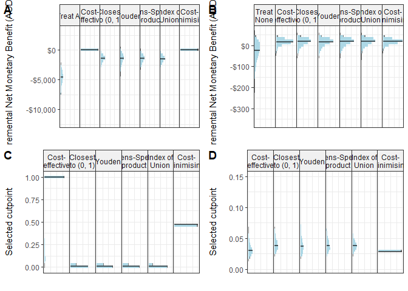
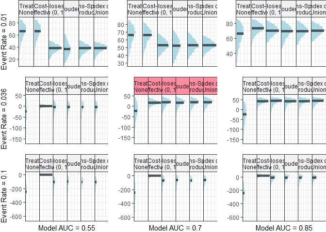
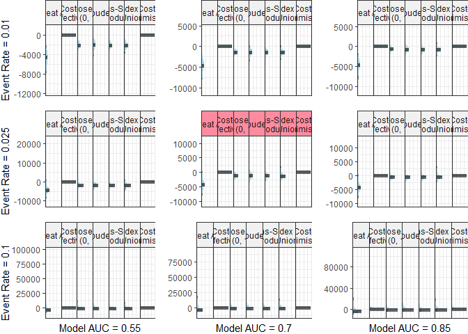

Analyses
================
12 September, 2022

Objective: evaluate the NMB associated with cutpoint methods, including
the cost-effective cutpoint which is our proposed method that finds the
cutpoint that maximises the NMB on the training set.

``` r
get_nmb <- function() {
  # WTP from Edney et al (2018), Pharmacoeconomics
  WTP <- params$global$WTP

  # treatment_effect taken from: Haines et al. (2010) Archives of Internal Medicine
  treatment_effect <- exp(rnorm(
    1,
    mean = params$falls$treatment_log_hazard$mean,
    sd = params$falls$treatment_log_hazard$sd
  ))

  # taken from abstract of Hill (2015), Lancet
  treatment_cost <- params$falls$treatment_cost

  # taken from Morello et al (2015). MJA

  falls_cost <-
    rgamma(
      1,
      params$falls$falls_cost$shape,
      params$falls$falls_cost$rate
    ) * params$falls$falls_cost$multiplier

  # taken from Latimer et al (2013) Age and Ageing
  fall_eff <- rbeta(
    1,
    params$falls$fall_decrement$shape1,
    params$falls$fall_decrement$shape2
  ) * 0.5 # Latimer conducted 6-month follow-up <- 0.5*utility = QALY

  c(
    "TN" = 0,
    "FN" = -falls_cost - fall_eff * WTP,
    "TP" = -falls_cost * (1 - treatment_effect) - treatment_cost - fall_eff * WTP,
    "FP" = -treatment_cost
  )
}
get_nmb()
```

    ##        TN        FN        TP        FP 
    ##     0.000 -7561.858 -3645.071  -100.859

``` r
# the same as get_nmb for falls but returns only the point estimates.
get_nmb_est <- function() {
  WTP <- params$global$WTP

  # treatment_effect taken from: Haines et al. (2010) Archives of Internal Medicine
  treatment_effect <- exp(params$falls$treatment_log_hazard$mean)

  # taken from abstract of Haines (2010), BMC Medicine
  treatment_cost <- params$falls$treatment_cost

  # taken from Morello et al (2015). MJA

  falls_cost <- 6669 * params$falls$falls_cost$multiplier

  # taken from Latimer et al (2013) Age and Ageing
  fall_eff <- 0.04206168 * 0.5 # Latimer conducted 6-month follow-up <- 0.5*utility = QALY

  c(
    "TN" = 0,
    "FN" = -falls_cost - fall_eff * WTP,
    "TP" = -falls_cost * (1 - treatment_effect) - treatment_cost - fall_eff * WTP,
    "FP" = -treatment_cost
  )
}
```

``` r
get_nmb_ICU <- function() {
  WTP <- params$global$WTP

  # Treatment effect taken from de Vos et al (2022), Value in Health
  eff_disch <- rbeta(
    1,
    params$icu$ward_eff$shape1,
    params$icu$ward_eff$shape2
  ) * params$icu$ward_eff$multiplier

  # ICU occupancy cost taken from Hicks et al (2019), MJA
  ICU_cost <- rgamma(
    1,
    params$icu$icu_cost$shape,
    params$icu$icu_cost$rate
  ) * params$icu$icu_cost$multiplier

  # Opportunity cost taken from Page et al (2017), BMC HSR
  ICU_opp_cost <- params$icu$opp_cost

  # ICU readmission LOS taken from Chen et al (1998), Crit Care Med
  ICU_readmit <- rgamma(
    1,
    params$icu$icu_readmit_los$shape,
    params$icu$icu_readmit_los$rate,
  )

  c(
    "TN" = eff_disch * WTP,
    "FN" = eff_disch * WTP - ICU_readmit * ICU_cost,
    "TP" = -ICU_cost,
    "FP" = -ICU_cost - ICU_opp_cost
  )
}
get_nmb_ICU()
```

    ##           TN           FN           TP           FP 
    ##     34.69451 -42916.31986  -4537.10721  -5042.55070

``` r
# Repeat point estimate replacement for ICU
get_nmb_est_ICU <- function() {
  WTP <- params$global$WTP

  # Treatment effect taken from de Vos et al (2022), Value in Health
  eff_disch <- 0.42

  # ICU occupancy cost taken from Hicks et al (2019), MJA
  ICU_cost <- 4375 * params$icu$icu_cost$multiplier

  # Opportunity cost taken from Page et al (2017), BMC HSR
  ICU_opp_cost <- params$icu$opp_cost

  # ICU readmission LOS taken from Chen et al (2021), World Journal of Surgery
  ICU_readmit <- 7.8

  c(
    "TN" = eff_disch * WTP,
    "FN" = eff_disch * WTP - unname(ICU_readmit) * ICU_cost,
    "TP" = -ICU_cost,
    "FP" = -ICU_cost - ICU_opp_cost
  )
}
```

### Run simulation

``` r
do_simulation <- function(sample_size, n_sims, n_valid, sim_auc, event_rate,
                          fx_costs_training, fx_costs_evaluation,
                          intercept_adjustment = 0, return_calibration_plot = F,
                          seed = 42, ...) {
  if (!is.null(seed)) set.seed(seed)
  if (missing(sample_size)) {
    pmsamp <- pmsampsize::pmsampsize(
      type = "b",
      cstatistic = sim_auc,
      parameters = 1,
      prevalence = event_rate
    )
    sample_size <- pmsamp$sample_size
    min_events <- pmsamp$events
  } else {
    min_events <- round(sample_size * prevalence)
  }
  if (return_calibration_plot) {
    p_calibration <- ggplot() +
      geom_abline()
  }

  i <- 0
  while (i < n_sims) {
    train_sample <- get_sample(auc = sim_auc, n_samples = sample_size, prevalence = event_rate, min_events = min_events)
    valid_sample <- get_sample(auc = sim_auc, n_samples = n_valid, prevalence = event_rate, min_events = 0)
    i <- i + 1
    model <- glm(actual ~ predicted, data = train_sample, family = binomial())

    if (intercept_adjustment != 0) {
      train_log_odds <- predict(model) + intercept_adjustment
      train_sample$predicted <- exp(train_log_odds) / (1 + exp(train_log_odds))

      valid_log_odds <- predict(model, newdata = valid_sample) + intercept_adjustment
      valid_sample$predicted <- exp(valid_log_odds) / (1 + exp(valid_log_odds))
    } else {
      train_sample$predicted <- predict(model, type = "response")
      valid_sample$predicted <- predict(model, type = "response", newdata = valid_sample)
    }

    if (return_calibration_plot) {
      df_calplot <- train_sample %>%
        mutate(bin = ntile(predicted, 10)) %>%
        group_by(bin) %>%
        summarize(
          n = n(),
          bin_pred = mean(predicted),
          bin_prob = mean(actual),
          se = sqrt((bin_prob * (1 - bin_prob)) / n),
          ul = bin_prob + 1.96 * se,
          ll = bin_prob - 1.96 * se
        ) %>%
        ungroup()

      p_calibration <- p_calibration + geom_line(data = df_calplot, aes(x = bin_pred, y = bin_prob), alpha = 0.2)
      p_calibration <- p_calibration + geom_point(data = df_calplot, aes(x = bin_pred, y = bin_prob), alpha = 0.2)
    }

    training_value_vector <- fx_costs_training()

    thresholds <- get_thresholds(
      predicted = train_sample$predicted,
      actual = train_sample$actual,
      costs = training_value_vector
    )

    evaluation_value_vector <- fx_costs_evaluation()

    cost_threshold <- function(pt) {
      classify_samples(
        predicted = valid_sample$predicted,
        actual = valid_sample$actual,
        pt = pt,
        costs = evaluation_value_vector
      )
    }

    results_i <-
      unlist(thresholds) %>%
      map_dbl(cost_threshold) %>%
      t()
    thresholds_i <- unlist(thresholds)
    if (i == 1) {
      df_result <- results_i
      df_thresholds <- thresholds_i
    } else {
      df_result <- rbind(df_result, results_i)
      df_thresholds <- rbind(df_thresholds, thresholds_i)
    }
  } # end simulation loop

  df_result <- as.data.frame.matrix(df_result)
  df_thresholds <- as.data.frame.matrix(df_thresholds)
  rownames(df_thresholds) <- NULL

  df_result <- add_column(df_result, n_sim = 1:nrow(df_result), .before = T)
  df_thresholds <- add_column(df_thresholds, n_sim = 1:nrow(df_thresholds), .before = T)

  res <- list(
    date_time = Sys.time(),
    df_result = df_result,
    df_thresholds = df_thresholds,
    meta_data = list(
      sample_size = sample_size,
      n_sims = n_sims,
      n_valid = n_valid,
      sim_auc = sim_auc,
      event_rate = event_rate,
      fx_costs_training = fx_costs_training,
      fx_costs_evaluation = fx_costs_evaluation
    )
  )

  if (return_calibration_plot) {
    p_calibration <-
      p_calibration +
      theme_bw() +
      labs(
        x = "Predicted Probability",
        y = "Observed Probability"
      )
    res <- append(res, list(calibration_plot = p_calibration))
  }

  res
}


# x <- do_simulation(
#   # sample_size=500,
#   n_sims=100, n_valid=1000, sim_auc=0.6, event_rate=0.01,
#   # fx_costs_training=get_nmb_est_ICU, fx_costs_evaluation=get_nmb_ICU,
#   fx_costs_training=get_nmb_est, fx_costs_evaluation=get_nmb,
#   plot_type = "histogram",
#   scale=1
# )
```

``` r
cfg <- list(
  n_sim = 500,
  n_valid = 10000,
  sim_auc = 0.7,
  event_rate = 0.036
)
if (do_new_analyses | !file.exists("output/calibration_experiment/calibration_simulations.rds")) {
  x_calibrated <-
    do_simulation(
      n_sims = cfg$n_sim, n_valid = cfg$n_valid, sim_auc = cfg$sim_auc, event_rate = cfg$event_rate,
      fx_costs_training = get_nmb_est, fx_costs_evaluation = get_nmb,
      intercept_adjustment = 0, return_calibration_plot = T
    )

  x_adjusted_up <-
    do_simulation(
      n_sims = cfg$n_sim, n_valid = cfg$n_valid, sim_auc = cfg$sim_auc, event_rate = cfg$event_rate,
      fx_costs_training = get_nmb_est, fx_costs_evaluation = get_nmb,
      intercept_adjustment = 1, return_calibration_plot = T
    )

  x_adjusted_down <-
    do_simulation(
      n_sims = cfg$n_sim, n_valid = cfg$n_valid, sim_auc = cfg$sim_auc, event_rate = cfg$event_rate,
      fx_costs_training = get_nmb_est, fx_costs_evaluation = get_nmb,
      intercept_adjustment = -1, return_calibration_plot = T
    )

  x_adjusted_up2 <-
    do_simulation(
      n_sims = cfg$n_sim, n_valid = cfg$n_valid, sim_auc = cfg$sim_auc, event_rate = cfg$event_rate,
      fx_costs_training = get_nmb_est, fx_costs_evaluation = get_nmb,
      intercept_adjustment = 2, return_calibration_plot = T
    )

  x_adjusted_down2 <-
    do_simulation(
      n_sims = cfg$n_sim, n_valid = cfg$n_valid, sim_auc = cfg$sim_auc, event_rate = cfg$event_rate,
      fx_costs_training = get_nmb_est, fx_costs_evaluation = get_nmb,
      intercept_adjustment = -2, return_calibration_plot = T
    )

  calibration_experiment_list <- list(
    up2 = x_adjusted_up2,
    up1 = x_adjusted_up,
    calibrated = x_calibrated,
    down1 = x_adjusted_down,
    down2 = x_adjusted_down2
  )

  saveRDS(calibration_experiment_list, "output/calibration_experiment/calibration_simulations.rds")
}

calibration_experiment_list <- readRDS("output/calibration_experiment/calibration_simulations.rds")

cols_rename <- c(
  "Treat All" = "treat_all",
  "Treat None" = "treat_none",
  "Cost- effective" = "cost_effective",
  "Closest to (0, 1)" = "er",
  "Youden" = "youden",
  "Sens-Spec product" = "cz",
  "Index of Union" = "iu",
  "Cost- Minimising" = "cost_minimising"
)


inb_plots <- get_plot_list(
  out_list = calibration_experiment_list,
  rename_vector = cols_rename,
  inb_ref_col = "Treat All",
  get_what = "inb",
  agg_line_size = 1
  # extra_theme=theme(panel.spacing  = unit(0, "lines")) # comment this line out to keep default spacing between facets
)

calibration_plots <- get_plot_list(
  out_list = calibration_experiment_list,
  get_what = "calibration"
)

inb_plots <- keep_only_first_plot_strip(inb_plots)

# test the ggplot below to find the extra rel-height for the first plot (with strips)
# ggsave(
#   plot=cowplot::plot_grid(plotlist=inb_plots, ncol=1, rel_heights = c(0.375, rep(0.3, length(inb_plots)-1))),
#   filename="output/calibration_experiment/inb_plots.jpeg",
#   height=10.5, width=14)
# inb_cowplot <- cowplot::plot_grid(plotlist=inb_plots, ncol=1)

inb_cowplot <- cowplot::plot_grid(plotlist = inb_plots, ncol = 1, rel_heights = c(0.375, rep(0.3, length(inb_plots) - 1)))


# cowplot::plot_grid(plotlist=calibration_plots, ncol=1)

calibration_cowplot <- plot_grid(
  plotlist = c(list(NULL), calibration_plots),
  ncol = 1,
  rel_heights = c(0.075, rep(0.3, length(calibration_plots)))
)

# calibration_cowplot <- plot_grid(plotlist=calibration_plots, ncol=1)
combined_fig <- plot_grid(inb_cowplot, calibration_cowplot, ncol = 2, rel_widths = c(0.6, 0.25))

if (save_plots) {
  ggsave(filename = "output/calibration_experiment/calibration_plots.jpeg", plot = combined_fig, dpi = 600, height = 8, width = 7.3)
}
```

# Primary analyses

``` r
if (do_new_analyses | !file.exists("output/primary_analyses/falls_primary_analyses.rds")) {
  falls_simulation <-
    do_simulation(
      n_sims = 5000, n_valid = 10000, sim_auc = 0.7, event_rate = 0.036,
      fx_costs_training = get_nmb_est, fx_costs_evaluation = get_nmb
    )
  saveRDS(falls_simulation, "output/primary_analyses/falls_primary_analyses.rds")
}
falls_simulation <- readRDS("output/primary_analyses/falls_primary_analyses.rds")

if (do_new_analyses | !file.exists("output/primary_analyses/falls_primary_analyses.rds")) {
  icu_simulation <-
    do_simulation(
      n_sims = 5000, n_valid = 10000, sim_auc = 0.7, event_rate = 0.01,
      fx_costs_training = get_nmb_est_ICU, fx_costs_evaluation = get_nmb_ICU
    )
  saveRDS(icu_simulation, "output/primary_analyses/icu_primary_analyses.rds")
}
icu_simulation <- readRDS("output/primary_analyses/icu_primary_analyses.rds")
```

## Plots with most realistic AUC and event rate for each use-case

``` r
cols_rename <- c(
  "Treat All" = "treat_all",
  "Treat None" = "treat_none",
  "Cost- effective" = "cost_effective",
  "Closest to (0, 1)" = "er",
  "Youden" = "youden",
  "Sens-Spec product" = "cz",
  "Index of Union" = "iu",
  "Cost- Minimising" = "cost_minimising"
)

PA_CFG <- list(agg_line_size = 1)

p_falls_nmb <-
  falls_simulation$df_result %>%
  # select(-cost_minimising) %>%
  rename(any_of(cols_rename)) %>%
  plot_fw_histogram(
    hdi = F,
    plot_labels = labs(x = "Incremental Net Monetary Benefit (AUD)\n", y = ""),
    inb_ref_col = "Treat All",
    agg_line_size = PA_CFG$agg_line_size
  )


p_falls_cutpoints <-
  falls_simulation$df_thresholds %>%
  select(-treat_all, -treat_none) %>%
  # select(-cost_minimising) %>%
  rename(., any_of(cols_rename)) %>%
  plot_fw_histogram(
    hdi = F,
    plot_labels = labs(x = "Selected cutpoint\n", y = ""),
    dollar_format = F,
    agg_line_size = PA_CFG$agg_line_size
  )


p_icu_nmb <-
  icu_simulation$df_result %>%
  rename(any_of(cols_rename)) %>%
  plot_fw_histogram(
    hdi = F,
    plot_labels = labs(x = "Incremental Net Monetary Benefit (AUD)\n", y = ""),
    inb_ref_col = "Treat None",
    agg_line_size = PA_CFG$agg_line_size
  )

p_icu_cutpoints <-
  icu_simulation$df_thresholds %>%
  select(-treat_all, -treat_none) %>%
  rename(., any_of(cols_rename)) %>%
  plot_fw_histogram(
    hdi = F,
    plot_labels = labs(x = "Selected cutpoint\n", y = ""),
    dollar_format = F,
    agg_line_size = PA_CFG$agg_line_size
  )


plot_grid(
  plotlist = list(
    p_icu_nmb, p_falls_nmb,
    p_icu_cutpoints, p_falls_cutpoints
  ),
  labels = LETTERS[1:4],
  ncol = 2
)
```

<!-- -->

``` r
if (save_plots) {
  ggsave(filename = "output/primary_analyses/primary_results.jpeg", dpi = 600, height = 7, width = 11)
}
```

## Table with most realistic AUC and event rate for each use-case

``` r
falls_summary <- do.call(
  get_summary,
  c(
    falls_simulation$meta_data,
    list(
      data = falls_simulation$df_result, agg_fx = median, hdi = F, ci = 0.95,
      recode_methods_vector = cols_rename, inb_ref_col = "treat_all"
    )
  )
)

icu_summary <- do.call(
  get_summary,
  c(
    icu_simulation$meta_data,
    list(
      data = icu_simulation$df_result, agg_fx = median, hdi = F, ci = 0.95,
      recode_methods_vector = cols_rename, inb_ref_col = "treat_none"
    )
  )
)

# primary_analyses_table
primary_analyses_table <-
  rbind(icu_summary, falls_summary) %>%
  select(
    "Cutpoint method" = method,
    "Incremental Net Monetary Benefit (AUD)" = summary,
    "Best performing [n (%)]" = n_best_percent
  ) %>%
  formattable() %>%
  kable(
    escape = F,
    caption = glue::glue("Incremental Net Monetary Benefit presented as median [{percent(0.95, digits=0)} Intervals]")
  ) %>%
  pack_rows(
    index = c(
      "ICU readmission (reference group: Treat None)" = nrow(icu_summary),
      "Inpatient falls (reference group: Treat All)" = nrow(falls_summary)
    )
  ) %>%
  kable_styling() %>%
  save_kable(file = "output/primary_analyses/primary_analyses.html")


# primary analyses for deliverable (falls only and remove cost-minimising cutpoint method)
do.call(
  get_summary,
  c(
    falls_simulation$meta_data,
    list(
      # data = select(falls_simulation$df_result, -cost_minimising),
      data = falls_simulation$df_result,
      agg_fx = median, hdi = F, ci = 0.95,
      recode_methods_vector = cols_rename, inb_ref_col = "treat_all"
    )
  )
) %>%
  select(
    "Cutpoint method" = method,
    "Incremental Net Monetary Benefit (AUD)" = summary,
    "Best performing [n (%)]" = n_best_percent
  ) %>%
  formattable() %>%
  kable(
    escape = F,
    caption = glue::glue("Incremental Net Monetary Benefit presented as median [{percent(0.95, digits=0)} Intervals]")
  ) %>%
  kable_styling() %>%
  save_kable(file = "output/primary_analyses/primary_results_falls-only_for-deliverables.html")
```

``` r
simulation_config <- list(
  n_sims = 5000,
  n_valid = 10000
)

g_falls <- expand.grid(
  sim_auc = c(0.55, 0.7, 0.85),
  event_rate = c(0.01, 0.036, 0.1)
  # sim_auc=c(0.7),
  # event_rate=seq(0.01, 0.075, 0.005)
)

g_icu <- expand.grid(
  sim_auc = c(0.55, 0.7, 0.85),
  event_rate = c(0.01, 0.025, 0.1)
)

if (do_new_analyses | !file.exists("output/sensitivity_analyses/falls_sensitivity_analyses.rds")) {
  n_cluster <- detectCores() - 2
  cl <- makeCluster(n_cluster)
  cl <- parallelly::autoStopCluster(cl)

  clusterExport(cl, {
    c("do_simulation", "g_falls", "g_icu", "get_nmb", "get_nmb_est", "get_nmb_ICU", "get_nmb_est_ICU", "params", "simulation_config")
  })

  invisible(clusterEvalQ(cl, {
    library(tidyverse)
    library(data.table)
    library(ggridges)
    library(bayestestR)
    library(cutpointr)
    source("src/utils.R")
    source("src/cutpoint_methods.R")
    source("src/summary.R")
  }))


  ll_falls <- parLapply(
    cl,
    1:nrow(g_falls),
    function(i) {
      do.call(
        do_simulation,
        c(
          simulation_config,
          list(
            sim_auc = g_falls$sim_auc[i],
            event_rate = g_falls$event_rate[i],
            fx_costs_training = get_nmb_est,
            fx_costs_evaluation = get_nmb
          )
        )
      )
    }
  )

  saveRDS(ll_falls, "output/sensitivity_analyses/falls_sensitivity_analyses.rds")
}

if (do_new_analyses | !file.exists("output/sensitivity_analyses/falls_sensitivity_analyses.rds")) {
  n_cluster <- detectCores() - 2
  cl <- makeCluster(n_cluster)
  cl <- parallelly::autoStopCluster(cl)

  clusterExport(cl, {
    c("do_simulation", "g_falls", "g_icu", "get_nmb", "get_nmb_est", "get_nmb_ICU", "get_nmb_est_ICU", "params", "simulation_config")
  })

  invisible(clusterEvalQ(cl, {
    library(tidyverse)
    library(data.table)
    library(ggridges)
    library(bayestestR)
    library(cutpointr)
    source("src/utils.R")
    source("src/cutpoint_methods.R")
    source("src/summary.R")
  }))

  ll_icu <- parLapply(
    cl,
    1:nrow(g_icu),
    function(i) {
      do.call(
        do_simulation,
        c(
          simulation_config,
          list(
            sim_auc = g_icu$sim_auc[i],
            event_rate = g_icu$event_rate[i],
            fx_costs_training = get_nmb_est_ICU,
            fx_costs_evaluation = get_nmb_ICU
          )
        )
      )
    }
  )

  saveRDS(ll_icu, "output/sensitivity_analyses/icu_sensitivity_analyses.rds")
}


# save specific screen for falls across event rates
# saveRDS(ll_falls, "output/sensitivity_analyses/falls_sensitivity_analyses2.rds")

# load simulation results
ll_falls <- readRDS("output/sensitivity_analyses/falls_sensitivity_analyses.rds")
ll_icu <- readRDS("output/sensitivity_analyses/icu_sensitivity_analyses.rds")
```

``` r
# falls_inb_plots <- get_plot_list(
#   ll_falls, cols_rename,
#   get_what = "inb",
#   inb_ref_col = "Treat All", groups_remove = "Cost- Minimising"
# )
# 
# falls_cp_plots <- get_plot_list(ll_falls, cols_rename, get_what = "cutpoints")
# 
# plot_grid(
#   plotlist = c(falls_inb_plots, falls_cp_plots),
#   nrow = 2,
#   labels = rep(g_falls$event_rate, 2)
# )
# 
# if (save_plots) {
#   ggsave(filename = "output/sensitivity_analyses/falls_simulations_inb_for-deliverables_sanity-check.jpeg", height = 10, width = 45)
# }
```

# save plots from sensitivity analyses

``` r
# FALLS
falls_axis_limits <- c(
  rep(list(list(min = -50, max = 100)), 3),
  rep(list(list(min = -300, max = 100)), 3),
  rep(list(list(min = -800, max = 100)), 3)
)

falls_inb_plots <- get_plot_list(
  ll_falls, cols_rename,
  get_what = "inb", inb_ref_col = "Treat All",
  # groups_remove = "Cost- Minimising", 
  only_show_interval = F,
  x_lims_list = falls_axis_limits
)

# add labels to left most graphs for event rate
event_rate_str <- function(rate) glue::glue("Event Rate = {rate}")
model_auc_str <- function(auc) glue::glue("Model AUC = {auc}")

falls_inb_plots[[1]] <- falls_inb_plots[[1]] + xlab(event_rate_str(g_falls$event_rate[1]))
falls_inb_plots[[4]] <- falls_inb_plots[[4]] + xlab(event_rate_str(g_falls$event_rate[4]))
falls_inb_plots[[7]] <- falls_inb_plots[[7]] + xlab(event_rate_str(g_falls$event_rate[7]))

falls_inb_plots[[7]] <- falls_inb_plots[[7]] + ylab(model_auc_str(g_falls$sim_auc[7]))
falls_inb_plots[[8]] <- falls_inb_plots[[8]] + ylab(model_auc_str(g_falls$sim_auc[8]))
falls_inb_plots[[9]] <- falls_inb_plots[[9]] + ylab(model_auc_str(g_falls$sim_auc[9]))


for (i in 1:length(falls_inb_plots)) {
  falls_inb_plots[[i]] <- falls_inb_plots[[i]] +
    theme(
      plot.margin = unit(c(0, 0, 0, 0), "cm")
    )
}

# add border to primary analyses within panels
falls_inb_plots[[5]] <-
  falls_inb_plots[[5]] +
  theme(
    strip.background = element_rect(fill = "#ff8ba0")
  )

plot_grid(
  plotlist = falls_inb_plots,
  ncol = length(unique(g_falls$sim_auc))
)
```

<!-- -->

``` r
if (save_plots) {
  ggsave(filename = "output/sensitivity_analyses/falls_simulations_inb.jpeg", height = 24 * 0.5, width = 15)
}

icu_axis_limits <- c(
  rep(list(list(min = -10000, max = 1000)), 3),
  rep(list(list(min = -10000, max = 4000)), 3),
  rep(list(list(min = -10000, max = 20000)), 3)
)

# ICU discharge
icu_inb_plots <- get_plot_list(
  ll_icu, cols_rename, 
  get_what = "inb", inb_ref_col = "Treat None",
  # groups_remove = "Cost- Minimising", 
  only_show_interval = F,
  x_lims_list = icu_axis_limits
)

icu_inb_plots[[1]] <- icu_inb_plots[[1]] + xlab(event_rate_str(g_icu$event_rate[1]))
icu_inb_plots[[4]] <- icu_inb_plots[[4]] + xlab(event_rate_str(g_icu$event_rate[4]))
icu_inb_plots[[7]] <- icu_inb_plots[[7]] + xlab(event_rate_str(g_icu$event_rate[7]))

icu_inb_plots[[7]] <- icu_inb_plots[[7]] + ylab(model_auc_str(g_icu$sim_auc[7]))
icu_inb_plots[[8]] <- icu_inb_plots[[8]] + ylab(model_auc_str(g_icu$sim_auc[8]))
icu_inb_plots[[9]] <- icu_inb_plots[[9]] + ylab(model_auc_str(g_icu$sim_auc[9]))

for (i in 1:length(icu_inb_plots)) {
  icu_inb_plots[[i]] <- icu_inb_plots[[i]] +
    theme(
      plot.margin = unit(c(0, 0, 0, 0), "cm"),
    )
}

# add border to primary analyses within panels
icu_inb_plots[[5]] <-
  icu_inb_plots[[5]] +
  theme(
    strip.background = element_rect(fill = "#ff8ba0")
  )


plot_grid(
  plotlist = icu_inb_plots,
  ncol = length(unique(g_icu$sim_auc))
)
```

<!-- -->

``` r
if (save_plots) {
  ggsave(filename = "output/sensitivity_analyses/icu_simulations_inb.jpeg", height = 24 * 0.5, width = 15)
}
```

``` r
# save selected cutpoints plots
# cowplot::plot_grid(
#   plotlist=get_plot_list(ll_falls, cols_rename, get_what="cutpoints"),
#   ncol=length(unique(g_falls$sim_auc))
# )
# ggsave(filename="output/falls_simulations_thresholds.jpeg", height=24, width=12)
#
# cowplot::plot_grid(
#   plotlist=get_plot_list(ll_icu, cols_rename, get_what="cutpoints"),
#   ncol=length(unique(g_icu$sim_auc))
# )
# ggsave(filename="output/icu_simulations_thresholds.jpeg", height=24, width=12)
```

``` r
make_table(
  ll_falls,
  get_what = "inb", rename_vector = cols_rename,
  save_path = "output/sensitivity_analyses/falls_inb_summary.html",
  inb_ref_col = "Treat All"
)
```

<table class="table" style="margin-left: auto; margin-right: auto;">
<caption>
Data presented as median \[95% Intervals\]
</caption>
<thead>
<tr>
<th style="text-align:right;">
Rate
</th>
<th style="text-align:right;">
Model AUC
</th>
<th style="text-align:left;">
Treat None
</th>
<th style="text-align:left;">
Cost- effective
</th>
<th style="text-align:left;">
Closest to (0, 1)
</th>
<th style="text-align:left;">
Youden
</th>
<th style="text-align:left;">
Sens-Spec product
</th>
<th style="text-align:left;">
Index of Union
</th>
<th style="text-align:left;">
Cost- Minimising
</th>
</tr>
</thead>
<tbody>
<tr>
<td style="text-align:right;">
0.010
</td>
<td style="text-align:right;">
0.55
</td>
<td style="text-align:left;">
<b>66.37 \[27.83, 84.33\]</b>
</td>
<td style="text-align:left;">
66.22 \[24.63, 84.15\]
</td>
<td style="text-align:left;">
38.23 \[19.2, 49.61\]
</td>
<td style="text-align:left;">
36.91 \[12.96, 61.45\]
</td>
<td style="text-align:left;">
38.12 \[19.2, 50.09\]
</td>
<td style="text-align:left;">
38.11 \[19.46, 47.36\]
</td>
<td style="text-align:left;">
<b>66.37 \[27.83, 84.33\]</b>
</td>
</tr>
<tr>
<td style="text-align:right;">
0.010
</td>
<td style="text-align:right;">
0.70
</td>
<td style="text-align:left;">
66.99 \[28.33, 84.84\]
</td>
<td style="text-align:left;">
66.93 \[31.77, 83.12\]
</td>
<td style="text-align:left;">
53.38 \[36.24, 68.79\]
</td>
<td style="text-align:left;">
51.97 \[28.07, 72.47\]
</td>
<td style="text-align:left;">
52.86 \[35.38, 70.31\]
</td>
<td style="text-align:left;">
53.1 \[37.4, 65.21\]
</td>
<td style="text-align:left;">
<b>67.6 \[33.11, 83.34\]</b>
</td>
</tr>
<tr>
<td style="text-align:right;">
0.010
</td>
<td style="text-align:right;">
0.85
</td>
<td style="text-align:left;">
66.58 \[26.92, 85.46\]
</td>
<td style="text-align:left;">
73.88 \[48.38, 85.81\]
</td>
<td style="text-align:left;">
70.51 \[52.34, 83.32\]
</td>
<td style="text-align:left;">
69.3 \[45.56, 83.39\]
</td>
<td style="text-align:left;">
69.61 \[49.75, 83.35\]
</td>
<td style="text-align:left;">
70.17 \[54.49, 82.49\]
</td>
<td style="text-align:left;">
<b>75.19 \[52.47, 85.84\]</b>
</td>
</tr>
<tr>
<td style="text-align:right;">
0.036
</td>
<td style="text-align:right;">
0.55
</td>
<td style="text-align:left;">
-24.05 \[-156.55, 40.86\]
</td>
<td style="text-align:left;">
<b>0.57 \[-23.85, 13.07\]</b>
</td>
<td style="text-align:left;">
-4.4 \[-70.07, 26.63\]
</td>
<td style="text-align:left;">
-3.95 \[-76.31, 28.03\]
</td>
<td style="text-align:left;">
-4.41 \[-70.5, 26.81\]
</td>
<td style="text-align:left;">
-4.34 \[-67.74, 26.26\]
</td>
<td style="text-align:left;">
0.49 \[-14.63, 10.04\]
</td>
</tr>
<tr>
<td style="text-align:right;">
0.036
</td>
<td style="text-align:right;">
0.70
</td>
<td style="text-align:left;">
-23.42 \[-156.56, 42.32\]
</td>
<td style="text-align:left;">
17.4 \[-34.17, 42.13\]
</td>
<td style="text-align:left;">
18.82 \[-37.91, 44.66\]
</td>
<td style="text-align:left;">
17.94 \[-45.5, 43.99\]
</td>
<td style="text-align:left;">
18.7 \[-39.83, 44.44\]
</td>
<td style="text-align:left;">
<b>19.23 \[-34.35, 44.38\]</b>
</td>
<td style="text-align:left;">
18.54 \[-19.45, 40.74\]
</td>
</tr>
<tr>
<td style="text-align:right;">
0.036
</td>
<td style="text-align:right;">
0.85
</td>
<td style="text-align:left;">
-24.36 \[-160.28, 41.66\]
</td>
<td style="text-align:left;">
41.48 \[-16.4, 60.84\]
</td>
<td style="text-align:left;">
42.42 \[-19.92, 62.25\]
</td>
<td style="text-align:left;">
41.99 \[-20.38, 61.57\]
</td>
<td style="text-align:left;">
42.74 \[-18.77, 61.87\]
</td>
<td style="text-align:left;">
43.21 \[-10.03, 62.31\]
</td>
<td style="text-align:left;">
<b>43.65 \[7.66, 60.59\]</b>
</td>
</tr>
<tr>
<td style="text-align:right;">
0.100
</td>
<td style="text-align:right;">
0.55
</td>
<td style="text-align:left;">
-242.94 \[-615.68, -67.52\]
</td>
<td style="text-align:left;">
-0.35 \[-5.92, 0.34\]
</td>
<td style="text-align:left;">
-107.9 \[-280.85, -24.06\]
</td>
<td style="text-align:left;">
-102.99 \[-324.63, -16.54\]
</td>
<td style="text-align:left;">
-107.9 \[-279.2, -24.06\]
</td>
<td style="text-align:left;">
-107.27 \[-278.72, -24.69\]
</td>
<td style="text-align:left;">
<b>0 \[0, 0\]</b>
</td>
</tr>
<tr>
<td style="text-align:right;">
0.100
</td>
<td style="text-align:right;">
0.70
</td>
<td style="text-align:left;">
-247.55 \[-592.32, -65.59\]
</td>
<td style="text-align:left;">
-0.27 \[-68.26, 9.38\]
</td>
<td style="text-align:left;">
-66.61 \[-228.87, 3.65\]
</td>
<td style="text-align:left;">
-62.38 \[-266.98, 6.5\]
</td>
<td style="text-align:left;">
-65.34 \[-242.86, 4.66\]
</td>
<td style="text-align:left;">
-64.79 \[-212.71, 3.84\]
</td>
<td style="text-align:left;">
<b>0.55 \[-25.78, 7.37\]</b>
</td>
</tr>
<tr>
<td style="text-align:right;">
0.100
</td>
<td style="text-align:right;">
0.85
</td>
<td style="text-align:left;">
-246.89 \[-610.1, -66.41\]
</td>
<td style="text-align:left;">
16.58 \[-63.19, 34.1\]
</td>
<td style="text-align:left;">
-16.26 \[-147.86, 33.29\]
</td>
<td style="text-align:left;">
-13.54 \[-168.03, 33.99\]
</td>
<td style="text-align:left;">
-15.19 \[-159.51, 34.09\]
</td>
<td style="text-align:left;">
-15.23 \[-134.31, 33.28\]
</td>
<td style="text-align:left;">
<b>18.8 \[-13.62, 33.77\]</b>
</td>
</tr>
</tbody>
</table>

``` r
make_table(
  ll_falls,
  get_what = "cutpoints", rename_vector = cols_rename,
  save_path = "output/sensitivity_analyses/falls_thresholds_summary.html"
)
```

<table class="table" style="margin-left: auto; margin-right: auto;">
<caption>
Data presented as median \[95% Intervals\]
</caption>
<thead>
<tr>
<th style="text-align:right;">
Rate
</th>
<th style="text-align:right;">
Model AUC
</th>
<th style="text-align:left;">
Cost- effective
</th>
<th style="text-align:left;">
Closest to (0, 1)
</th>
<th style="text-align:left;">
Youden
</th>
<th style="text-align:left;">
Sens-Spec product
</th>
<th style="text-align:left;">
Index of Union
</th>
<th style="text-align:left;">
Cost- Minimising
</th>
</tr>
</thead>
<tbody>
<tr>
<td style="text-align:right;">
0.010
</td>
<td style="text-align:right;">
0.55
</td>
<td style="text-align:left;">
0.02 \[0.01, 1\]
</td>
<td style="text-align:left;">
0.01 \[0.01, 0.01\]
</td>
<td style="text-align:left;">
0.01 \[0.01, 0.01\]
</td>
<td style="text-align:left;">
0.01 \[0.01, 0.01\]
</td>
<td style="text-align:left;">
0.01 \[0.01, 0.01\]
</td>
<td style="text-align:left;">
0.03 \[0.03, 0.03\]
</td>
</tr>
<tr>
<td style="text-align:right;">
0.010
</td>
<td style="text-align:right;">
0.70
</td>
<td style="text-align:left;">
0.03 \[0.02, 1\]
</td>
<td style="text-align:left;">
0.01 \[0.01, 0.02\]
</td>
<td style="text-align:left;">
0.01 \[0.01, 0.02\]
</td>
<td style="text-align:left;">
0.01 \[0.01, 0.02\]
</td>
<td style="text-align:left;">
0.01 \[0.01, 0.02\]
</td>
<td style="text-align:left;">
0.03 \[0.03, 0.03\]
</td>
</tr>
<tr>
<td style="text-align:right;">
0.010
</td>
<td style="text-align:right;">
0.85
</td>
<td style="text-align:left;">
0.03 \[0.01, 0.25\]
</td>
<td style="text-align:left;">
0.01 \[0, 0.06\]
</td>
<td style="text-align:left;">
0.01 \[0, 0.07\]
</td>
<td style="text-align:left;">
0.01 \[0, 0.06\]
</td>
<td style="text-align:left;">
0.01 \[0.01, 0.04\]
</td>
<td style="text-align:left;">
0.03 \[0.03, 0.03\]
</td>
</tr>
<tr>
<td style="text-align:right;">
0.036
</td>
<td style="text-align:right;">
0.55
</td>
<td style="text-align:left;">
0.03 \[0.02, 0.03\]
</td>
<td style="text-align:left;">
0.04 \[0.03, 0.04\]
</td>
<td style="text-align:left;">
0.04 \[0.03, 0.04\]
</td>
<td style="text-align:left;">
0.04 \[0.03, 0.04\]
</td>
<td style="text-align:left;">
0.04 \[0.03, 0.04\]
</td>
<td style="text-align:left;">
0.03 \[0.03, 0.03\]
</td>
</tr>
<tr>
<td style="text-align:right;">
0.036
</td>
<td style="text-align:right;">
0.70
</td>
<td style="text-align:left;">
0.03 \[0.02, 0.06\]
</td>
<td style="text-align:left;">
0.04 \[0.02, 0.06\]
</td>
<td style="text-align:left;">
0.04 \[0.02, 0.08\]
</td>
<td style="text-align:left;">
0.04 \[0.02, 0.07\]
</td>
<td style="text-align:left;">
0.04 \[0.02, 0.06\]
</td>
<td style="text-align:left;">
0.03 \[0.03, 0.03\]
</td>
</tr>
<tr>
<td style="text-align:right;">
0.036
</td>
<td style="text-align:right;">
0.85
</td>
<td style="text-align:left;">
0.04 \[0.01, 0.16\]
</td>
<td style="text-align:left;">
0.05 \[0.02, 0.19\]
</td>
<td style="text-align:left;">
0.04 \[0.01, 0.21\]
</td>
<td style="text-align:left;">
0.05 \[0.01, 0.2\]
</td>
<td style="text-align:left;">
0.05 \[0.02, 0.13\]
</td>
<td style="text-align:left;">
0.03 \[0.03, 0.03\]
</td>
</tr>
<tr>
<td style="text-align:right;">
0.100
</td>
<td style="text-align:right;">
0.55
</td>
<td style="text-align:left;">
0.06 \[0.05, 0.09\]
</td>
<td style="text-align:left;">
0.1 \[0.09, 0.11\]
</td>
<td style="text-align:left;">
0.1 \[0.09, 0.12\]
</td>
<td style="text-align:left;">
0.1 \[0.09, 0.11\]
</td>
<td style="text-align:left;">
0.1 \[0.09, 0.11\]
</td>
<td style="text-align:left;">
0.03 \[0.03, 0.03\]
</td>
</tr>
<tr>
<td style="text-align:right;">
0.100
</td>
<td style="text-align:right;">
0.70
</td>
<td style="text-align:left;">
0.04 \[0.02, 0.08\]
</td>
<td style="text-align:left;">
0.11 \[0.07, 0.17\]
</td>
<td style="text-align:left;">
0.1 \[0.05, 0.2\]
</td>
<td style="text-align:left;">
0.11 \[0.06, 0.18\]
</td>
<td style="text-align:left;">
0.1 \[0.07, 0.15\]
</td>
<td style="text-align:left;">
0.03 \[0.03, 0.03\]
</td>
</tr>
<tr>
<td style="text-align:right;">
0.100
</td>
<td style="text-align:right;">
0.85
</td>
<td style="text-align:left;">
0.04 \[0.01, 0.11\]
</td>
<td style="text-align:left;">
0.11 \[0.06, 0.23\]
</td>
<td style="text-align:left;">
0.11 \[0.04, 0.28\]
</td>
<td style="text-align:left;">
0.11 \[0.05, 0.26\]
</td>
<td style="text-align:left;">
0.11 \[0.06, 0.21\]
</td>
<td style="text-align:left;">
0.03 \[0.03, 0.03\]
</td>
</tr>
</tbody>
</table>

``` r
make_table(
  ll_icu,
  get_what = "inb", rename_vector = cols_rename,
  save_path = "output/sensitivity_analyses/icu_inb_summary.html",
  inb_ref_col = "Treat None"
)
```

<table class="table" style="margin-left: auto; margin-right: auto;">
<caption>
Data presented as median \[95% Intervals\]
</caption>
<thead>
<tr>
<th style="text-align:right;">
Rate
</th>
<th style="text-align:right;">
Model AUC
</th>
<th style="text-align:left;">
Treat All
</th>
<th style="text-align:left;">
Cost- effective
</th>
<th style="text-align:left;">
Closest to (0, 1)
</th>
<th style="text-align:left;">
Youden
</th>
<th style="text-align:left;">
Sens-Spec product
</th>
<th style="text-align:left;">
Index of Union
</th>
<th style="text-align:left;">
Cost- Minimising
</th>
</tr>
</thead>
<tbody>
<tr>
<td style="text-align:right;">
0.010
</td>
<td style="text-align:right;">
0.55
</td>
<td style="text-align:left;">
-4623.1 \[-7594.12, -2268.19\]
</td>
<td style="text-align:left;">
<b>0 \[0, 0\]</b>
</td>
<td style="text-align:left;">
-2081.63 \[-3574.01, -945.53\]
</td>
<td style="text-align:left;">
-2020.24 \[-4373.57, -590.08\]
</td>
<td style="text-align:left;">
-2074.33 \[-3561.08, -940.46\]
</td>
<td style="text-align:left;">
-2116.13 \[-3503.59, -969.11\]
</td>
<td style="text-align:left;">
<b>0 \[0, 0\]</b>
</td>
</tr>
<tr>
<td style="text-align:right;">
0.010
</td>
<td style="text-align:right;">
0.70
</td>
<td style="text-align:left;">
-4616.69 \[-7570.67, -2365.82\]
</td>
<td style="text-align:left;">
<b>0 \[-7.2, 0\]</b>
</td>
<td style="text-align:left;">
-1412.16 \[-2820.33, -281.78\]
</td>
<td style="text-align:left;">
-1415.91 \[-3516.53, -168.37\]
</td>
<td style="text-align:left;">
-1415.53 \[-2977.96, -251.93\]
</td>
<td style="text-align:left;">
-1477.87 \[-2753.65, -340.32\]
</td>
<td style="text-align:left;">
<b>0 \[0, 0\]</b>
</td>
</tr>
<tr>
<td style="text-align:right;">
0.010
</td>
<td style="text-align:right;">
0.85
</td>
<td style="text-align:left;">
-4583.71 \[-7466.05, -2345.28\]
</td>
<td style="text-align:left;">
<b>0 \[-36.02, 90.13\]</b>
</td>
<td style="text-align:left;">
-652.12 \[-2107.69, 457.12\]
</td>
<td style="text-align:left;">
-700.95 \[-2605.15, 436.32\]
</td>
<td style="text-align:left;">
-693.05 \[-2326.28, 436.29\]
</td>
<td style="text-align:left;">
-707.01 \[-1995.68, 477.73\]
</td>
<td style="text-align:left;">
<b>0 \[-14.55, 56.23\]</b>
</td>
</tr>
<tr>
<td style="text-align:right;">
0.025
</td>
<td style="text-align:right;">
0.55
</td>
<td style="text-align:left;">
-4290.48 \[-7346.75, -26.12\]
</td>
<td style="text-align:left;">
<b>0 \[-1.03, 0\]</b>
</td>
<td style="text-align:left;">
-1923.62 \[-3411.43, 270.89\]
</td>
<td style="text-align:left;">
-1825.63 \[-4211.7, 261.45\]
</td>
<td style="text-align:left;">
-1922.78 \[-3417.62, 270.89\]
</td>
<td style="text-align:left;">
-1951.48 \[-3405.49, 299.6\]
</td>
<td style="text-align:left;">
<b>0 \[0, 0\]</b>
</td>
</tr>
<tr>
<td style="text-align:right;">
0.025
</td>
<td style="text-align:right;">
0.70
</td>
<td style="text-align:left;">
-4260.48 \[-7320.42, 416.36\]
</td>
<td style="text-align:left;">
<b>0 \[-24.07, 25.11\]</b>
</td>
<td style="text-align:left;">
-1243.78 \[-2767.4, 1558.89\]
</td>
<td style="text-align:left;">
-1212.82 \[-3457.86, 1553.76\]
</td>
<td style="text-align:left;">
-1233.36 \[-2915.04, 1558.77\]
</td>
<td style="text-align:left;">
-1320.39 \[-2662.36, 1681.96\]
</td>
<td style="text-align:left;">
<b>0 \[-1.54, 1.33\]</b>
</td>
</tr>
<tr>
<td style="text-align:right;">
0.025
</td>
<td style="text-align:right;">
0.85
</td>
<td style="text-align:left;">
-4248.23 \[-7347.53, -88.34\]
</td>
<td style="text-align:left;">
<b>0 \[-114.37, 554.47\]</b>
</td>
<td style="text-align:left;">
-524.45 \[-2042.98, 2295.34\]
</td>
<td style="text-align:left;">
-575.2 \[-2509.51, 2238.64\]
</td>
<td style="text-align:left;">
-559.01 \[-2229.5, 2320.03\]
</td>
<td style="text-align:left;">
-577.71 \[-1909.39, 2383.83\]
</td>
<td style="text-align:left;">
<b>0 \[-68.01, 400.43\]</b>
</td>
</tr>
<tr>
<td style="text-align:right;">
0.100
</td>
<td style="text-align:right;">
0.55
</td>
<td style="text-align:left;">
-3501.48 \[-6859.66, 16129.35\]
</td>
<td style="text-align:left;">
<b>0 \[-8.37, 10.39\]</b>
</td>
<td style="text-align:left;">
-1552.11 \[-3245.17, 8826.46\]
</td>
<td style="text-align:left;">
-1380.05 \[-3904.36, 8894.15\]
</td>
<td style="text-align:left;">
-1549.44 \[-3277.62, 8747.87\]
</td>
<td style="text-align:left;">
-1583.1 \[-3225.75, 8964.11\]
</td>
<td style="text-align:left;">
<b>0 \[0, 0\]</b>
</td>
</tr>
<tr>
<td style="text-align:right;">
0.100
</td>
<td style="text-align:right;">
0.70
</td>
<td style="text-align:left;">
-3442.81 \[-7002.28, 16807.74\]
</td>
<td style="text-align:left;">
<b>0 \[-233.39, 1320.33\]</b>
</td>
<td style="text-align:left;">
-924.3 \[-2815.2, 11641.08\]
</td>
<td style="text-align:left;">
-816.4 \[-3370.6, 11870.13\]
</td>
<td style="text-align:left;">
-887.15 \[-2912.05, 11870.13\]
</td>
<td style="text-align:left;">
-1003.92 \[-2698.71, 11719.73\]
</td>
<td style="text-align:left;">
<b>0 \[-87.84, 531.8\]</b>
</td>
</tr>
<tr>
<td style="text-align:right;">
0.100
</td>
<td style="text-align:right;">
0.85
</td>
<td style="text-align:left;">
-3380.71 \[-6968.28, 16753.46\]
</td>
<td style="text-align:left;">
27.57 \[-496.45, 5777.93\]
</td>
<td style="text-align:left;">
-411.02 \[-1990.98, 14566.43\]
</td>
<td style="text-align:left;">
-410.58 \[-2280.99, 14692.09\]
</td>
<td style="text-align:left;">
-408.44 \[-2134.12, 14567.33\]
</td>
<td style="text-align:left;">
-422.37 \[-1934.61, 14742.27\]
</td>
<td style="text-align:left;">
<b>52.44 \[-366.72, 5548.12\]</b>
</td>
</tr>
</tbody>
</table>

``` r
make_table(
  ll_icu,
  get_what = "cutpoints", rename_vector = cols_rename,
  save_path = "output/sensitivity_analyses/icu_thresholds_summary.html"
)
```

<table class="table" style="margin-left: auto; margin-right: auto;">
<caption>
Data presented as median \[95% Intervals\]
</caption>
<thead>
<tr>
<th style="text-align:right;">
Rate
</th>
<th style="text-align:right;">
Model AUC
</th>
<th style="text-align:left;">
Cost- effective
</th>
<th style="text-align:left;">
Closest to (0, 1)
</th>
<th style="text-align:left;">
Youden
</th>
<th style="text-align:left;">
Sens-Spec product
</th>
<th style="text-align:left;">
Index of Union
</th>
<th style="text-align:left;">
Cost- Minimising
</th>
</tr>
</thead>
<tbody>
<tr>
<td style="text-align:right;">
0.010
</td>
<td style="text-align:right;">
0.55
</td>
<td style="text-align:left;">
1 \[0.02, 1\]
</td>
<td style="text-align:left;">
0.01 \[0.01, 0.01\]
</td>
<td style="text-align:left;">
0.01 \[0.01, 0.01\]
</td>
<td style="text-align:left;">
0.01 \[0.01, 0.01\]
</td>
<td style="text-align:left;">
0.01 \[0.01, 0.01\]
</td>
<td style="text-align:left;">
0.47 \[0.47, 0.47\]
</td>
</tr>
<tr>
<td style="text-align:right;">
0.010
</td>
<td style="text-align:right;">
0.70
</td>
<td style="text-align:left;">
1 \[0.06, 1\]
</td>
<td style="text-align:left;">
0.01 \[0.01, 0.02\]
</td>
<td style="text-align:left;">
0.01 \[0.01, 0.02\]
</td>
<td style="text-align:left;">
0.01 \[0.01, 0.02\]
</td>
<td style="text-align:left;">
0.01 \[0.01, 0.02\]
</td>
<td style="text-align:left;">
0.47 \[0.47, 0.47\]
</td>
</tr>
<tr>
<td style="text-align:right;">
0.010
</td>
<td style="text-align:right;">
0.85
</td>
<td style="text-align:left;">
1 \[0.12, 1\]
</td>
<td style="text-align:left;">
0.01 \[0, 0.06\]
</td>
<td style="text-align:left;">
0.01 \[0, 0.07\]
</td>
<td style="text-align:left;">
0.01 \[0, 0.06\]
</td>
<td style="text-align:left;">
0.01 \[0, 0.04\]
</td>
<td style="text-align:left;">
0.47 \[0.47, 0.47\]
</td>
</tr>
<tr>
<td style="text-align:right;">
0.025
</td>
<td style="text-align:right;">
0.55
</td>
<td style="text-align:left;">
1 \[0.04, 1\]
</td>
<td style="text-align:left;">
0.03 \[0.02, 0.03\]
</td>
<td style="text-align:left;">
0.03 \[0.02, 0.03\]
</td>
<td style="text-align:left;">
0.03 \[0.02, 0.03\]
</td>
<td style="text-align:left;">
0.03 \[0.02, 0.03\]
</td>
<td style="text-align:left;">
0.47 \[0.47, 0.47\]
</td>
</tr>
<tr>
<td style="text-align:right;">
0.025
</td>
<td style="text-align:right;">
0.70
</td>
<td style="text-align:left;">
1 \[0.09, 1\]
</td>
<td style="text-align:left;">
0.03 \[0.02, 0.04\]
</td>
<td style="text-align:left;">
0.03 \[0.01, 0.06\]
</td>
<td style="text-align:left;">
0.03 \[0.02, 0.05\]
</td>
<td style="text-align:left;">
0.03 \[0.02, 0.04\]
</td>
<td style="text-align:left;">
0.47 \[0.47, 0.47\]
</td>
</tr>
<tr>
<td style="text-align:right;">
0.025
</td>
<td style="text-align:right;">
0.85
</td>
<td style="text-align:left;">
0.51 \[0.15, 1\]
</td>
<td style="text-align:left;">
0.03 \[0.01, 0.13\]
</td>
<td style="text-align:left;">
0.03 \[0.01, 0.15\]
</td>
<td style="text-align:left;">
0.03 \[0.01, 0.14\]
</td>
<td style="text-align:left;">
0.03 \[0.01, 0.09\]
</td>
<td style="text-align:left;">
0.47 \[0.47, 0.47\]
</td>
</tr>
<tr>
<td style="text-align:right;">
0.100
</td>
<td style="text-align:right;">
0.55
</td>
<td style="text-align:left;">
1 \[0.13, 1\]
</td>
<td style="text-align:left;">
0.1 \[0.09, 0.11\]
</td>
<td style="text-align:left;">
0.1 \[0.09, 0.12\]
</td>
<td style="text-align:left;">
0.1 \[0.09, 0.11\]
</td>
<td style="text-align:left;">
0.1 \[0.09, 0.11\]
</td>
<td style="text-align:left;">
0.47 \[0.47, 0.47\]
</td>
</tr>
<tr>
<td style="text-align:right;">
0.100
</td>
<td style="text-align:right;">
0.70
</td>
<td style="text-align:left;">
0.42 \[0.2, 1\]
</td>
<td style="text-align:left;">
0.11 \[0.07, 0.17\]
</td>
<td style="text-align:left;">
0.1 \[0.05, 0.2\]
</td>
<td style="text-align:left;">
0.11 \[0.06, 0.18\]
</td>
<td style="text-align:left;">
0.1 \[0.07, 0.16\]
</td>
<td style="text-align:left;">
0.47 \[0.47, 0.47\]
</td>
</tr>
<tr>
<td style="text-align:right;">
0.100
</td>
<td style="text-align:right;">
0.85
</td>
<td style="text-align:left;">
0.45 \[0.26, 1\]
</td>
<td style="text-align:left;">
0.11 \[0.06, 0.23\]
</td>
<td style="text-align:left;">
0.11 \[0.04, 0.27\]
</td>
<td style="text-align:left;">
0.11 \[0.05, 0.25\]
</td>
<td style="text-align:left;">
0.11 \[0.06, 0.21\]
</td>
<td style="text-align:left;">
0.47 \[0.47, 0.47\]
</td>
</tr>
</tbody>
</table>
