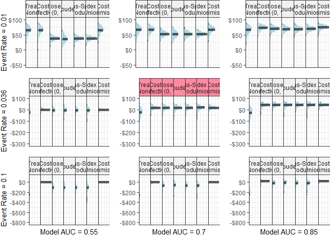
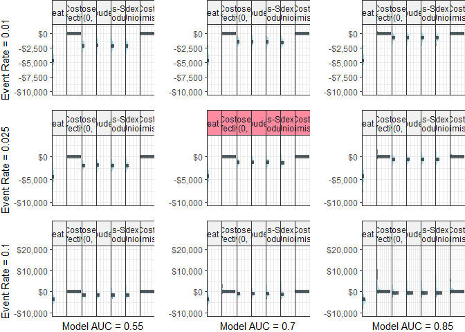

Analyses
================
08 September, 2022

Objective: evaluate the NMB associated with cutpoint methods, including
the cost-effective cutpoint which is our proposed method that finds the
cutpoint that maximises the NMB on the training set.

``` r
get_nmb <- function() {
  # WTP from Edney et al (2018), Pharmacoeconomics
  WTP <- params$global$WTP

  # treatment_effect taken from: Haines et al. (2010) Archives of Internal Medicine
  treatment_effect <- exp(rnorm(
    1,
    mean = params$falls$treatment_log_hazard$mean,
    sd = params$falls$treatment_log_hazard$sd
  ))

  # taken from abstract of Hill (2015), Lancet
  treatment_cost <- params$falls$treatment_cost

  # taken from Morello et al (2015). MJA

  falls_cost <-
    rgamma(
      1,
      params$falls$falls_cost$shape,
      params$falls$falls_cost$rate
    ) * params$falls$falls_cost$multiplier

  # taken from Latimer et al (2013) Age and Ageing
  fall_eff <- rbeta(
    1,
    params$falls$fall_decrement$shape1,
    params$falls$fall_decrement$shape2
  ) * 0.5 # Latimer conducted 6-month follow-up <- 0.5*utility = QALY

  c(
    "TN" = 0,
    "FN" = -falls_cost - fall_eff * WTP,
    "TP" = -falls_cost * (1 - treatment_effect) - treatment_cost - fall_eff * WTP,
    "FP" = -treatment_cost
  )
}
get_nmb()
```

    ##        TN        FN        TP        FP 
    ##     0.000 -7561.858 -3645.071  -100.859

``` r
# the same as get_nmb for falls but returns only the point estimates.
get_nmb_est <- function() {
  WTP <- params$global$WTP

  # treatment_effect taken from: Haines et al. (2010) Archives of Internal Medicine
  treatment_effect <- exp(params$falls$treatment_log_hazard$mean)

  # taken from abstract of Haines (2010), BMC Medicine
  treatment_cost <- params$falls$treatment_cost

  # taken from Morello et al (2015). MJA

  falls_cost <- 6669 * params$falls$falls_cost$multiplier

  # taken from Latimer et al (2013) Age and Ageing
  fall_eff <- 0.04206168 * 0.5 # Latimer conducted 6-month follow-up <- 0.5*utility = QALY

  c(
    "TN" = 0,
    "FN" = -falls_cost - fall_eff * WTP,
    "TP" = -falls_cost * (1 - treatment_effect) - treatment_cost - fall_eff * WTP,
    "FP" = -treatment_cost
  )
}
```

``` r
get_nmb_ICU <- function() {
  WTP <- params$global$WTP

  # Treatment effect taken from de Vos et al (2022), Value in Health
  eff_disch <- rbeta(
    1,
    params$icu$ward_eff$shape1,
    params$icu$ward_eff$shape2
  ) * params$icu$ward_eff$multiplier

  # ICU occupancy cost taken from Hicks et al (2019), MJA
  ICU_cost <- rgamma(
    1,
    params$icu$icu_cost$shape,
    params$icu$icu_cost$rate
  ) * params$icu$icu_cost$multiplier

  # Opportunity cost taken from Page et al (2017), BMC HSR
  ICU_opp_cost <- params$icu$opp_cost

  # ICU readmission LOS taken from Chen et al (1998), Crit Care Med
  ICU_readmit <- rgamma(
    1,
    params$icu$icu_readmit_los$shape,
    params$icu$icu_readmit_los$rate,
  )

  c(
    "TN" = eff_disch * WTP,
    "FN" = eff_disch * WTP - ICU_readmit * ICU_cost,
    "TP" = -ICU_cost,
    "FP" = -ICU_cost - ICU_opp_cost
  )
}
get_nmb_ICU()
```

    ##           TN           FN           TP           FP 
    ##     34.69451 -42916.31986  -4537.10721  -5042.55070

``` r
# Repeat point estimate replacement for ICU
get_nmb_est_ICU <- function() {
  WTP <- params$global$WTP

  # Treatment effect taken from de Vos et al (2022), Value in Health
  eff_disch <- 0.42

  # ICU occupancy cost taken from Hicks et al (2019), MJA
  ICU_cost <- 4375 * params$icu$icu_cost$multiplier

  # Opportunity cost taken from Page et al (2017), BMC HSR
  ICU_opp_cost <- params$icu$opp_cost

  # ICU readmission LOS taken from Chen et al (2021), World Journal of Surgery
  ICU_readmit <- 7.8

  c(
    "TN" = eff_disch * WTP,
    "FN" = eff_disch * WTP - unname(ICU_readmit) * ICU_cost,
    "TP" = -ICU_cost,
    "FP" = -ICU_cost - ICU_opp_cost
  )
}
```

### Run simulation

``` r
do_simulation <- function(sample_size, n_sims, n_valid, sim_auc, event_rate,
                          fx_costs_training, fx_costs_evaluation,
                          intercept_adjustment = 0, return_calibration_plot = F,
                          seed = 42, ...) {
  if (!is.null(seed)) set.seed(seed)
  if (missing(sample_size)) {
    pmsamp <- pmsampsize::pmsampsize(
      type = "b",
      cstatistic = sim_auc,
      parameters = 1,
      prevalence = event_rate
    )
    sample_size <- pmsamp$sample_size
    min_events <- pmsamp$events
    check_events <- TRUE
  } else {
    check_events <- FALSE
  }
  if (return_calibration_plot) {
    p_calibration <- ggplot() +
      geom_abline()
  }

  i <- 0
  while (i < n_sims) {
    train_sample <- get_sample(auc = sim_auc, n_samples = sample_size, prevalence = event_rate)
    valid_sample <- get_sample(auc = sim_auc, n_samples = n_valid, prevalence = event_rate)
    if (length(unique(train_sample$actual)) != 2 | length(unique(valid_sample$actual)) != 2) {
      next
    }
    if (check_events) {
      if (sum(train_sample$actual) < min_events) {
        next
      }
    }
    i <- i + 1
    model <- glm(actual ~ predicted, data = train_sample, family = binomial())

    if (intercept_adjustment != 0) {
      train_log_odds <- predict(model) + intercept_adjustment
      train_sample$predicted <- exp(train_log_odds) / (1 + exp(train_log_odds))

      valid_log_odds <- predict(model, newdata = valid_sample) + intercept_adjustment
      valid_sample$predicted <- exp(valid_log_odds) / (1 + exp(valid_log_odds))
    } else {
      train_sample$predicted <- predict(model, type = "response")
      valid_sample$predicted <- predict(model, type = "response", newdata = valid_sample)
    }

    if (return_calibration_plot) {
      df_calplot <- train_sample %>%
        mutate(bin = ntile(predicted, 10)) %>%
        group_by(bin) %>%
        summarize(
          n = n(),
          bin_pred = mean(predicted),
          bin_prob = mean(actual),
          se = sqrt((bin_prob * (1 - bin_prob)) / n),
          ul = bin_prob + 1.96 * se,
          ll = bin_prob - 1.96 * se
        ) %>%
        ungroup()

      # p_calibration <- p_calibration + geom_pointrange(data=df_calplot, aes(x=bin_pred, y=bin_prob, ymin=ll, ymax=ul), alpha=0.2)
      p_calibration <- p_calibration + geom_line(data = df_calplot, aes(x = bin_pred, y = bin_prob), alpha = 0.2)
      p_calibration <- p_calibration + geom_point(data = df_calplot, aes(x = bin_pred, y = bin_prob), alpha = 0.2)
    }

    training_value_vector <- fx_costs_training()

    thresholds <- get_thresholds(
      predicted = train_sample$predicted,
      actual = train_sample$actual,
      costs = training_value_vector
    )

    evaluation_value_vector <- fx_costs_evaluation()

    cost_threshold <- function(pt) {
      classify_samples(
        predicted = valid_sample$predicted,
        actual = valid_sample$actual,
        pt = pt,
        costs = evaluation_value_vector
      )
    }

    results_i <-
      unlist(thresholds) %>%
      map_dbl(cost_threshold) %>%
      t()
    thresholds_i <- unlist(thresholds)
    if (i == 1) {
      df_result <- results_i
      df_thresholds <- thresholds_i
    } else {
      df_result <- rbind(df_result, results_i)
      df_thresholds <- rbind(df_thresholds, thresholds_i)
    }
  } # end simulation loop

  df_result <- as.data.frame.matrix(df_result)
  df_thresholds <- as.data.frame.matrix(df_thresholds)
  rownames(df_thresholds) <- NULL

  df_result <- add_column(df_result, n_sim = 1:nrow(df_result), .before = T)
  df_thresholds <- add_column(df_thresholds, n_sim = 1:nrow(df_thresholds), .before = T)

  res <- list(
    date_time = Sys.time(),
    df_result = df_result,
    df_thresholds = df_thresholds,
    # calibration_plot=p_calibration,
    meta_data = list(
      sample_size = sample_size,
      n_sims = n_sims,
      n_valid = n_valid,
      sim_auc = sim_auc,
      event_rate = event_rate,
      fx_costs_training = fx_costs_training,
      fx_costs_evaluation = fx_costs_evaluation
    )
  )

  if (return_calibration_plot) {
    p_calibration <-
      p_calibration +
      theme_bw() +
      labs(
        x = "Predicted Probability",
        y = "Observed Probability"
      )
    res <- append(res, list(calibration_plot = p_calibration))
  }

  res
}


# x <- do_simulation(
#   # sample_size=500,
#   n_sims=100, n_valid=1000, sim_auc=0.6, event_rate=0.01,
#   # fx_costs_training=get_nmb_est_ICU, fx_costs_evaluation=get_nmb_ICU,
#   fx_costs_training=get_nmb_est, fx_costs_evaluation=get_nmb,
#   plot_type = "histogram",
#   scale=1
# )


# x$df_result %>%
#   plot_fw_histogram(hdi=F, plot_labels=labs(x="Net Monetary Benefit (AUD)\n", y=""))
```

``` r
cfg <- list(
  n_sim = 500,
  n_valid = 10000,
  sim_auc = 0.7,
  event_rate = 0.036
)
if (do_new_analyses | !file.exists("output/calibration_experiment/calibration_simulations.rds")) {
  x_calibrated <-
    do_simulation(
      n_sims = cfg$n_sim, n_valid = cfg$n_valid, sim_auc = cfg$sim_auc, event_rate = cfg$event_rate,
      fx_costs_training = get_nmb_est, fx_costs_evaluation = get_nmb,
      intercept_adjustment = 0, return_calibration_plot = T
    )

  x_adjusted_up <-
    do_simulation(
      n_sims = cfg$n_sim, n_valid = cfg$n_valid, sim_auc = cfg$sim_auc, event_rate = cfg$event_rate,
      fx_costs_training = get_nmb_est, fx_costs_evaluation = get_nmb,
      intercept_adjustment = 1, return_calibration_plot = T
    )

  x_adjusted_down <-
    do_simulation(
      n_sims = cfg$n_sim, n_valid = cfg$n_valid, sim_auc = cfg$sim_auc, event_rate = cfg$event_rate,
      fx_costs_training = get_nmb_est, fx_costs_evaluation = get_nmb,
      intercept_adjustment = -1, return_calibration_plot = T
    )

  x_adjusted_up2 <-
    do_simulation(
      n_sims = cfg$n_sim, n_valid = cfg$n_valid, sim_auc = cfg$sim_auc, event_rate = cfg$event_rate,
      fx_costs_training = get_nmb_est, fx_costs_evaluation = get_nmb,
      intercept_adjustment = 2, return_calibration_plot = T
    )

  x_adjusted_down2 <-
    do_simulation(
      n_sims = cfg$n_sim, n_valid = cfg$n_valid, sim_auc = cfg$sim_auc, event_rate = cfg$event_rate,
      fx_costs_training = get_nmb_est, fx_costs_evaluation = get_nmb,
      intercept_adjustment = -2, return_calibration_plot = T
    )

  calibration_experiment_list <- list(
    up2 = x_adjusted_up2,
    up1 = x_adjusted_up,
    calibrated = x_calibrated,
    down1 = x_adjusted_down,
    down2 = x_adjusted_down2
  )

  saveRDS(calibration_experiment_list, "output/calibration_experiment/calibration_simulations.rds")
}

calibration_experiment_list <- readRDS("output/calibration_experiment/calibration_simulations.rds")

cols_rename <- c(
  "Treat All" = "treat_all",
  "Treat None" = "treat_none",
  "Cost- effective" = "cost_effective",
  "Closest to (0, 1)" = "er",
  "Youden" = "youden",
  "Sens-Spec product" = "cz",
  "Index of Union" = "iu",
  "Cost- Minimising" = "cost_minimising"
)


inb_plots <- get_plot_list(
  out_list = calibration_experiment_list,
  rename_vector = cols_rename,
  inb_ref_col = "Treat All",
  get_what = "inb",
  agg_line_size = 1
  # extra_theme=theme(panel.spacing  = unit(0, "lines")) # comment this line out to keep default spacing between facets
)

calibration_plots <- get_plot_list(
  out_list = calibration_experiment_list,
  get_what = "calibration"
)

inb_plots <- keep_only_first_plot_strip(inb_plots)

# test the ggplot below to find the extra rel-height for the first plot (with strips)
# ggsave(
#   plot=cowplot::plot_grid(plotlist=inb_plots, ncol=1, rel_heights = c(0.375, rep(0.3, length(inb_plots)-1))),
#   filename="output/calibration_experiment/inb_plots.jpeg",
#   height=10.5, width=14)
# inb_cowplot <- cowplot::plot_grid(plotlist=inb_plots, ncol=1)

inb_cowplot <- cowplot::plot_grid(plotlist = inb_plots, ncol = 1, rel_heights = c(0.375, rep(0.3, length(inb_plots) - 1)))


# cowplot::plot_grid(plotlist=calibration_plots, ncol=1)

calibration_cowplot <- plot_grid(
  plotlist = c(list(NULL), calibration_plots),
  ncol = 1,
  rel_heights = c(0.075, rep(0.3, length(calibration_plots)))
)

# calibration_cowplot <- plot_grid(plotlist=calibration_plots, ncol=1)
combined_fig <- plot_grid(inb_cowplot, calibration_cowplot, ncol = 2, rel_widths = c(0.6, 0.25))

if (save_plots) {
  ggsave(filename = "output/calibration_experiment/calibration_plots.jpeg", plot = combined_fig, dpi = 600, height = 8, width = 7.3)
}
```

# Primary analyses

``` r
if (do_new_analyses | !file.exists("output/primary_analyses/falls_primary_analyses.rds")) {
  falls_simulation <-
    do_simulation(
      n_sims = 5000, n_valid = 10000, sim_auc = 0.7, event_rate = 0.036,
      fx_costs_training = get_nmb_est, fx_costs_evaluation = get_nmb
    )
  saveRDS(falls_simulation, "output/primary_analyses/falls_primary_analyses.rds")
}
falls_simulation <- readRDS("output/primary_analyses/falls_primary_analyses.rds")

if (do_new_analyses | !file.exists("output/primary_analyses/falls_primary_analyses.rds")) {
  icu_simulation <-
    do_simulation(
      n_sims = 5000, n_valid = 10000, sim_auc = 0.7, event_rate = 0.01,
      fx_costs_training = get_nmb_est_ICU, fx_costs_evaluation = get_nmb_ICU
    )
  saveRDS(icu_simulation, "output/primary_analyses/icu_primary_analyses.rds")
}
icu_simulation <- readRDS("output/primary_analyses/icu_primary_analyses.rds")
```

## Plots with most realistic AUC and event rate for each use-case

``` r
cols_rename <- c(
  "Treat All" = "treat_all",
  "Treat None" = "treat_none",
  "Cost- effective" = "cost_effective",
  "Closest to (0, 1)" = "er",
  "Youden" = "youden",
  "Sens-Spec product" = "cz",
  "Index of Union" = "iu",
  "Cost- Minimising" = "cost_minimising"
)

PA_CFG <- list(agg_line_size = 1)

p_falls_nmb <-
  falls_simulation$df_result %>%
  # select(-cost_minimising) %>%
  rename(any_of(cols_rename)) %>%
  plot_fw_histogram(
    hdi = F,
    plot_labels = labs(x = "Incremental Net Monetary Benefit (AUD)\n", y = ""),
    inb_ref_col = "Treat All",
    agg_line_size = PA_CFG$agg_line_size
  )


p_falls_cutpoints <-
  falls_simulation$df_thresholds %>%
  select(-treat_all, -treat_none) %>%
  # select(-cost_minimising) %>%
  rename(., any_of(cols_rename)) %>%
  plot_fw_histogram(
    hdi = F,
    plot_labels = labs(x = "Selected cutpoint\n", y = ""),
    dollar_format = F,
    agg_line_size = PA_CFG$agg_line_size
  )


p_icu_nmb <-
  icu_simulation$df_result %>%
  rename(any_of(cols_rename)) %>%
  plot_fw_histogram(
    hdi = F,
    plot_labels = labs(x = "Incremental Net Monetary Benefit (AUD)\n", y = ""),
    inb_ref_col = "Treat None",
    agg_line_size = PA_CFG$agg_line_size
  )

p_icu_cutpoints <-
  icu_simulation$df_thresholds %>%
  select(-treat_all, -treat_none) %>%
  rename(., any_of(cols_rename)) %>%
  plot_fw_histogram(
    hdi = F,
    plot_labels = labs(x = "Selected cutpoint\n", y = ""),
    dollar_format = F,
    agg_line_size = PA_CFG$agg_line_size
  )


plot_grid(
  plotlist = list(
    p_icu_nmb, p_falls_nmb,
    p_icu_cutpoints, p_falls_cutpoints
  ),
  labels = LETTERS[1:4],
  ncol = 2
)
```

<!-- -->

``` r
if (save_plots) {
  ggsave(filename = "output/primary_analyses/primary_results.jpeg", dpi = 600, height = 7, width = 11)
}
```

## Table with most realistic AUC and event rate for each use-case

``` r
falls_summary <- do.call(
  get_summary,
  c(
    falls_simulation$meta_data,
    list(
      data = falls_simulation$df_result, agg_fx = median, hdi = F, ci = 0.95,
      recode_methods_vector = cols_rename, inb_ref_col = "treat_all"
    )
  )
)

icu_summary <- do.call(
  get_summary,
  c(
    icu_simulation$meta_data,
    list(
      data = icu_simulation$df_result, agg_fx = median, hdi = F, ci = 0.95,
      recode_methods_vector = cols_rename, inb_ref_col = "treat_none"
    )
  )
)

# primary_analyses_table
primary_analyses_table <-
  rbind(icu_summary, falls_summary) %>%
  select(
    "Cutpoint method" = method,
    "Incremental Net Monetary Benefit (AUD)" = summary,
    "Best performing [n (%)]" = n_best_percent
  ) %>%
  formattable() %>%
  kable(
    escape = F,
    caption = glue::glue("Incremental Net Monetary Benefit presented as median [{percent(0.95, digits=0)} Intervals]")
  ) %>%
  pack_rows(
    index = c(
      "ICU readmission (reference group: Treat None)" = nrow(icu_summary),
      "Inpatient falls (reference group: Treat All)" = nrow(falls_summary)
    )
  ) %>%
  kable_styling() %>%
  save_kable(file = "output/primary_analyses/primary_analyses.html")


# primary analyses for deliverable (falls only and remove cost-minimising cutpoint method)
do.call(
  get_summary,
  c(
    falls_simulation$meta_data,
    list(
      data = select(falls_simulation$df_result, -cost_minimising), agg_fx = median, hdi = F, ci = 0.95,
      recode_methods_vector = cols_rename, inb_ref_col = "treat_all"
    )
  )
) %>%
  select(
    "Cutpoint method" = method,
    "Incremental Net Monetary Benefit (AUD)" = summary,
    "Best performing [n (%)]" = n_best_percent
  ) %>%
  formattable() %>%
  kable(
    escape = F,
    caption = glue::glue("Incremental Net Monetary Benefit presented as median [{percent(0.95, digits=0)} Intervals]")
  ) %>%
  kable_styling() %>%
  save_kable(file = "output/primary_analyses/primary_results_falls-only_for-deliverables.html")
```

``` r
simulation_config <- list(
  n_sims = 5000,
  n_valid = 10000
)

g_falls <- expand.grid(
  sim_auc = c(0.55, 0.7, 0.85),
  event_rate = c(0.01, 0.036, 0.1)
  # sim_auc=c(0.7),
  # event_rate=seq(0.01, 0.075, 0.005)
)

g_icu <- expand.grid(
  sim_auc = c(0.55, 0.7, 0.85),
  event_rate = c(0.01, 0.025, 0.1)
)

if (do_new_analyses | !file.exists("output/sensitivity_analyses/falls_sensitivity_analyses.rds")) {
  n_cluster <- detectCores() - 2
  cl <- makeCluster(n_cluster)
  cl <- parallelly::autoStopCluster(cl)

  clusterExport(cl, {
    c("do_simulation", "g_falls", "g_icu", "get_nmb", "get_nmb_est", "get_nmb_ICU", "get_nmb_est_ICU", "params", "simulation_config")
  })

  invisible(clusterEvalQ(cl, {
    library(tidyverse)
    library(data.table)
    library(ggridges)
    library(bayestestR)
    library(cutpointr)
    source("src/utils.R")
    source("src/cutpoint_methods.R")
    source("src/summary.R")
  }))


  ll_falls <- parLapply(
    cl,
    1:nrow(g_falls),
    function(i) {
      do.call(
        do_simulation,
        c(
          simulation_config,
          list(
            sim_auc = g_falls$sim_auc[i],
            event_rate = g_falls$event_rate[i],
            fx_costs_training = get_nmb_est,
            fx_costs_evaluation = get_nmb
          )
        )
      )
    }
  )

  saveRDS(ll_falls, "output/sensitivity_analyses/falls_sensitivity_analyses.rds")
}

if (do_new_analyses | !file.exists("output/sensitivity_analyses/falls_sensitivity_analyses.rds")) {
  n_cluster <- detectCores() - 2
  cl <- makeCluster(n_cluster)
  cl <- parallelly::autoStopCluster(cl)

  clusterExport(cl, {
    c("do_simulation", "g_falls", "g_icu", "get_nmb", "get_nmb_est", "get_nmb_ICU", "get_nmb_est_ICU", "params", "simulation_config")
  })

  invisible(clusterEvalQ(cl, {
    library(tidyverse)
    library(data.table)
    library(ggridges)
    library(bayestestR)
    library(cutpointr)
    source("src/utils.R")
    source("src/cutpoint_methods.R")
    source("src/summary.R")
  }))

  ll_icu <- parLapply(
    cl,
    1:nrow(g_icu),
    function(i) {
      do.call(
        do_simulation,
        c(
          simulation_config,
          list(
            sim_auc = g_icu$sim_auc[i],
            event_rate = g_icu$event_rate[i],
            fx_costs_training = get_nmb_est_ICU,
            fx_costs_evaluation = get_nmb_ICU
          )
        )
      )
    }
  )

  saveRDS(ll_icu, "output/sensitivity_analyses/icu_sensitivity_analyses.rds")
}


# save specific screen for falls across event rates
# saveRDS(ll_falls, "output/sensitivity_analyses/falls_sensitivity_analyses2.rds")

# load simulation results
ll_falls <- readRDS("output/sensitivity_analyses/falls_sensitivity_analyses.rds")
ll_icu <- readRDS("output/sensitivity_analyses/icu_sensitivity_analyses.rds")
```

``` r
falls_inb_plots <- get_plot_list(
  ll_falls, cols_rename,
  get_what = "inb",
  inb_ref_col = "Treat All", groups_remove = "Cost- Minimising"
)

falls_cp_plots <- get_plot_list(ll_falls, cols_rename, get_what = "cutpoints")

plot_grid(
  plotlist = c(falls_inb_plots, falls_cp_plots),
  nrow = 2,
  labels = rep(g_falls$event_rate, 2)
)
```

<!-- -->

``` r
if (save_plots) {
  ggsave(filename = "output/sensitivity_analyses/falls_simulations_inb_for-deliverables_sanity-check.jpeg", height = 10, width = 45)
}
```

# save plots from sensitivity analyses

``` r
# FALLS
falls_inb_plots <- get_plot_list(
  ll_falls, cols_rename,
  get_what = "inb", inb_ref_col = "Treat All",
  groups_remove = "Cost- Minimising", only_show_interval = T
)

# add labels to left most graphs for event rate
event_rate_str <- function(rate) glue::glue("Event Rate = {rate}")
model_auc_str <- function(auc) glue::glue("Model AUC = {auc}")

falls_inb_plots[[1]] <- falls_inb_plots[[1]] + xlab(event_rate_str(g_falls$event_rate[1]))
falls_inb_plots[[4]] <- falls_inb_plots[[4]] + xlab(event_rate_str(g_falls$event_rate[4]))
falls_inb_plots[[7]] <- falls_inb_plots[[7]] + xlab(event_rate_str(g_falls$event_rate[7]))

falls_inb_plots[[7]] <- falls_inb_plots[[7]] + ylab(model_auc_str(g_falls$sim_auc[7]))
falls_inb_plots[[8]] <- falls_inb_plots[[8]] + ylab(model_auc_str(g_falls$sim_auc[8]))
falls_inb_plots[[9]] <- falls_inb_plots[[9]] + ylab(model_auc_str(g_falls$sim_auc[9]))

for (i in 1:length(falls_inb_plots)) {
  falls_inb_plots[[i]] <- falls_inb_plots[[i]] +
    theme(
      plot.margin = unit(c(0, 0, 0, 0), "cm"),
      # panel.grid.major.x = element_blank(),
      # panel.grid.minor.x = element_blank()
    )
}

# add border to primary analyses within panels
falls_inb_plots[[5]] <-
  falls_inb_plots[[5]] +
  theme(
    strip.background = element_rect(fill = "#ff8ba0")
  )

plot_grid(
  plotlist = falls_inb_plots,
  ncol = length(unique(g_falls$sim_auc))
)
```

<!-- -->

``` r
if (save_plots) {
  ggsave(filename = "output/sensitivity_analyses/falls_simulations_inb.jpeg", height = 24 * 0.5, width = 15)
}


# ICU discharge
icu_inb_plots <- get_plot_list(ll_icu, cols_rename, get_what = "inb", inb_ref_col = "Treat None")

icu_inb_plots[[1]] <- icu_inb_plots[[1]] + xlab(event_rate_str(g_icu$event_rate[1]))
icu_inb_plots[[4]] <- icu_inb_plots[[4]] + xlab(event_rate_str(g_icu$event_rate[4]))
icu_inb_plots[[7]] <- icu_inb_plots[[7]] + xlab(event_rate_str(g_icu$event_rate[7]))

icu_inb_plots[[7]] <- icu_inb_plots[[7]] + ylab(model_auc_str(g_icu$sim_auc[7]))
icu_inb_plots[[8]] <- icu_inb_plots[[8]] + ylab(model_auc_str(g_icu$sim_auc[8]))
icu_inb_plots[[9]] <- icu_inb_plots[[9]] + ylab(model_auc_str(g_icu$sim_auc[9]))

for (i in 1:length(icu_inb_plots)) {
  icu_inb_plots[[i]] <- icu_inb_plots[[i]] +
    theme(
      plot.margin = unit(c(0, 0, 0, 0), "cm"),
      # panel.grid.major.x = element_blank(),
      # panel.grid.minor.x = element_blank()
    )
}

# add border to primary analyses within panels
icu_inb_plots[[5]] <-
  icu_inb_plots[[5]] +
  theme(
    strip.background = element_rect(fill = "#ff8ba0")
  )


plot_grid(
  plotlist = icu_inb_plots,
  ncol = length(unique(g_icu$sim_auc))
)
```

<!-- -->

``` r
if (save_plots) {
  ggsave(filename = "output/sensitivity_analyses/icu_simulations_inb.jpeg", height = 24 * 0.5, width = 15)
}
```

``` r
# save selected cutpoints plots
# cowplot::plot_grid(
#   plotlist=get_plot_list(ll_falls, cols_rename, get_what="cutpoints"),
#   ncol=length(unique(g_falls$sim_auc))
# )
# ggsave(filename="output/falls_simulations_thresholds.jpeg", height=24, width=12)
#
# cowplot::plot_grid(
#   plotlist=get_plot_list(ll_icu, cols_rename, get_what="cutpoints"),
#   ncol=length(unique(g_icu$sim_auc))
# )
# ggsave(filename="output/icu_simulations_thresholds.jpeg", height=24, width=12)
```

``` r
make_table(
  ll_falls,
  get_what = "inb", rename_vector = cols_rename,
  save_path = "output/sensitivity_analyses/falls_inb_summary.html",
  inb_ref_col = "Treat All"
)
```

<table class="table" style="margin-left: auto; margin-right: auto;">
<caption>
Data presented as median \[95% Intervals\]
</caption>
<thead>
<tr>
<th style="text-align:right;">
Rate
</th>
<th style="text-align:right;">
Model AUC
</th>
<th style="text-align:left;">
Treat None
</th>
<th style="text-align:left;">
Cost- effective
</th>
<th style="text-align:left;">
Closest to (0, 1)
</th>
<th style="text-align:left;">
Youden
</th>
<th style="text-align:left;">
Sens-Spec product
</th>
<th style="text-align:left;">
Index of Union
</th>
<th style="text-align:left;">
Cost- Minimising
</th>
</tr>
</thead>
<tbody>
<tr>
<td style="text-align:right;">
0.010
</td>
<td style="text-align:right;">
0.55
</td>
<td style="text-align:left;">
<b>66.64 \[28.85, 85.03\]</b>
</td>
<td style="text-align:left;">
66.56 \[26.74, 84.85\]
</td>
<td style="text-align:left;">
38.14 \[19.58, 49.93\]
</td>
<td style="text-align:left;">
36.78 \[13.23, 61.66\]
</td>
<td style="text-align:left;">
38.09 \[19.56, 50.25\]
</td>
<td style="text-align:left;">
38.2 \[19.36, 47.79\]
</td>
<td style="text-align:left;">
<b>66.64 \[28.85, 85.03\]</b>
</td>
</tr>
<tr>
<td style="text-align:right;">
0.010
</td>
<td style="text-align:right;">
0.70
</td>
<td style="text-align:left;">
66.17 \[29.76, 84.84\]
</td>
<td style="text-align:left;">
65.91 \[35.08, 82.36\]
</td>
<td style="text-align:left;">
53.02 \[36.71, 67.89\]
</td>
<td style="text-align:left;">
51.92 \[28.35, 71.78\]
</td>
<td style="text-align:left;">
52.66 \[35.76, 69.2\]
</td>
<td style="text-align:left;">
52.8 \[37.48, 64.78\]
</td>
<td style="text-align:left;">
<b>66.91 \[36.41, 82.28\]</b>
</td>
</tr>
<tr>
<td style="text-align:right;">
0.010
</td>
<td style="text-align:right;">
0.85
</td>
<td style="text-align:left;">
66.46 \[27.25, 84.85\]
</td>
<td style="text-align:left;">
73.46 \[53.26, 85.02\]
</td>
<td style="text-align:left;">
70.33 \[53.59, 82.78\]
</td>
<td style="text-align:left;">
69.43 \[46.21, 83.03\]
</td>
<td style="text-align:left;">
69.72 \[51.12, 83.01\]
</td>
<td style="text-align:left;">
70.18 \[55.4, 81.89\]
</td>
<td style="text-align:left;">
<b>75.08 \[57.25, 84.07\]</b>
</td>
</tr>
<tr>
<td style="text-align:right;">
0.036
</td>
<td style="text-align:right;">
0.55
</td>
<td style="text-align:left;">
-23.1 \[-159.33, 41.73\]
</td>
<td style="text-align:left;">
<b>0.58 \[-18.96, 10.51\]</b>
</td>
<td style="text-align:left;">
-3.7 \[-68.21, 26.81\]
</td>
<td style="text-align:left;">
-3.11 \[-75.68, 27.86\]
</td>
<td style="text-align:left;">
-3.64 \[-68.21, 26.83\]
</td>
<td style="text-align:left;">
-3.54 \[-67.53, 26.55\]
</td>
<td style="text-align:left;">
0.38 \[-10.23, 7.29\]
</td>
</tr>
<tr>
<td style="text-align:right;">
0.036
</td>
<td style="text-align:right;">
0.70
</td>
<td style="text-align:left;">
-22.51 \[-165.15, 41.2\]
</td>
<td style="text-align:left;">
16.99 \[-18.35, 39.56\]
</td>
<td style="text-align:left;">
18.94 \[-40.95, 44\]
</td>
<td style="text-align:left;">
18.29 \[-47.46, 43.57\]
</td>
<td style="text-align:left;">
18.87 \[-42.01, 43.89\]
</td>
<td style="text-align:left;">
<b>19.35 \[-35.49, 43.89\]</b>
</td>
<td style="text-align:left;">
17.47 \[-7.5, 35.81\]
</td>
</tr>
<tr>
<td style="text-align:right;">
0.036
</td>
<td style="text-align:right;">
0.85
</td>
<td style="text-align:left;">
-23.02 \[-157.34, 41.78\]
</td>
<td style="text-align:left;">
42.02 \[-1.88, 60.41\]
</td>
<td style="text-align:left;">
43.57 \[-17.04, 62.1\]
</td>
<td style="text-align:left;">
42.54 \[-18.59, 61.7\]
</td>
<td style="text-align:left;">
43.17 \[-17.15, 61.74\]
</td>
<td style="text-align:left;">
<b>44.17 \[-8.95, 62.46\]</b>
</td>
<td style="text-align:left;">
42.97 \[16.23, 59.11\]
</td>
</tr>
<tr>
<td style="text-align:right;">
0.100
</td>
<td style="text-align:right;">
0.55
</td>
<td style="text-align:left;">
-242.87 \[-629.7, -63.56\]
</td>
<td style="text-align:left;">
-0.34 \[-5.69, 0.35\]
</td>
<td style="text-align:left;">
-107.34 \[-291.67, -23.35\]
</td>
<td style="text-align:left;">
-101.19 \[-328.57, -15.91\]
</td>
<td style="text-align:left;">
-106.92 \[-291.59, -23.33\]
</td>
<td style="text-align:left;">
-106.6 \[-290.75, -22.7\]
</td>
<td style="text-align:left;">
<b>0 \[0, 0\]</b>
</td>
</tr>
<tr>
<td style="text-align:right;">
0.100
</td>
<td style="text-align:right;">
0.70
</td>
<td style="text-align:left;">
-245.64 \[-623.22, -66.09\]
</td>
<td style="text-align:left;">
0.18 \[-56.15, 8.78\]
</td>
<td style="text-align:left;">
-65.68 \[-234.03, 3.53\]
</td>
<td style="text-align:left;">
-63.23 \[-268.58, 5.52\]
</td>
<td style="text-align:left;">
-65.07 \[-241.82, 3.72\]
</td>
<td style="text-align:left;">
-63.96 \[-217.75, 3.23\]
</td>
<td style="text-align:left;">
<b>0.58 \[-15.3, 6.25\]</b>
</td>
</tr>
<tr>
<td style="text-align:right;">
0.100
</td>
<td style="text-align:right;">
0.85
</td>
<td style="text-align:left;">
-240.78 \[-615.1, -60.32\]
</td>
<td style="text-align:left;">
17.48 \[-46.14, 34.54\]
</td>
<td style="text-align:left;">
-13.43 \[-136.99, 34.07\]
</td>
<td style="text-align:left;">
-10.9 \[-159.74, 35.06\]
</td>
<td style="text-align:left;">
-12.15 \[-150.49, 34.67\]
</td>
<td style="text-align:left;">
-12.84 \[-133.4, 34.8\]
</td>
<td style="text-align:left;">
<b>19.15 \[-4.82, 32.53\]</b>
</td>
</tr>
</tbody>
</table>

``` r
make_table(
  ll_falls,
  get_what = "cutpoints", rename_vector = cols_rename,
  save_path = "output/sensitivity_analyses/falls_thresholds_summary.html"
)
```

<table class="table" style="margin-left: auto; margin-right: auto;">
<caption>
Data presented as median \[95% Intervals\]
</caption>
<thead>
<tr>
<th style="text-align:right;">
Rate
</th>
<th style="text-align:right;">
Model AUC
</th>
<th style="text-align:left;">
Cost- effective
</th>
<th style="text-align:left;">
Closest to (0, 1)
</th>
<th style="text-align:left;">
Youden
</th>
<th style="text-align:left;">
Sens-Spec product
</th>
<th style="text-align:left;">
Index of Union
</th>
<th style="text-align:left;">
Cost- Minimising
</th>
</tr>
</thead>
<tbody>
<tr>
<td style="text-align:right;">
0.010
</td>
<td style="text-align:right;">
0.55
</td>
<td style="text-align:left;">
0.02 \[0.01, 1\]
</td>
<td style="text-align:left;">
0.01 \[0.01, 0.01\]
</td>
<td style="text-align:left;">
0.01 \[0.01, 0.01\]
</td>
<td style="text-align:left;">
0.01 \[0.01, 0.01\]
</td>
<td style="text-align:left;">
0.01 \[0.01, 0.01\]
</td>
<td style="text-align:left;">
0.03 \[0.03, 0.03\]
</td>
</tr>
<tr>
<td style="text-align:right;">
0.010
</td>
<td style="text-align:right;">
0.70
</td>
<td style="text-align:left;">
0.03 \[0.02, 1\]
</td>
<td style="text-align:left;">
0.01 \[0.01, 0.02\]
</td>
<td style="text-align:left;">
0.01 \[0.01, 0.02\]
</td>
<td style="text-align:left;">
0.01 \[0.01, 0.02\]
</td>
<td style="text-align:left;">
0.01 \[0.01, 0.02\]
</td>
<td style="text-align:left;">
0.03 \[0.03, 0.03\]
</td>
</tr>
<tr>
<td style="text-align:right;">
0.010
</td>
<td style="text-align:right;">
0.85
</td>
<td style="text-align:left;">
0.03 \[0.01, 0.16\]
</td>
<td style="text-align:left;">
0.02 \[0.01, 0.07\]
</td>
<td style="text-align:left;">
0.02 \[0.01, 0.08\]
</td>
<td style="text-align:left;">
0.02 \[0.01, 0.07\]
</td>
<td style="text-align:left;">
0.02 \[0.01, 0.04\]
</td>
<td style="text-align:left;">
0.03 \[0.03, 0.03\]
</td>
</tr>
<tr>
<td style="text-align:right;">
0.036
</td>
<td style="text-align:right;">
0.55
</td>
<td style="text-align:left;">
0.03 \[0.02, 0.03\]
</td>
<td style="text-align:left;">
0.04 \[0.04, 0.04\]
</td>
<td style="text-align:left;">
0.04 \[0.03, 0.04\]
</td>
<td style="text-align:left;">
0.04 \[0.04, 0.04\]
</td>
<td style="text-align:left;">
0.04 \[0.04, 0.04\]
</td>
<td style="text-align:left;">
0.03 \[0.03, 0.03\]
</td>
</tr>
<tr>
<td style="text-align:right;">
0.036
</td>
<td style="text-align:right;">
0.70
</td>
<td style="text-align:left;">
0.03 \[0.02, 0.06\]
</td>
<td style="text-align:left;">
0.05 \[0.03, 0.07\]
</td>
<td style="text-align:left;">
0.04 \[0.03, 0.08\]
</td>
<td style="text-align:left;">
0.05 \[0.03, 0.07\]
</td>
<td style="text-align:left;">
0.04 \[0.03, 0.06\]
</td>
<td style="text-align:left;">
0.03 \[0.03, 0.03\]
</td>
</tr>
<tr>
<td style="text-align:right;">
0.036
</td>
<td style="text-align:right;">
0.85
</td>
<td style="text-align:left;">
0.04 \[0.01, 0.16\]
</td>
<td style="text-align:left;">
0.06 \[0.03, 0.2\]
</td>
<td style="text-align:left;">
0.05 \[0.02, 0.22\]
</td>
<td style="text-align:left;">
0.06 \[0.02, 0.21\]
</td>
<td style="text-align:left;">
0.06 \[0.03, 0.14\]
</td>
<td style="text-align:left;">
0.03 \[0.03, 0.03\]
</td>
</tr>
<tr>
<td style="text-align:right;">
0.100
</td>
<td style="text-align:right;">
0.55
</td>
<td style="text-align:left;">
0.07 \[0.05, 0.09\]
</td>
<td style="text-align:left;">
0.1 \[0.1, 0.11\]
</td>
<td style="text-align:left;">
0.1 \[0.09, 0.12\]
</td>
<td style="text-align:left;">
0.1 \[0.1, 0.11\]
</td>
<td style="text-align:left;">
0.1 \[0.1, 0.11\]
</td>
<td style="text-align:left;">
0.03 \[0.03, 0.03\]
</td>
</tr>
<tr>
<td style="text-align:right;">
0.100
</td>
<td style="text-align:right;">
0.70
</td>
<td style="text-align:left;">
0.05 \[0.02, 0.09\]
</td>
<td style="text-align:left;">
0.12 \[0.09, 0.18\]
</td>
<td style="text-align:left;">
0.12 \[0.07, 0.22\]
</td>
<td style="text-align:left;">
0.12 \[0.08, 0.19\]
</td>
<td style="text-align:left;">
0.12 \[0.09, 0.16\]
</td>
<td style="text-align:left;">
0.03 \[0.03, 0.03\]
</td>
</tr>
<tr>
<td style="text-align:right;">
0.100
</td>
<td style="text-align:right;">
0.85
</td>
<td style="text-align:left;">
0.04 \[0.01, 0.11\]
</td>
<td style="text-align:left;">
0.13 \[0.08, 0.24\]
</td>
<td style="text-align:left;">
0.13 \[0.06, 0.29\]
</td>
<td style="text-align:left;">
0.13 \[0.06, 0.27\]
</td>
<td style="text-align:left;">
0.13 \[0.08, 0.22\]
</td>
<td style="text-align:left;">
0.03 \[0.03, 0.03\]
</td>
</tr>
</tbody>
</table>

``` r
make_table(
  ll_icu,
  get_what = "inb", rename_vector = cols_rename,
  save_path = "output/sensitivity_analyses/icu_inb_summary.html",
  inb_ref_col = "Treat None"
)
```

<table class="table" style="margin-left: auto; margin-right: auto;">
<caption>
Data presented as median \[95% Intervals\]
</caption>
<thead>
<tr>
<th style="text-align:right;">
Rate
</th>
<th style="text-align:right;">
Model AUC
</th>
<th style="text-align:left;">
Treat All
</th>
<th style="text-align:left;">
Cost- effective
</th>
<th style="text-align:left;">
Closest to (0, 1)
</th>
<th style="text-align:left;">
Youden
</th>
<th style="text-align:left;">
Sens-Spec product
</th>
<th style="text-align:left;">
Index of Union
</th>
<th style="text-align:left;">
Cost- Minimising
</th>
</tr>
</thead>
<tbody>
<tr>
<td style="text-align:right;">
0.010
</td>
<td style="text-align:right;">
0.55
</td>
<td style="text-align:left;">
-4615.44 \[-7487.39, -2420.84\]
</td>
<td style="text-align:left;">
<b>0 \[0, 0\]</b>
</td>
<td style="text-align:left;">
-2087.34 \[-3486.81, -996.13\]
</td>
<td style="text-align:left;">
-2030.77 \[-4334.36, -581.38\]
</td>
<td style="text-align:left;">
-2080.48 \[-3501.57, -986.17\]
</td>
<td style="text-align:left;">
-2117.9 \[-3451.6, -1006.2\]
</td>
<td style="text-align:left;">
<b>0 \[0, 0\]</b>
</td>
</tr>
<tr>
<td style="text-align:right;">
0.010
</td>
<td style="text-align:right;">
0.70
</td>
<td style="text-align:left;">
-4569.82 \[-7623.74, -2392.13\]
</td>
<td style="text-align:left;">
<b>0 \[-7.63, 0.75\]</b>
</td>
<td style="text-align:left;">
-1407.9 \[-2856.25, -275.69\]
</td>
<td style="text-align:left;">
-1422.81 \[-3587.2, -163.87\]
</td>
<td style="text-align:left;">
-1401.64 \[-3029.28, -263.68\]
</td>
<td style="text-align:left;">
-1471.23 \[-2743.43, -385.56\]
</td>
<td style="text-align:left;">
<b>0 \[0, 0\]</b>
</td>
</tr>
<tr>
<td style="text-align:right;">
0.010
</td>
<td style="text-align:right;">
0.85
</td>
<td style="text-align:left;">
-4612.39 \[-7523.78, -2291.01\]
</td>
<td style="text-align:left;">
<b>0 \[-45.65, 116.07\]</b>
</td>
<td style="text-align:left;">
-692.42 \[-2046.12, 495.31\]
</td>
<td style="text-align:left;">
-748.35 \[-2567.06, 463.09\]
</td>
<td style="text-align:left;">
-738.81 \[-2247.23, 477.24\]
</td>
<td style="text-align:left;">
-730.38 \[-1981.76, 489.4\]
</td>
<td style="text-align:left;">
<b>0 \[-19.4, 81.67\]</b>
</td>
</tr>
<tr>
<td style="text-align:right;">
0.025
</td>
<td style="text-align:right;">
0.55
</td>
<td style="text-align:left;">
-4289.28 \[-7433.23, 273.15\]
</td>
<td style="text-align:left;">
<b>0 \[-1.11, 0\]</b>
</td>
<td style="text-align:left;">
-1921.98 \[-3482.53, 437.88\]
</td>
<td style="text-align:left;">
-1833.33 \[-4172.02, 391.19\]
</td>
<td style="text-align:left;">
-1915.11 \[-3489.29, 437.88\]
</td>
<td style="text-align:left;">
-1955.95 \[-3443.9, 437.89\]
</td>
<td style="text-align:left;">
<b>0 \[0, 0\]</b>
</td>
</tr>
<tr>
<td style="text-align:right;">
0.025
</td>
<td style="text-align:right;">
0.70
</td>
<td style="text-align:left;">
-4306.53 \[-7291.83, -53.44\]
</td>
<td style="text-align:left;">
<b>0 \[-31.29, 37.13\]</b>
</td>
<td style="text-align:left;">
-1272.14 \[-2756.71, 1416.6\]
</td>
<td style="text-align:left;">
-1245.97 \[-3453.16, 1364.71\]
</td>
<td style="text-align:left;">
-1264.76 \[-2880.8, 1411.74\]
</td>
<td style="text-align:left;">
-1334.24 \[-2682.23, 1416.15\]
</td>
<td style="text-align:left;">
<b>0 \[-2, 3.05\]</b>
</td>
</tr>
<tr>
<td style="text-align:right;">
0.025
</td>
<td style="text-align:right;">
0.85
</td>
<td style="text-align:left;">
-4248.57 \[-7362.38, -19.89\]
</td>
<td style="text-align:left;">
<b>0 \[-140.03, 739.01\]</b>
</td>
<td style="text-align:left;">
-566.65 \[-2074.23, 2388.71\]
</td>
<td style="text-align:left;">
-600.96 \[-2486.98, 2375.84\]
</td>
<td style="text-align:left;">
-592.64 \[-2294.39, 2384.99\]
</td>
<td style="text-align:left;">
-610.89 \[-1966.6, 2433.76\]
</td>
<td style="text-align:left;">
<b>0 \[-79.76, 563.72\]</b>
</td>
</tr>
<tr>
<td style="text-align:right;">
0.100
</td>
<td style="text-align:right;">
0.55
</td>
<td style="text-align:left;">
-3331.3 \[-6938.47, 15256.6\]
</td>
<td style="text-align:left;">
<b>0 \[-7.95, 11.75\]</b>
</td>
<td style="text-align:left;">
-1475.34 \[-3256.01, 8410.12\]
</td>
<td style="text-align:left;">
-1258.72 \[-4037.63, 8584.33\]
</td>
<td style="text-align:left;">
-1467.74 \[-3284.63, 8408.7\]
</td>
<td style="text-align:left;">
-1511.98 \[-3261.83, 8470.24\]
</td>
<td style="text-align:left;">
<b>0 \[0, 0\]</b>
</td>
</tr>
<tr>
<td style="text-align:right;">
0.100
</td>
<td style="text-align:right;">
0.70
</td>
<td style="text-align:left;">
-3347.11 \[-7006.44, 15704.94\]
</td>
<td style="text-align:left;">
<b>0 \[-262.44, 1377.23\]</b>
</td>
<td style="text-align:left;">
-891.16 \[-2767.25, 11454.76\]
</td>
<td style="text-align:left;">
-785.79 \[-3324.72, 11453.78\]
</td>
<td style="text-align:left;">
-866.95 \[-2873.58, 11374.15\]
</td>
<td style="text-align:left;">
-951.33 \[-2698.67, 11677.66\]
</td>
<td style="text-align:left;">
<b>0 \[-116.76, 669.05\]</b>
</td>
</tr>
<tr>
<td style="text-align:right;">
0.100
</td>
<td style="text-align:right;">
0.85
</td>
<td style="text-align:left;">
-3384.09 \[-6965.12, 16311.93\]
</td>
<td style="text-align:left;">
30.26 \[-554.39, 6963.17\]
</td>
<td style="text-align:left;">
-404.75 \[-1990.46, 14634.44\]
</td>
<td style="text-align:left;">
-401.49 \[-2297.68, 14634.44\]
</td>
<td style="text-align:left;">
-401.79 \[-2120.46, 14660.18\]
</td>
<td style="text-align:left;">
-426.5 \[-1977.98, 14736.32\]
</td>
<td style="text-align:left;">
<b>54.45 \[-409.89, 6315.58\]</b>
</td>
</tr>
</tbody>
</table>

``` r
make_table(
  ll_icu,
  get_what = "cutpoints", rename_vector = cols_rename,
  save_path = "output/sensitivity_analyses/icu_thresholds_summary.html"
)
```

<table class="table" style="margin-left: auto; margin-right: auto;">
<caption>
Data presented as median \[95% Intervals\]
</caption>
<thead>
<tr>
<th style="text-align:right;">
Rate
</th>
<th style="text-align:right;">
Model AUC
</th>
<th style="text-align:left;">
Cost- effective
</th>
<th style="text-align:left;">
Closest to (0, 1)
</th>
<th style="text-align:left;">
Youden
</th>
<th style="text-align:left;">
Sens-Spec product
</th>
<th style="text-align:left;">
Index of Union
</th>
<th style="text-align:left;">
Cost- Minimising
</th>
</tr>
</thead>
<tbody>
<tr>
<td style="text-align:right;">
0.010
</td>
<td style="text-align:right;">
0.55
</td>
<td style="text-align:left;">
1 \[0.02, 1\]
</td>
<td style="text-align:left;">
0.01 \[0.01, 0.01\]
</td>
<td style="text-align:left;">
0.01 \[0.01, 0.01\]
</td>
<td style="text-align:left;">
0.01 \[0.01, 0.01\]
</td>
<td style="text-align:left;">
0.01 \[0.01, 0.01\]
</td>
<td style="text-align:left;">
0.47 \[0.47, 0.47\]
</td>
</tr>
<tr>
<td style="text-align:right;">
0.010
</td>
<td style="text-align:right;">
0.70
</td>
<td style="text-align:left;">
1 \[0.07, 1\]
</td>
<td style="text-align:left;">
0.01 \[0.01, 0.02\]
</td>
<td style="text-align:left;">
0.01 \[0.01, 0.02\]
</td>
<td style="text-align:left;">
0.01 \[0.01, 0.02\]
</td>
<td style="text-align:left;">
0.01 \[0.01, 0.02\]
</td>
<td style="text-align:left;">
0.47 \[0.47, 0.47\]
</td>
</tr>
<tr>
<td style="text-align:right;">
0.010
</td>
<td style="text-align:right;">
0.85
</td>
<td style="text-align:left;">
0.64 \[0.13, 1\]
</td>
<td style="text-align:left;">
0.02 \[0.01, 0.06\]
</td>
<td style="text-align:left;">
0.02 \[0.01, 0.07\]
</td>
<td style="text-align:left;">
0.02 \[0.01, 0.07\]
</td>
<td style="text-align:left;">
0.02 \[0.01, 0.04\]
</td>
<td style="text-align:left;">
0.47 \[0.47, 0.47\]
</td>
</tr>
<tr>
<td style="text-align:right;">
0.025
</td>
<td style="text-align:right;">
0.55
</td>
<td style="text-align:left;">
1 \[0.04, 1\]
</td>
<td style="text-align:left;">
0.03 \[0.02, 0.03\]
</td>
<td style="text-align:left;">
0.03 \[0.02, 0.03\]
</td>
<td style="text-align:left;">
0.03 \[0.02, 0.03\]
</td>
<td style="text-align:left;">
0.03 \[0.02, 0.03\]
</td>
<td style="text-align:left;">
0.47 \[0.47, 0.47\]
</td>
</tr>
<tr>
<td style="text-align:right;">
0.025
</td>
<td style="text-align:right;">
0.70
</td>
<td style="text-align:left;">
1 \[0.1, 1\]
</td>
<td style="text-align:left;">
0.03 \[0.02, 0.05\]
</td>
<td style="text-align:left;">
0.03 \[0.02, 0.06\]
</td>
<td style="text-align:left;">
0.03 \[0.02, 0.05\]
</td>
<td style="text-align:left;">
0.03 \[0.02, 0.04\]
</td>
<td style="text-align:left;">
0.47 \[0.47, 0.47\]
</td>
</tr>
<tr>
<td style="text-align:right;">
0.025
</td>
<td style="text-align:right;">
0.85
</td>
<td style="text-align:left;">
0.48 \[0.16, 1\]
</td>
<td style="text-align:left;">
0.04 \[0.02, 0.16\]
</td>
<td style="text-align:left;">
0.04 \[0.01, 0.17\]
</td>
<td style="text-align:left;">
0.04 \[0.02, 0.16\]
</td>
<td style="text-align:left;">
0.04 \[0.02, 0.1\]
</td>
<td style="text-align:left;">
0.47 \[0.47, 0.47\]
</td>
</tr>
<tr>
<td style="text-align:right;">
0.100
</td>
<td style="text-align:right;">
0.55
</td>
<td style="text-align:left;">
1 \[0.14, 1\]
</td>
<td style="text-align:left;">
0.1 \[0.1, 0.11\]
</td>
<td style="text-align:left;">
0.1 \[0.09, 0.12\]
</td>
<td style="text-align:left;">
0.1 \[0.1, 0.11\]
</td>
<td style="text-align:left;">
0.1 \[0.1, 0.11\]
</td>
<td style="text-align:left;">
0.47 \[0.47, 0.47\]
</td>
</tr>
<tr>
<td style="text-align:right;">
0.100
</td>
<td style="text-align:right;">
0.70
</td>
<td style="text-align:left;">
0.41 \[0.22, 1\]
</td>
<td style="text-align:left;">
0.12 \[0.09, 0.18\]
</td>
<td style="text-align:left;">
0.12 \[0.07, 0.21\]
</td>
<td style="text-align:left;">
0.12 \[0.08, 0.19\]
</td>
<td style="text-align:left;">
0.12 \[0.09, 0.16\]
</td>
<td style="text-align:left;">
0.47 \[0.47, 0.47\]
</td>
</tr>
<tr>
<td style="text-align:right;">
0.100
</td>
<td style="text-align:right;">
0.85
</td>
<td style="text-align:left;">
0.46 \[0.26, 0.78\]
</td>
<td style="text-align:left;">
0.13 \[0.08, 0.24\]
</td>
<td style="text-align:left;">
0.13 \[0.05, 0.3\]
</td>
<td style="text-align:left;">
0.13 \[0.06, 0.26\]
</td>
<td style="text-align:left;">
0.13 \[0.08, 0.22\]
</td>
<td style="text-align:left;">
0.47 \[0.47, 0.47\]
</td>
</tr>
</tbody>
</table>
