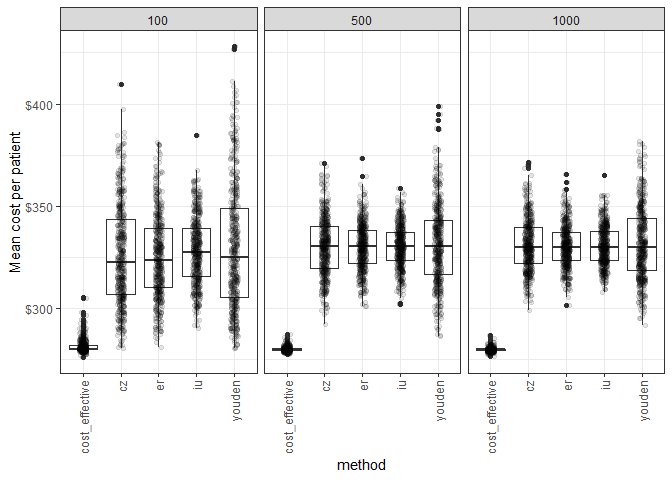
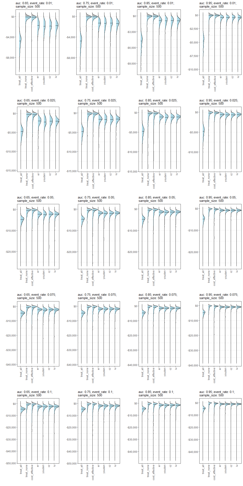
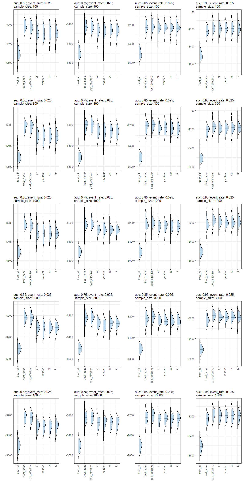
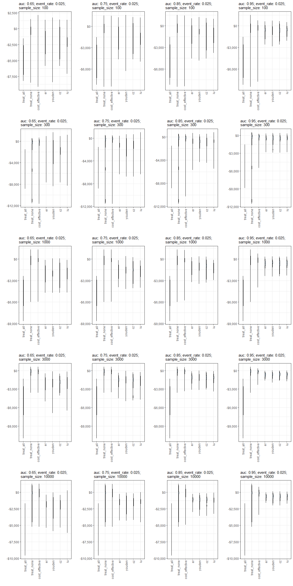

Experiment 1
================
21 April, 2022

Question: What are the differences in NMB between models where the
Probability threshold was based on the currently available methods
versus costs-based selection. (Hospital falls as a use case.)

1.  Define costs of a TP, TN, FP, FN of falls classification (option to
    move this into the loop where costs are sampled from a distributions
    to account for uncertainty in their estimates in the literature)
      - FP have cost of applying intervention
      - FN have cost of patient fall
      - TP have cost of intervention + cost of fall\*(1-effectiveness of
        intervention on rate of falls)
      - TN are cost $0
2.  Select appropriate ranges for model AUC (\~0.75?) and prevalence
    (\~3%) for comparable clinical prediction model for falls.
3.  For sample sizes (N) in \[100, 500, 1000\]: (repeat 500 times at
    each sample size)
      - Get training data by sampling observed predictor values and
        outcome by transforming AUC into Cohens’ D and sampling from two
        normal distributions, the first (negative events) with mean=0
        and the second (positive events) with mean=Cohens’D. (Both with
        sd=1.)
      - Fit a logistic regression model using this sampled data.
      - Fit predicted probabilities to the training data and use these
        to obtain probability thresholds using each method.
      - Get validation data using the same approach but with n=1000.
      - Use the previously fit model to estimate probabilities for
        validation data.
      - Evaluate the thresholds selected using the training data on the
        validation data, in terms of mean cost per patient.
4.  Measure differences in NMB on validation sample dependent on use of
    currently available methods and cost-based approach to determine
    threshold.
5.  Observe whether this relationship is dependent on the sample size
    taken
6.  ???

<!-- end list -->

``` r
get_nmb <- function(){
  # WTP from Edney et al (2018), Pharmacoeconomics
  WTP <- params$global$WTP
  
  # treatment_effect taken from: Haines et al. (2010) Archives of Internal Medicine
  treatment_effect <- exp(rnorm(
    1, 
    mean=params$falls$treatment_log_hazard$mean,
    sd=params$falls$treatment_log_hazard$sd
  ))
  
  # taken from abstract of Haines (2010), BMC Medicine
  treatment_cost <- params$falls$treatment_cost
  
  # taken from Morello et al (2015). MJA
  
  falls_cost <- 
    rgamma(
      1, 
      params$falls$falls_cost$shape, 
      params$falls$falls_cost$rate
    ) * params$falls$falls_cost$multiplier
  
  #taken from Latimer et al (2013) Age and Ageing
  fall_eff <- rbeta(
    1,
    params$falls$fall_decrement$shape1,
    params$falls$fall_decrement$shape2
  ) * 0.5 #Latimer conducted 6-month follow-up <- 0.5*utility = QALY
    
  c(
    "TN"=0,
    "FN"=-falls_cost - fall_eff*WTP,
    "TP"=-falls_cost*(1-treatment_effect) - treatment_cost - fall_eff*WTP,
    "FP"=-treatment_cost
  )
}
get_nmb()
```

    ##         TN         FN         TP         FP 
    ##     0.0000 -9107.6463 -5978.8682  -383.6033

``` r
# the same as get_nmb for falls but returns only the point estimates.
get_nmb_est <- function() {
  WTP <- params$global$WTP
  
  # treatment_effect taken from: Haines et al. (2010) Archives of Internal Medicine
  treatment_effect <- exp(params$falls$treatment_log_hazard$mean)
  
  # taken from abstract of Haines (2010), BMC Medicine
  treatment_cost <- params$falls$treatment_cost
  
  # taken from Morello et al (2015). MJA
  
  falls_cost <- 6669 * params$falls$falls_cost$multiplier
  
  #taken from Latimer et al (2013) Age and Ageing
  fall_eff <- 0.04206168 * 0.5 #Latimer conducted 6-month follow-up <- 0.5*utility = QALY
    
  c(
    "TN"=0,
    "FN"=-falls_cost - fall_eff*WTP,
    "TP"=-falls_cost*(1-treatment_effect) - treatment_cost - fall_eff*WTP,
    "FP"=-treatment_cost
  )
}
```

``` r
get_nmb_ICU <- function(){
  
  WTP <- params$global$WTP

  # Treatment effect taken from de Vos et al (2022), Value in Health
  eff_disch <- rbeta(
    1,
    params$icu$ward_eff$shape1,
    params$icu$ward_eff$shape2
  ) * params$icu$ward_eff$multiplier
  
  # ICU occupancy cost taken from Hicks et al (2019), MJA
  ICU_cost <- rgamma(
    1, 
    params$icu$icu_cost$shape,
    params$icu$icu_cost$rate
  ) * params$icu$icu_cost$multiplier
  
  # Opportunity cost taken from Page et al (2017), BMC HSR
  ICU_opp_cost <- params$icu$opp_cost
  
  # ICU readmission LOS taken from Chen et al (1998), Crit Care Med
  ICU_readmit <- rgamma(
    1, 
    params$icu$icu_readmit_los$shape,
    params$icu$icu_readmit_los$rate,
  )
  
  c(
    "TN"=eff_disch*WTP,
    "FN"=eff_disch*WTP - ICU_readmit*ICU_cost,
    "TP"=-ICU_cost,
    "FP"=-ICU_cost - ICU_opp_cost
  )
}
get_nmb_ICU()
```

    ##          TN          FN          TP          FP 
    ##    34.68588 -7618.72730 -4214.68081 -4720.12431

``` r
# Repeat point estimate replacement for ICU
get_nmb_est_ICU <- function() {
  WTP <- params$global$WTP
  
  # Treatment effect taken from de Vos et al (2022), Value in Health
  eff_disch <- 0.42
  
  # ICU occupancy cost taken from Hicks et al (2019), MJA
  ICU_cost <- 4375*params$icu$icu_cost$multiplier
  
   # Opportunity cost taken from Page et al (2017), BMC HSR
  ICU_opp_cost <- params$icu$opp_cost
  
  # ICU readmission LOS taken from Chen et al (2021), World Journal of Surgery
  ICU_readmit <- 7.8
    
  c(
    "TN"=eff_disch*WTP,
    "FN"=eff_disch*WTP - unname(ICU_readmit)*ICU_cost,
    "TP"=-ICU_cost,
    "FP"=-ICU_cost - ICU_opp_cost
  )
}
```

### Run simulation

``` r
do_simulation <- function(sample_size, n_sims, n_valid, sim_auc, event_rate, 
                          fx_costs_training, fx_costs_evaluation,
                          return_summary=T, return_data=T, return_plot=T,
                          plot_type="boxplot", 
                          scale=60, use_hdi=TRUE, hdi_prob=0.9,
                          seed=42){
  
  if(!is.null(seed)) set.seed(seed)
  
  i <- 0
  while(i < n_sims){
    train_sample <- get_sample(auc=sim_auc, n_samples=sample_size, prevalence=event_rate)
    valid_sample <- get_sample(auc=sim_auc, n_samples=n_valid, prevalence=event_rate)
    if(length(unique(train_sample$actual))!=2 | length(unique(valid_sample$actual))!=2){
      next
    }
    i <- i + 1
    model <- glm(actual~predicted, data=train_sample, family=binomial())
    train_sample$predicted <- predict(model, type="response")

    
    valid_sample$predicted <- predict(model, type="response", newdata=valid_sample)
    
    training_value_vector <- fx_costs_training()
    
    thresholds <- get_thresholds(
      predicted=train_sample$predicted, 
      actual=train_sample$actual,
      costs=training_value_vector
    )
    
    evaluation_value_vector <- fx_costs_evaluation()
    
    cost_threshold <- function(pt){
      classify_samples(
        predicted=valid_sample$predicted,
        actual=valid_sample$actual,
        pt=pt,
        costs=evaluation_value_vector
      )
    }
    
    results_i <-
      unlist(thresholds) %>%
      map_dbl(cost_threshold) %>%
      t()
    thresholds_i <- unlist(thresholds)
    if(i==1){
      df_result <- results_i
      df_thresholds <- thresholds_i
    } else {
      df_result <- rbind(df_result, results_i)
      df_thresholds <- rbind(df_thresholds, thresholds_i)
    }
  }
  
  df_result <- as.data.frame.matrix(df_result)
  df_thresholds <- as.data.frame.matrix(df_thresholds)
  rownames(df_thresholds) <- NULL
  
  df_result <- add_column(df_result, n_sim=1:nrow(df_result), .before=T)
  df_thresholds <- add_column(df_thresholds, n_sim=1:nrow(df_thresholds), .before=T)
  
  pts <- round(colMeans(df_thresholds)[-1], 3)
  df_plot <- df_result
  names(df_plot)[-1] <- method_levels <- paste0(names(df_plot)[-1], "(", pts, ")")
  
  res <- list()
  
  if(return_plot){
    sub <- glue::glue("auc: {sim_auc}; event_rate: {event_rate};\nsample_size: {sample_size}")
    if(plot_type=="boxplot"){
      p <- get_boxplot(data=df_plot, ordered_methods=method_levels, subtitle=sub)
    } else if(plot_type=="point"){
      p <- get_errorbar_plot(data=df_plot, ordered_methods=method_levels, subtitle=sub)
    } else if(plot_type=="density") {
      p <- plot_density_ridge(
        select(df_result, -n_sim), FUN='hdi', scale=scale, subtitle=sub,
        factor_levels=names(select(df_result, -n_sim))
      ) 
    }
    res <- c(res, list(plot=p))
  }
  
  if(return_summary){
    df_summary <- get_summary(
      data=df_result, hdi_prob=hdi_prob, use_hdi=use_hdi,
      sample_size=sample_size, n_sims=n_sims,
      n_valid=n_valid, sim_auc=sim_auc,
      event_rate=event_rate
    )
    res <- c(res, list(summary=df_summary))
  }
  
  if(return_data){
    res <- c(res, list(data=df_result))
  }
  res
}

# x <- do_simulation(
#   sample_size=500, n_sims=50, n_valid=1000, sim_auc=0.8, event_rate=0.025,
#   fx_costs_training=get_nmb_est, fx_costs_evaluation=get_nmb,
#   plot_type = "density",
#   scale=60
# )
# x
```

## search through a grid of combinations of AUC and event rates to see how this influences the differences between probability threshold methods. The same costs were used in all simulations (distributions at top of document) and are resampled separately for training and validation.

#### In the plot below, the columns, from left to right, have increasing AUC. The rows, from top to bottom, have increasing event rates.

### My hot takes:

#### Probability threshold selection method becomes increasingly important as the AUC of the model and the event rate reduces.

#### I think that this is because, for models with very high discrimination, they’re able to correctly classify a larger proportion of samples, and there are fewer which are classified differently based on selection method. The difference is greater for smaller event rates because a false negative is the most costly classification, and only the cost-based method is “aware” of this. This is also why, when the event rate is very high, there is not much of a difference between methods (cost-based method is focused on correctly classifying the majority class but so are the other methods).

``` r
simulation_config <- list(
  training_sample_size = 500,
  n_simulations = 200,
  validation_sample_size = 1000
)
library(parallel)
n_cluster <- detectCores()
cl <- makeCluster(n_cluster)
cl <- parallelly::autoStopCluster(cl)

g <- expand.grid(
  sim_auc=c(0.65, 0.75, 0.85, 0.95),
  event_rate=c(0.01, 0.025, 0.05, 0.075, 0.1)
)

clusterExport(cl, {
  c("do_simulation", "g", "get_nmb", "get_nmb_est", "get_nmb_ICU", "get_nmb_est_ICU", "params", "simulation_config")
})

invisible(clusterEvalQ(cl, {
  library(tidyverse)
  library(data.table)
  library(ggridges)
  library(bayestestR)
  library(cutpointr)
  source("src/utils.R")
  source("src/cutpoint_methods.R")
  source("src/summary.R")
}))


ll1 <- parallel::parLapply(
  cl,
  1:nrow(g),
  function(i) do_simulation(
    sample_size=simulation_config$training_sample_size,
    n_sims=simulation_config$n_simulations,
    n_valid=simulation_config$validation_sample_size,
    sim_auc=g$sim_auc[i], event_rate=g$event_rate[i],
    return_data=F, return_plot=T, return_summary=T,
    fx_costs_training=get_nmb_est, fx_costs_evaluation=get_nmb,
    plot_type="density", scale=60
  )
)

ll2 <- parallel::parLapply(
  cl,
  1:nrow(g),
  function(i) do_simulation(
    sample_size=simulation_config$training_sample_size,
    n_sims=simulation_config$n_simulations,
    n_valid=simulation_config$validation_sample_size,
    sim_auc=g$sim_auc[i], event_rate=g$event_rate[i],
    return_data=F, return_plot=T, return_summary=T,
    fx_costs_training=get_nmb_est_ICU, fx_costs_evaluation=get_nmb_ICU,
    plot_type="density", scale=400
  )
)

cowplot::plot_grid(plotlist=extract_plots(ll1), ncol=length(unique(g$sim_auc)))
```

<!-- -->

``` r
cowplot::plot_grid(plotlist=extract_plots(ll2), ncol=length(unique(g$sim_auc)))
```

<!-- -->

``` r
library(kableExtra)
```

    ## 
    ## Attaching package: 'kableExtra'

    ## The following object is masked from 'package:dplyr':
    ## 
    ##     group_rows

``` r
library(formattable)
```

    ## 
    ## Attaching package: 'formattable'

    ## The following object is masked from 'package:MASS':
    ## 
    ##     area

``` r
df_summaries <- rbindlist(extract_summaries(ll1)) %>%
  group_by(sample_size, n_sims, n_valid, sim_auc, event_rate)  %>%
  mutate(.group_id=cur_group_id()) %>%
  ungroup()

df_summaries %>%
  select(-sample_size, -n_sims, -n_valid, -.group_id) %>%
  select(event_rate, sim_auc, everything()) %>%
  pivot_wider(names_from="method", values_from="summary") %>% 
  formattable() %>%
  kable_styling() 
```

<table class="table table-condensed">

<thead>

<tr>

<th style="text-align:right;">

event\_rate

</th>

<th style="text-align:right;">

sim\_auc

</th>

<th style="text-align:right;">

treat\_all

</th>

<th style="text-align:right;">

treat\_none

</th>

<th style="text-align:right;">

cost\_effective

</th>

<th style="text-align:right;">

er

</th>

<th style="text-align:right;">

youden

</th>

<th style="text-align:right;">

cz

</th>

<th style="text-align:right;">

iu

</th>

</tr>

</thead>

<tbody>

<tr>

<td style="text-align:right;">

0.010

</td>

<td style="text-align:right;">

0.65

</td>

<td style="text-align:right;">

\-432.26 \[90% HDI:-467.8, -402.11\]

</td>

<td style="text-align:right;">

<b>-81.09 \[90% HDI:-132.59, -40.61\]</br>

</td>

<td style="text-align:right;">

\-87.62 \[90% HDI:-408.37, -36.81\]

</td>

<td style="text-align:right;">

\-182.02 \[90% HDI:-288.8, -102.01\]

</td>

<td style="text-align:right;">

\-200.43 \[90% HDI:-316.25, -85.05\]

</td>

<td style="text-align:right;">

\-198.73 \[90% HDI:-300.15, -111.09\]

</td>

<td style="text-align:right;">

\-164.85 \[90% HDI:-299.04, -63.73\]

</td>

</tr>

<tr>

<td style="text-align:right;">

0.010

</td>

<td style="text-align:right;">

0.75

</td>

<td style="text-align:right;">

\-432.26 \[90% HDI:-467.8, -402.11\]

</td>

<td style="text-align:right;">

<b>-81.09 \[90% HDI:-132.59, -40.61\]</br>

</td>

<td style="text-align:right;">

\-82.57 \[90% HDI:-139.09, -46.48\]

</td>

<td style="text-align:right;">

\-161.36 \[90% HDI:-231.73, -78.23\]

</td>

<td style="text-align:right;">

\-162.99 \[90% HDI:-254.93, -77.84\]

</td>

<td style="text-align:right;">

\-162.44 \[90% HDI:-236.36, -77.2\]

</td>

<td style="text-align:right;">

\-148.75 \[90% HDI:-233.48, -59.89\]

</td>

</tr>

<tr>

<td style="text-align:right;">

0.010

</td>

<td style="text-align:right;">

0.85

</td>

<td style="text-align:right;">

\-432.26 \[90% HDI:-467.8, -402.11\]

</td>

<td style="text-align:right;">

\-81.09 \[90% HDI:-132.59, -40.61\]

</td>

<td style="text-align:right;">

<b>-80.75 \[90% HDI:-129.93, -43.31\]</br>

</td>

<td style="text-align:right;">

\-128.58 \[90% HDI:-191.1, -66.23\]

</td>

<td style="text-align:right;">

\-135.18 \[90% HDI:-208.11, -62.78\]

</td>

<td style="text-align:right;">

\-130.4 \[90% HDI:-190.91, -56.49\]

</td>

<td style="text-align:right;">

\-124.33 \[90% HDI:-188.04, -58.02\]

</td>

</tr>

<tr>

<td style="text-align:right;">

0.010

</td>

<td style="text-align:right;">

0.95

</td>

<td style="text-align:right;">

\-432.26 \[90% HDI:-467.8, -402.11\]

</td>

<td style="text-align:right;">

\-81.09 \[90% HDI:-132.59, -40.61\]

</td>

<td style="text-align:right;">

<b>-73.65 \[90% HDI:-118.92, -39.95\]</br>

</td>

<td style="text-align:right;">

\-90.95 \[90% HDI:-148.7, -49.9\]

</td>

<td style="text-align:right;">

\-90.67 \[90% HDI:-149.96, -46.34\]

</td>

<td style="text-align:right;">

\-90.67 \[90% HDI:-149.96, -46.34\]

</td>

<td style="text-align:right;">

\-89.12 \[90% HDI:-135.16, -43.06\]

</td>

</tr>

<tr>

<td style="text-align:right;">

0.025

</td>

<td style="text-align:right;">

0.65

</td>

<td style="text-align:right;">

\-508.74 \[90% HDI:-592.63, -443.23\]

</td>

<td style="text-align:right;">

<b>-211.09 \[90% HDI:-320.14, -126.64\]</br>

</td>

<td style="text-align:right;">

\-215.95 \[90% HDI:-334.04, -112.47\]

</td>

<td style="text-align:right;">

\-302.48 \[90% HDI:-404.87, -215.82\]

</td>

<td style="text-align:right;">

\-313.56 \[90% HDI:-434.48, -201.86\]

</td>

<td style="text-align:right;">

\-308.24 \[90% HDI:-404.87, -214.66\]

</td>

<td style="text-align:right;">

\-307.97 \[90% HDI:-418.89, -218.65\]

</td>

</tr>

<tr>

<td style="text-align:right;">

0.025

</td>

<td style="text-align:right;">

0.75

</td>

<td style="text-align:right;">

\-508.74 \[90% HDI:-592.63, -443.23\]

</td>

<td style="text-align:right;">

<b>-211.09 \[90% HDI:-320.14, -126.64\]</br>

</td>

<td style="text-align:right;">

\-211.98 \[90% HDI:-324.88, -130.72\]

</td>

<td style="text-align:right;">

\-272.23 \[90% HDI:-368.58, -188.69\]

</td>

<td style="text-align:right;">

\-279.32 \[90% HDI:-398.59, -185.51\]

</td>

<td style="text-align:right;">

\-272.7 \[90% HDI:-369.53, -190.12\]

</td>

<td style="text-align:right;">

\-271.9 \[90% HDI:-382.97, -201.07\]

</td>

</tr>

<tr>

<td style="text-align:right;">

0.025

</td>

<td style="text-align:right;">

0.85

</td>

<td style="text-align:right;">

\-508.74 \[90% HDI:-592.63, -443.23\]

</td>

<td style="text-align:right;">

\-211.09 \[90% HDI:-320.14, -126.64\]

</td>

<td style="text-align:right;">

<b>-195.7 \[90% HDI:-303.67, -131.18\]</br>

</td>

<td style="text-align:right;">

\-235.28 \[90% HDI:-323.5, -148.28\]

</td>

<td style="text-align:right;">

\-238.57 \[90% HDI:-333.8, -145.41\]

</td>

<td style="text-align:right;">

\-240.33 \[90% HDI:-326.23, -147.54\]

</td>

<td style="text-align:right;">

\-235.19 \[90% HDI:-319.27, -157.04\]

</td>

</tr>

<tr>

<td style="text-align:right;">

0.025

</td>

<td style="text-align:right;">

0.95

</td>

<td style="text-align:right;">

\-508.74 \[90% HDI:-592.63, -443.23\]

</td>

<td style="text-align:right;">

\-211.09 \[90% HDI:-320.14, -126.64\]

</td>

<td style="text-align:right;">

<b>-175.43 \[90% HDI:-262.74, -106\]</br>

</td>

<td style="text-align:right;">

\-187.76 \[90% HDI:-262.63, -110.78\]

</td>

<td style="text-align:right;">

\-194.92 \[90% HDI:-269.24, -111.26\]

</td>

<td style="text-align:right;">

\-190.6 \[90% HDI:-269.24, -111.26\]

</td>

<td style="text-align:right;">

\-188.16 \[90% HDI:-274.49, -112.75\]

</td>

</tr>

<tr>

<td style="text-align:right;">

0.050

</td>

<td style="text-align:right;">

0.65

</td>

<td style="text-align:right;">

\-642.1 \[90% HDI:-781.61, -506.49\]

</td>

<td style="text-align:right;">

\-427.71 \[90% HDI:-625.19, -282.26\]

</td>

<td style="text-align:right;">

<b>-424.55 \[90% HDI:-604.01, -274.76\]</br>

</td>

<td style="text-align:right;">

\-472.38 \[90% HDI:-631.55, -347.38\]

</td>

<td style="text-align:right;">

\-485.42 \[90% HDI:-644.82, -336.98\]

</td>

<td style="text-align:right;">

\-475.25 \[90% HDI:-627.85, -334.1\]

</td>

<td style="text-align:right;">

\-477.2 \[90% HDI:-631.72, -344.22\]

</td>

</tr>

<tr>

<td style="text-align:right;">

0.050

</td>

<td style="text-align:right;">

0.75

</td>

<td style="text-align:right;">

\-642.1 \[90% HDI:-781.61, -506.49\]

</td>

<td style="text-align:right;">

\-427.71 \[90% HDI:-625.19, -282.26\]

</td>

<td style="text-align:right;">

<b>-412.13 \[90% HDI:-593.58, -283.28\]</br>

</td>

<td style="text-align:right;">

\-437.56 \[90% HDI:-595.72, -308.39\]

</td>

<td style="text-align:right;">

\-442.3 \[90% HDI:-598.48, -301.34\]

</td>

<td style="text-align:right;">

\-437.81 \[90% HDI:-588.11, -305.92\]

</td>

<td style="text-align:right;">

\-436.01 \[90% HDI:-591.66, -301.73\]

</td>

</tr>

<tr>

<td style="text-align:right;">

0.050

</td>

<td style="text-align:right;">

0.85

</td>

<td style="text-align:right;">

\-642.1 \[90% HDI:-781.61, -506.49\]

</td>

<td style="text-align:right;">

\-427.71 \[90% HDI:-625.19, -282.26\]

</td>

<td style="text-align:right;">

<b>-380.01 \[90% HDI:-535.64, -248.18\]</br>

</td>

<td style="text-align:right;">

\-390.52 \[90% HDI:-535.49, -255.79\]

</td>

<td style="text-align:right;">

\-396.37 \[90% HDI:-539.05, -256.3\]

</td>

<td style="text-align:right;">

\-395.38 \[90% HDI:-535.11, -250.68\]

</td>

<td style="text-align:right;">

\-395.15 \[90% HDI:-537.41, -255.24\]

</td>

</tr>

<tr>

<td style="text-align:right;">

0.050

</td>

<td style="text-align:right;">

0.95

</td>

<td style="text-align:right;">

\-642.1 \[90% HDI:-781.61, -506.49\]

</td>

<td style="text-align:right;">

\-427.71 \[90% HDI:-625.19, -282.26\]

</td>

<td style="text-align:right;">

<b>-332.57 \[90% HDI:-489.85, -209.34\]</br>

</td>

<td style="text-align:right;">

\-338.87 \[90% HDI:-486.64, -207.87\]

</td>

<td style="text-align:right;">

\-342.98 \[90% HDI:-485.81, -212.56\]

</td>

<td style="text-align:right;">

\-339.21 \[90% HDI:-489.57, -212.56\]

</td>

<td style="text-align:right;">

\-335.03 \[90% HDI:-496.94, -214.86\]

</td>

</tr>

<tr>

<td style="text-align:right;">

0.075

</td>

<td style="text-align:right;">

0.65

</td>

<td style="text-align:right;">

\-770.34 \[90% HDI:-972.69, -596.97\]

</td>

<td style="text-align:right;">

\-635.5 \[90% HDI:-882.83, -430.23\]

</td>

<td style="text-align:right;">

<b>-629.1 \[90% HDI:-890.37, -470\]</br>

</td>

<td style="text-align:right;">

\-642.31 \[90% HDI:-859.76, -476.78\]

</td>

<td style="text-align:right;">

\-644.62 \[90% HDI:-853.74, -463.21\]

</td>

<td style="text-align:right;">

\-639.44 \[90% HDI:-859.8, -476.78\]

</td>

<td style="text-align:right;">

\-648.51 \[90% HDI:-858.01, -474.82\]

</td>

</tr>

<tr>

<td style="text-align:right;">

0.075

</td>

<td style="text-align:right;">

0.75

</td>

<td style="text-align:right;">

\-770.34 \[90% HDI:-972.69, -596.97\]

</td>

<td style="text-align:right;">

\-635.5 \[90% HDI:-882.83, -430.23\]

</td>

<td style="text-align:right;">

<b>-592.01 \[90% HDI:-804.82, -404.08\]</br>

</td>

<td style="text-align:right;">

\-599.55 \[90% HDI:-810.14, -425.73\]

</td>

<td style="text-align:right;">

\-600.39 \[90% HDI:-817.84, -431.98\]

</td>

<td style="text-align:right;">

\-598.5 \[90% HDI:-810.14, -426.16\]

</td>

<td style="text-align:right;">

\-603.42 \[90% HDI:-815.98, -432.93\]

</td>

</tr>

<tr>

<td style="text-align:right;">

0.075

</td>

<td style="text-align:right;">

0.85

</td>

<td style="text-align:right;">

\-770.34 \[90% HDI:-972.69, -596.97\]

</td>

<td style="text-align:right;">

\-635.5 \[90% HDI:-882.83, -430.23\]

</td>

<td style="text-align:right;">

<b>-544.01 \[90% HDI:-748.77, -371.45\]</br>

</td>

<td style="text-align:right;">

\-548.09 \[90% HDI:-761.36, -382.86\]

</td>

<td style="text-align:right;">

\-547.09 \[90% HDI:-760.6, -375.86\]

</td>

<td style="text-align:right;">

\-547.7 \[90% HDI:-760.6, -381.14\]

</td>

<td style="text-align:right;">

\-549.16 \[90% HDI:-770.31, -389.76\]

</td>

</tr>

<tr>

<td style="text-align:right;">

0.075

</td>

<td style="text-align:right;">

0.95

</td>

<td style="text-align:right;">

\-770.34 \[90% HDI:-972.69, -596.97\]

</td>

<td style="text-align:right;">

\-635.5 \[90% HDI:-882.83, -430.23\]

</td>

<td style="text-align:right;">

\-488.36 \[90% HDI:-694.91, -313.35\]

</td>

<td style="text-align:right;">

\-486.38 \[90% HDI:-696.71, -313.09\]

</td>

<td style="text-align:right;">

\-486.18 \[90% HDI:-696.71, -314.29\]

</td>

<td style="text-align:right;">

\-486.18 \[90% HDI:-696.71, -314.29\]

</td>

<td style="text-align:right;">

<b>-483.02 \[90% HDI:-695.39, -315.44\]</br>

</td>

</tr>

<tr>

<td style="text-align:right;">

0.100

</td>

<td style="text-align:right;">

0.65

</td>

<td style="text-align:right;">

\-898.39 \[90% HDI:-1172.23, -661.01\]

</td>

<td style="text-align:right;">

\-861.75 \[90% HDI:-1194.56, -600.78\]

</td>

<td style="text-align:right;">

\-819.12 \[90% HDI:-1087.72, -583.57\]

</td>

<td style="text-align:right;">

<b>-806.31 \[90% HDI:-1088.03, -585.97\]</br>

</td>

<td style="text-align:right;">

\-815.01 \[90% HDI:-1088.03, -579.01\]

</td>

<td style="text-align:right;">

\-807 \[90% HDI:-1075.39, -578.31\]

</td>

<td style="text-align:right;">

\-811.94 \[90% HDI:-1111.14, -610.83\]

</td>

</tr>

<tr>

<td style="text-align:right;">

0.100

</td>

<td style="text-align:right;">

0.75

</td>

<td style="text-align:right;">

\-898.39 \[90% HDI:-1172.23, -661.01\]

</td>

<td style="text-align:right;">

\-861.75 \[90% HDI:-1194.56, -600.78\]

</td>

<td style="text-align:right;">

\-765.49 \[90% HDI:-1036.62, -525.04\]

</td>

<td style="text-align:right;">

\-759.31 \[90% HDI:-1035.48, -532.23\]

</td>

<td style="text-align:right;">

\-758.75 \[90% HDI:-1031.96, -535.17\]

</td>

<td style="text-align:right;">

<b>-758.5 \[90% HDI:-1035.48, -531.78\]</br>

</td>

<td style="text-align:right;">

\-762.74 \[90% HDI:-1022.11, -526.84\]

</td>

</tr>

<tr>

<td style="text-align:right;">

0.100

</td>

<td style="text-align:right;">

0.85

</td>

<td style="text-align:right;">

\-898.39 \[90% HDI:-1172.23, -661.01\]

</td>

<td style="text-align:right;">

\-861.75 \[90% HDI:-1194.56, -600.78\]

</td>

<td style="text-align:right;">

\-712.57 \[90% HDI:-948.34, -462.71\]

</td>

<td style="text-align:right;">

<b>-710.56 \[90% HDI:-976.54, -482.36\]</br>

</td>

<td style="text-align:right;">

\-718.54 \[90% HDI:-961.59, -470.45\]

</td>

<td style="text-align:right;">

\-712.41 \[90% HDI:-976.54, -481.67\]

</td>

<td style="text-align:right;">

\-710.8 \[90% HDI:-977.31, -478.92\]

</td>

</tr>

<tr>

<td style="text-align:right;">

0.100

</td>

<td style="text-align:right;">

0.95

</td>

<td style="text-align:right;">

\-898.39 \[90% HDI:-1172.23, -661.01\]

</td>

<td style="text-align:right;">

\-861.75 \[90% HDI:-1194.56, -600.78\]

</td>

<td style="text-align:right;">

\-637.67 \[90% HDI:-887.87, -377.67\]

</td>

<td style="text-align:right;">

\-640.98 \[90% HDI:-913.29, -409.06\]

</td>

<td style="text-align:right;">

<b>-636.5 \[90% HDI:-886.12, -382.09\]</br>

</td>

<td style="text-align:right;">

\-636.5 \[90% HDI:-886.12, -382.09\]

</td>

<td style="text-align:right;">

\-636.95 \[90% HDI:-913.93, -408.79\]

</td>

</tr>

</tbody>

</table>

``` r
df_summaries_ICU <- rbindlist(extract_summaries(ll2)) %>%
  group_by(sample_size, n_sims, n_valid, sim_auc, event_rate)  %>%
  mutate(.group_id=cur_group_id()) %>%
  ungroup()

df_summaries_ICU %>%
  select(-sample_size, -n_sims, -n_valid, -.group_id) %>%
  select(event_rate, sim_auc, everything()) %>%
  pivot_wider(names_from="method", values_from="summary") %>% 
  formattable() %>%
  kable_styling() 
```

<table class="table table-condensed">

<thead>

<tr>

<th style="text-align:right;">

event\_rate

</th>

<th style="text-align:right;">

sim\_auc

</th>

<th style="text-align:right;">

treat\_all

</th>

<th style="text-align:right;">

treat\_none

</th>

<th style="text-align:right;">

cost\_effective

</th>

<th style="text-align:right;">

er

</th>

<th style="text-align:right;">

youden

</th>

<th style="text-align:right;">

cz

</th>

<th style="text-align:right;">

iu

</th>

</tr>

</thead>

<tbody>

<tr>

<td style="text-align:right;">

0.010

</td>

<td style="text-align:right;">

0.65

</td>

<td style="text-align:right;">

\-4781.56 \[90% HDI:-7109.94, -3105.69\]

</td>

<td style="text-align:right;">

<b>-75.37 \[90% HDI:-839.92, 45.13\]</br>

</td>

<td style="text-align:right;">

\-108.83 \[90% HDI:-2517.75, 45.13\]

</td>

<td style="text-align:right;">

\-1699.91 \[90% HDI:-3267.26, -249.99\]

</td>

<td style="text-align:right;">

\-1880.51 \[90% HDI:-3583.79, -169.3\]

</td>

<td style="text-align:right;">

\-1860.21 \[90% HDI:-3440.37, -410.81\]

</td>

<td style="text-align:right;">

\-1339.08 \[90% HDI:-3212.12, 34.34\]

</td>

</tr>

<tr>

<td style="text-align:right;">

0.010

</td>

<td style="text-align:right;">

0.75

</td>

<td style="text-align:right;">

\-4781.56 \[90% HDI:-7109.94, -3105.69\]

</td>

<td style="text-align:right;">

<b>-75.37 \[90% HDI:-839.92, 45.13\]</br>

</td>

<td style="text-align:right;">

\-84.66 \[90% HDI:-1167.95, 45.13\]

</td>

<td style="text-align:right;">

\-1306.69 \[90% HDI:-2620, -253.36\]

</td>

<td style="text-align:right;">

\-1331.5 \[90% HDI:-2877.5, -223.72\]

</td>

<td style="text-align:right;">

\-1323.18 \[90% HDI:-2667, -223.72\]

</td>

<td style="text-align:right;">

\-1146.7 \[90% HDI:-2468.66, 24.38\]

</td>

</tr>

<tr>

<td style="text-align:right;">

0.010

</td>

<td style="text-align:right;">

0.85

</td>

<td style="text-align:right;">

\-4781.56 \[90% HDI:-7109.94, -3105.69\]

</td>

<td style="text-align:right;">

<b>-75.37 \[90% HDI:-839.92, 45.13\]</br>

</td>

<td style="text-align:right;">

\-83.28 \[90% HDI:-821.39, 45.13\]

</td>

<td style="text-align:right;">

\-886.84 \[90% HDI:-1900, -56.38\]

</td>

<td style="text-align:right;">

\-934.27 \[90% HDI:-2170.82, -93.45\]

</td>

<td style="text-align:right;">

\-886.84 \[90% HDI:-1887.74, -51.95\]

</td>

<td style="text-align:right;">

\-838.27 \[90% HDI:-1691.41, -33.17\]

</td>

</tr>

<tr>

<td style="text-align:right;">

0.010

</td>

<td style="text-align:right;">

0.95

</td>

<td style="text-align:right;">

\-4781.56 \[90% HDI:-7109.94, -3105.69\]

</td>

<td style="text-align:right;">

\-75.37 \[90% HDI:-839.92, 45.13\]

</td>

<td style="text-align:right;">

<b>-72.64 \[90% HDI:-705.59, 45.13\]</br>

</td>

<td style="text-align:right;">

\-448.28 \[90% HDI:-1105.03, 1.12\]

</td>

<td style="text-align:right;">

\-458.69 \[90% HDI:-1164.93, 1.12\]

</td>

<td style="text-align:right;">

\-458.69 \[90% HDI:-1126.16, 1.12\]

</td>

<td style="text-align:right;">

\-391.65 \[90% HDI:-855.62, -28.3\]

</td>

</tr>

<tr>

<td style="text-align:right;">

0.025

</td>

<td style="text-align:right;">

0.65

</td>

<td style="text-align:right;">

\-4787.59 \[90% HDI:-7101.34, -3100.63\]

</td>

<td style="text-align:right;">

<b>-271.38 \[90% HDI:-2604.46, 44.56\]</br>

</td>

<td style="text-align:right;">

\-330.58 \[90% HDI:-4199.67, 44.56\]

</td>

<td style="text-align:right;">

\-1995.25 \[90% HDI:-3524.94, -556.75\]

</td>

<td style="text-align:right;">

\-2238.04 \[90% HDI:-3860.25, -306.66\]

</td>

<td style="text-align:right;">

\-2046.79 \[90% HDI:-3585.5, -483.64\]

</td>

<td style="text-align:right;">

\-1952.33 \[90% HDI:-4309.91, -609.5\]

</td>

</tr>

<tr>

<td style="text-align:right;">

0.025

</td>

<td style="text-align:right;">

0.75

</td>

<td style="text-align:right;">

\-4787.59 \[90% HDI:-7101.34, -3100.63\]

</td>

<td style="text-align:right;">

\-271.38 \[90% HDI:-2604.46, 44.56\]

</td>

<td style="text-align:right;">

<b>-265.06 \[90% HDI:-2454.08, 44.56\]</br>

</td>

<td style="text-align:right;">

\-1616.34 \[90% HDI:-2925.67, -620.81\]

</td>

<td style="text-align:right;">

\-1675.78 \[90% HDI:-3035.63, -201.81\]

</td>

<td style="text-align:right;">

\-1684.06 \[90% HDI:-2905.06, -541.16\]

</td>

<td style="text-align:right;">

\-1597.32 \[90% HDI:-2952.98, -751.02\]

</td>

</tr>

<tr>

<td style="text-align:right;">

0.025

</td>

<td style="text-align:right;">

0.85

</td>

<td style="text-align:right;">

\-4787.59 \[90% HDI:-7101.34, -3100.63\]

</td>

<td style="text-align:right;">

\-271.38 \[90% HDI:-2604.46, 44.56\]

</td>

<td style="text-align:right;">

<b>-262.41 \[90% HDI:-2359.65, 44.56\]</br>

</td>

<td style="text-align:right;">

\-1149.12 \[90% HDI:-2116.56, -367.03\]

</td>

<td style="text-align:right;">

\-1214.24 \[90% HDI:-2365.52, -224.8\]

</td>

<td style="text-align:right;">

\-1166.68 \[90% HDI:-2292.96, -330.55\]

</td>

<td style="text-align:right;">

\-1147.32 \[90% HDI:-2150.2, -429.21\]

</td>

</tr>

<tr>

<td style="text-align:right;">

0.025

</td>

<td style="text-align:right;">

0.95

</td>

<td style="text-align:right;">

\-4787.59 \[90% HDI:-7101.34, -3100.63\]

</td>

<td style="text-align:right;">

\-271.38 \[90% HDI:-2604.46, 44.56\]

</td>

<td style="text-align:right;">

<b>-220.51 \[90% HDI:-1710.74, 23.76\]</br>

</td>

<td style="text-align:right;">

\-607.91 \[90% HDI:-1331.44, -229.53\]

</td>

<td style="text-align:right;">

\-669.13 \[90% HDI:-1367.14, -143.07\]

</td>

<td style="text-align:right;">

\-662.29 \[90% HDI:-1331.44, -143.07\]

</td>

<td style="text-align:right;">

\-597.12 \[90% HDI:-1202.67, -164.57\]

</td>

</tr>

<tr>

<td style="text-align:right;">

0.050

</td>

<td style="text-align:right;">

0.65

</td>

<td style="text-align:right;">

\-4776.97 \[90% HDI:-7085.17, -3089.01\]

</td>

<td style="text-align:right;">

<b>-578.52 \[90% HDI:-5392.27, 43.75\]</br>

</td>

<td style="text-align:right;">

\-602.61 \[90% HDI:-5392.27, 43.75\]

</td>

<td style="text-align:right;">

\-2252.54 \[90% HDI:-4419.22, -853.19\]

</td>

<td style="text-align:right;">

\-2423.45 \[90% HDI:-4791.46, -559.36\]

</td>

<td style="text-align:right;">

\-2254.01 \[90% HDI:-4350.3, -679.77\]

</td>

<td style="text-align:right;">

\-2320.88 \[90% HDI:-4480.57, -924.35\]

</td>

</tr>

<tr>

<td style="text-align:right;">

0.050

</td>

<td style="text-align:right;">

0.75

</td>

<td style="text-align:right;">

\-4776.97 \[90% HDI:-7085.17, -3089.01\]

</td>

<td style="text-align:right;">

<b>-578.52 \[90% HDI:-5392.27, 43.75\]</br>

</td>

<td style="text-align:right;">

\-581.21 \[90% HDI:-5210.54, 38.59\]

</td>

<td style="text-align:right;">

\-1890.86 \[90% HDI:-3639.82, -770.71\]

</td>

<td style="text-align:right;">

\-2032.19 \[90% HDI:-3863.89, -683.68\]

</td>

<td style="text-align:right;">

\-1906.18 \[90% HDI:-3716.09, -729.03\]

</td>

<td style="text-align:right;">

\-1888.83 \[90% HDI:-3680.99, -900.21\]

</td>

</tr>

<tr>

<td style="text-align:right;">

0.050

</td>

<td style="text-align:right;">

0.85

</td>

<td style="text-align:right;">

\-4776.97 \[90% HDI:-7085.17, -3089.01\]

</td>

<td style="text-align:right;">

\-578.52 \[90% HDI:-5392.27, 43.75\]

</td>

<td style="text-align:right;">

<b>-546.15 \[90% HDI:-4586.01, 38.59\]</br>

</td>

<td style="text-align:right;">

\-1414.07 \[90% HDI:-2755.65, -524.23\]

</td>

<td style="text-align:right;">

\-1506.98 \[90% HDI:-2804.8, -356.36\]

</td>

<td style="text-align:right;">

\-1449.39 \[90% HDI:-2917.05, -610.94\]

</td>

<td style="text-align:right;">

\-1432.98 \[90% HDI:-2755.65, -623.15\]

</td>

</tr>

<tr>

<td style="text-align:right;">

0.050

</td>

<td style="text-align:right;">

0.95

</td>

<td style="text-align:right;">

\-4776.97 \[90% HDI:-7085.17, -3089.01\]

</td>

<td style="text-align:right;">

\-578.52 \[90% HDI:-5392.27, 43.75\]

</td>

<td style="text-align:right;">

<b>-401.44 \[90% HDI:-2914.26, -14.14\]</br>

</td>

<td style="text-align:right;">

\-825.98 \[90% HDI:-1568.13, -220.52\]

</td>

<td style="text-align:right;">

\-845.14 \[90% HDI:-1758.92, -354.78\]

</td>

<td style="text-align:right;">

\-847.24 \[90% HDI:-1726.16, -354.78\]

</td>

<td style="text-align:right;">

\-798.74 \[90% HDI:-1536.92, -232.73\]

</td>

</tr>

<tr>

<td style="text-align:right;">

0.075

</td>

<td style="text-align:right;">

0.65

</td>

<td style="text-align:right;">

\-4763.83 \[90% HDI:-7072.03, -3076.88\]

</td>

<td style="text-align:right;">

<b>-867.57 \[90% HDI:-8638.96, 42.73\]</br>

</td>

<td style="text-align:right;">

\-931.55 \[90% HDI:-8638.96, 42.73\]

</td>

<td style="text-align:right;">

\-2408.6 \[90% HDI:-5267.08, -838.69\]

</td>

<td style="text-align:right;">

\-2608.16 \[90% HDI:-5637.43, -835.36\]

</td>

<td style="text-align:right;">

\-2423.2 \[90% HDI:-5162.59, -835.36\]

</td>

<td style="text-align:right;">

\-2472.22 \[90% HDI:-5208.3, -1061.15\]

</td>

</tr>

<tr>

<td style="text-align:right;">

0.075

</td>

<td style="text-align:right;">

0.75

</td>

<td style="text-align:right;">

\-4763.83 \[90% HDI:-7072.03, -3076.88\]

</td>

<td style="text-align:right;">

<b>-867.57 \[90% HDI:-8638.96, 42.73\]</br>

</td>

<td style="text-align:right;">

\-882.99 \[90% HDI:-8597.44, 38.36\]

</td>

<td style="text-align:right;">

\-2011.28 \[90% HDI:-4379.14, -862.99\]

</td>

<td style="text-align:right;">

\-2015.89 \[90% HDI:-4584.46, -604.18\]

</td>

<td style="text-align:right;">

\-2036.03 \[90% HDI:-4379.14, -796.55\]

</td>

<td style="text-align:right;">

\-2012.19 \[90% HDI:-4492.52, -942.34\]

</td>

</tr>

<tr>

<td style="text-align:right;">

0.075

</td>

<td style="text-align:right;">

0.85

</td>

<td style="text-align:right;">

\-4763.83 \[90% HDI:-7072.03, -3076.88\]

</td>

<td style="text-align:right;">

\-867.57 \[90% HDI:-8638.96, 42.73\]

</td>

<td style="text-align:right;">

<b>-828.55 \[90% HDI:-6988.04, 14.21\]</br>

</td>

<td style="text-align:right;">

\-1576.32 \[90% HDI:-3478.38, -721.12\]

</td>

<td style="text-align:right;">

\-1605.52 \[90% HDI:-3513.7, -636.65\]

</td>

<td style="text-align:right;">

\-1584.92 \[90% HDI:-3513.7, -664.68\]

</td>

<td style="text-align:right;">

\-1582.5 \[90% HDI:-3383.98, -599.66\]

</td>

</tr>

<tr>

<td style="text-align:right;">

0.075

</td>

<td style="text-align:right;">

0.95

</td>

<td style="text-align:right;">

\-4763.83 \[90% HDI:-7072.03, -3076.88\]

</td>

<td style="text-align:right;">

\-867.57 \[90% HDI:-8638.96, 42.73\]

</td>

<td style="text-align:right;">

<b>-615.36 \[90% HDI:-3722.57, -83.35\]</br>

</td>

<td style="text-align:right;">

\-1009.09 \[90% HDI:-2052.76, -410.9\]

</td>

<td style="text-align:right;">

\-1045.34 \[90% HDI:-2046.95, -334.81\]

</td>

<td style="text-align:right;">

\-1025.15 \[90% HDI:-2046.95, -400.44\]

</td>

<td style="text-align:right;">

\-981.16 \[90% HDI:-1996.28, -313.03\]

</td>

</tr>

<tr>

<td style="text-align:right;">

0.100

</td>

<td style="text-align:right;">

0.65

</td>

<td style="text-align:right;">

\-4752.46 \[90% HDI:-7060.4, -3064.75\]

</td>

<td style="text-align:right;">

<b>-1206.59 \[90% HDI:-11180.6, 41.61\]</br>

</td>

<td style="text-align:right;">

\-1212.53 \[90% HDI:-11180.6, 38.01\]

</td>

<td style="text-align:right;">

\-2650.51 \[90% HDI:-6332.53, -955.84\]

</td>

<td style="text-align:right;">

\-2742.98 \[90% HDI:-6326.81, -737.73\]

</td>

<td style="text-align:right;">

\-2643.8 \[90% HDI:-6420.41, -940.12\]

</td>

<td style="text-align:right;">

\-2693.63 \[90% HDI:-6518.28, -1159.69\]

</td>

</tr>

<tr>

<td style="text-align:right;">

0.100

</td>

<td style="text-align:right;">

0.75

</td>

<td style="text-align:right;">

\-4752.46 \[90% HDI:-7060.4, -3064.75\]

</td>

<td style="text-align:right;">

\-1206.59 \[90% HDI:-11180.6, 41.61\]

</td>

<td style="text-align:right;">

<b>-1170.32 \[90% HDI:-10345.41, 38.01\]</br>

</td>

<td style="text-align:right;">

\-2141.05 \[90% HDI:-4945.27, -957.86\]

</td>

<td style="text-align:right;">

\-2195.05 \[90% HDI:-5191.27, -783\]

</td>

<td style="text-align:right;">

\-2180.94 \[90% HDI:-5059.35, -921.1\]

</td>

<td style="text-align:right;">

\-2229.24 \[90% HDI:-5309.77, -998.09\]

</td>

</tr>

<tr>

<td style="text-align:right;">

0.100

</td>

<td style="text-align:right;">

0.85

</td>

<td style="text-align:right;">

\-4752.46 \[90% HDI:-7060.4, -3064.75\]

</td>

<td style="text-align:right;">

\-1206.59 \[90% HDI:-11180.6, 41.61\]

</td>

<td style="text-align:right;">

<b>-1050.72 \[90% HDI:-7054.92, 11.69\]</br>

</td>

<td style="text-align:right;">

\-1748.07 \[90% HDI:-3925.82, -771.96\]

</td>

<td style="text-align:right;">

\-1797.9 \[90% HDI:-3778.51, -609.92\]

</td>

<td style="text-align:right;">

\-1761.12 \[90% HDI:-3865.01, -709.64\]

</td>

<td style="text-align:right;">

\-1744.17 \[90% HDI:-3839.46, -795.08\]

</td>

</tr>

<tr>

<td style="text-align:right;">

0.100

</td>

<td style="text-align:right;">

0.95

</td>

<td style="text-align:right;">

\-4752.46 \[90% HDI:-7060.4, -3064.75\]

</td>

<td style="text-align:right;">

\-1206.59 \[90% HDI:-11180.6, 41.61\]

</td>

<td style="text-align:right;">

<b>-782.88 \[90% HDI:-4256.73, -163.43\]</br>

</td>

<td style="text-align:right;">

\-1152.88 \[90% HDI:-2378.19, -490.18\]

</td>

<td style="text-align:right;">

\-1154.08 \[90% HDI:-2337.5, -440.21\]

</td>

<td style="text-align:right;">

\-1167.47 \[90% HDI:-2373.73, -468.47\]

</td>

<td style="text-align:right;">

\-1128.42 \[90% HDI:-2343.57, -478.91\]

</td>

</tr>

</tbody>

</table>

``` r
library(parallel)
n_cluster <- detectCores()
cl <- makeCluster(n_cluster)
cl <- parallelly::autoStopCluster(cl)

g2 <- expand.grid(
  sim_auc=c(0.65, 0.75, 0.85, 0.95),
  train_size=c(100, 300, 1000, 3000, 10000)
)

clusterExport(cl, {
  c("do_simulation", "g2", "get_nmb", "get_nmb_est", "get_nmb_ICU", "get_nmb_est_ICU", "params")
})

invisible(clusterEvalQ(cl, {
  library(tidyverse)
  library(data.table)
  library(ggridges)
  library(bayestestR)
  library(cutpointr)
  source("src/utils.R")
  source("src/cutpoint_methods.R")
  source("src/summary.R")
}))


ll3 <- parallel::parLapply(
  cl,
  1:nrow(g),
  function(i) do_simulation(
    sample_size=g2$train_size[i],
    n_sims=30,
    n_valid=5000,
    sim_auc=g2$sim_auc[i], event_rate=0.025,
    return_data=F, return_plot=T, return_summary=T,
    fx_costs_training=get_nmb_est, fx_costs_evaluation=get_nmb,
    plot_type="density", scale=60
  )
)

ll4 <- parallel::parLapply(
  cl,
  1:nrow(g),
  function(i) do_simulation(
    sample_size=g2$train_size[i],
    n_sims=30,
    n_valid=5000,
    sim_auc=g2$sim_auc[i], event_rate=0.025,
    return_data=F, return_plot=T, return_summary=T,
    fx_costs_training=get_nmb_est_ICU, fx_costs_evaluation=get_nmb_ICU,
    plot_type="density", scale=60
  )
)

cowplot::plot_grid(plotlist=extract_plots(ll3), ncol=length(unique(g2$sim_auc)))
```

<!-- -->

``` r
cowplot::plot_grid(plotlist=extract_plots(ll4), ncol=length(unique(g2$sim_auc)))
```

<!-- -->
