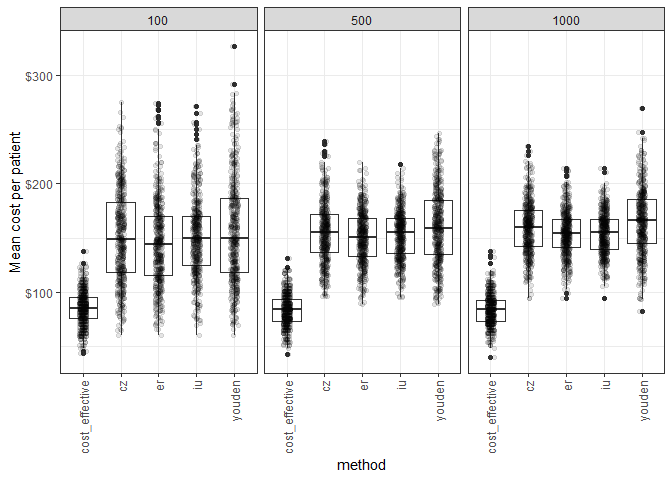

Experiment 1
================
11 February, 2022

Question: What are the differences in NMB between models where the
Probability threshold was based on the Youden index versus costs-based
selection. (Hospital falls as a use case.)

1.  Define costs of a TP, TN, FP, FN of falls classification (option to
    move this into the loop where costs are sampled from a distributions
    to account for uncertainty in their estimates in the literature)
    -   FP have cost of applying intervention
    -   FN have cost of patient fall
    -   TP have cost of intervention + cost of fall\*(1-effectiveness of
        intervention on rate of falls)
    -   TN are cost $0
2.  Determine beta distribution parameters to represent predicted
    probabilities with an expected value equal to the prevalence
    (\~1-3%?) and approximately similar AUC to currently available
    models (\~0.75?) when evaluating probabilities to outcomes using
    binomial distribution.
3.  For sample sizes (N) in \[100, 500, 1000, 5000, 1000\]: (repeat 10k
    times at each sample size)
    -   Sample N samples from beta distribution under selected
        parameters (with or without some error on the parameters)
    -   Transform probabilities to events using binomial distribution
    -   Select probability thresholds based on Youden index vs costs
    -   Evaluate the two thresholds on sample taken from same beta
        distribution but with n=10000. Estimate mean cost per patient on
        this validation set.
4.  Measure differences in NMB on validation sample dependent on use of
    Youden index versus cost-based approach to determine threshold.
5.  Observe whether this relationship is dependent on the sample size
    taken

### Define costs

``` r
treatment_cost <-250
treatment_effect <- 0.1
wtp <- 28000
QALYs_event <- 0.1

cost_vector <- c(
  "TN"=0, 
  "FN"=QALYs_event*wtp, 
  "TP"=QALYs_event*(1-treatment_effect)*wtp, 
  "FP"=treatment_cost
)
```

### Determine appropriate beta distribution for predicted probabilities (prevalence of \~3% and AUC of \~0.75)

``` r
distribution <- get_beta_preds(beta=35, p=0.03, n=100000, get_what=c("auc", "params", "preds"))

glue::glue("AUC: {round(distribution$auc, 4)}")
```

    ## AUC: 0.7524

``` r
glue::glue("Prevalence: {round(mean(distribution$preds$actual), 4)}")
```

    ## Prevalence: 0.0307

``` r
glue::glue("Parameters: alpha={round(distribution$alpha, 4)}; beta={distribution$beta}")
```

    ## Parameters: alpha=1.0825; beta=35

### Run simulation

``` r
get_confusion <- function(d, pt=0.2){
  TN <- sum(d$predicted < pt & d$actual==0)
  FN <- sum(d$predicted < pt & d$actual==1)
  TP <- sum(d$predicted > pt & d$actual==1)
  FP <- sum(d$predicted > pt & d$actual==0)
  
  Se <- TP/(TP+FN)
  Sp <- TN/(FP+TN)
  
  list(TN=TN, FN=FN, TP=TP, FP=FP, Se=Se, Sp=Sp)
}


get_thresholds <- function(predicted, actual, pt_seq=seq(0.01, 0.99,0.01), costs){
  rocobj <- pROC::roc(as.factor(actual), predicted, direction="<", quiet=TRUE)
  auc <- pROC::auc(rocobj)
  pt_er <- pROC::coords(rocobj, "best", best.method="closest.topleft")$threshold
  pt_youden <- pROC::coords(rocobj, "best", best.method="youden")$threshold
  
  f <- function(pt){
    # new threshold selection methods are from here: https://www.hindawi.com/journals/cmmm/2017/3762651/
    cm <- get_confusion(d=data.frame(predicted=predicted, actual=actual), pt=pt)
    data.frame(
        pt=pt, 
        cost_effective=cm$TN*costs["TN"] + cm$TP*costs["TP"] + cm$FN*costs["FN"] + cm$FP*costs["FP"],
        cz=cm$Se*cm$Sp,
        iu=abs(cm$Se - auc) + abs(cm$Sp - auc)
      )
  }
  
  screen_df <- map_dfr(pt_seq, f)
  
  pt_cost_effective <- mean(screen_df$pt[screen_df$cost_effective==min(screen_df$cost_effective)])
  pt_cz <- mean(screen_df$pt[screen_df$cz==max(screen_df$cz)])
  pt_iu <- mean(screen_df$pt[screen_df$iu==min(screen_df$iu)])
  
  list(pt_er=pt_er, pt_youden=pt_youden, pt_cost_effective=pt_cost_effective, pt_cz=pt_cz, pt_iu=pt_iu)
}
```

``` r
sample_sizes <- c(100, 500, 1000)
n_sims <- 500
n_valid <- 1000

df_result <- data.frame(
  train_sample_size=c(), n_sim=c(), youden_cost=c(), cost_effective_cost=c(),
  cz_cost=c(), iu_cost=c(), er_cost=c()
)

for(n in sample_sizes){
  i <- 0
  while(i < n_sims){
    train_sample <- get_beta_preds(
      alpha=distribution$alpha, 
      beta=distribution$beta, 
      n=n, 
      get_what="preds"
    )$preds
    
    valid_sample <- get_beta_preds(
      alpha=distribution$alpha, 
      beta=distribution$beta, 
      n=n_valid,
      get_what="preds"
    )$preds
    
    if(length(unique(valid_sample$actual))!=2 | length(unique(train_sample$actual))!=2){
      # If there are no cases in either the training or validation sample, then redo sampling.
      next
    }
    
    i <- i+1
    
    thresholds <- get_thresholds(
      predicted=train_sample$predicted, 
      actual=train_sample$actual,
      costs=cost_vector
    )
    
    youden_mean_cost <- classify_samples(
      predicted=valid_sample$predicted,
      actual=valid_sample$actual,
      pt=thresholds$pt_youden,
      costs=cost_vector
    )
    
    cost_threshold <- function(pt){
      classify_samples(
        predicted=valid_sample$predicted,
        actual=valid_sample$actual,
        pt=pt,
        costs=cost_vector
      )
    }
    
    
    cost_effective_mean_cost <- classify_samples(
      predicted=valid_sample$predicted,
      actual=valid_sample$actual,
      pt=thresholds$pt_cost_effective,
      costs=cost_vector
    )
    
    cost_effective_mean_cost <- classify_samples(
      predicted=valid_sample$predicted,
      actual=valid_sample$actual,
      pt=thresholds$pt_cost_effective,
      costs=cost_vector
    )
    
    df_result <- rbind(
      df_result, 
      data.frame(
        train_sample_size=c(n), 
        n_sim=c(i), 
        youden_cost=cost_threshold(thresholds$pt_youden), 
        cost_effective_cost=cost_threshold(thresholds$pt_cost_effective),
        cz_cost=c(cost_threshold(thresholds$pt_cz)), 
        er_cost=c(cost_threshold(thresholds$pt_er)), 
        iu_cost=c(cost_threshold(thresholds$pt_iu))
      )
    )
  }
}

df_result %>%
  select(-n_sim) %>%
  pivot_longer(!train_sample_size, names_to="method", values_to="cost") %>%
  mutate(method=str_remove(method, "_cost")) %>%
  ggplot(aes(method, cost)) +
  geom_boxplot() +
  geom_jitter(alpha=0.1, width=0.1) +
  facet_wrap(~train_sample_size) +
  theme_bw() +
  labs(y="Mean cost per patient") +
  scale_y_continuous(labels=scales::dollar_format()) +
  theme(axis.text.x = element_text(angle = 90, vjust = 0.5, hjust=1))
```

<!-- -->
