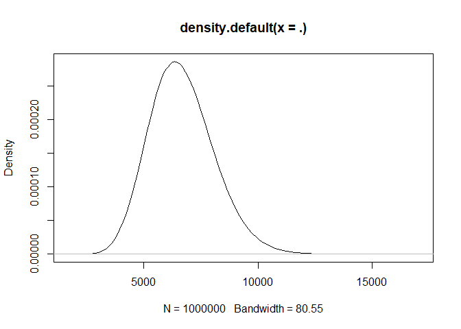
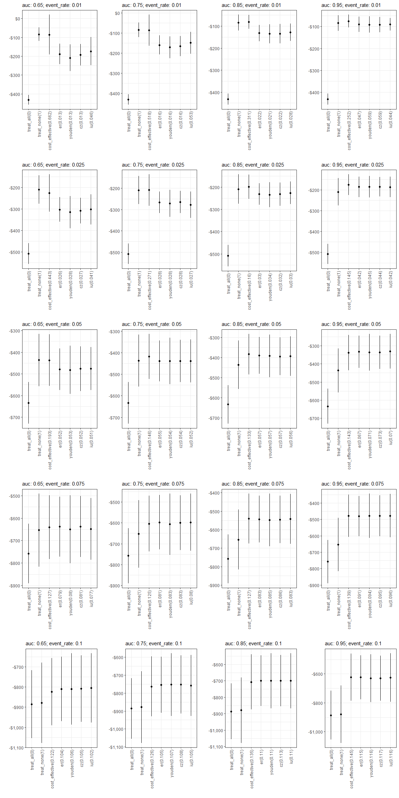

Experiment 1
================
14 April, 2022

Question: What are the differences in NMB between models where the
Probability threshold was based on the currently available methods
versus costs-based selection. (Hospital falls as a use case.)

1.  Define costs of a TP, TN, FP, FN of falls classification (option to
    move this into the loop where costs are sampled from a distributions
    to account for uncertainty in their estimates in the literature)
      - FP have cost of applying intervention
      - FN have cost of patient fall
      - TP have cost of intervention + cost of fall\*(1-effectiveness of
        intervention on rate of falls)
      - TN are cost $0
2.  Select appropriate ranges for model AUC (\~0.75?) and prevalence
    (\~3%) for comparable clinical prediction model for falls.
3.  For sample sizes (N) in \[100, 500, 1000\]: (repeat 500 times at
    each sample size)
      - Get training data by sampling observed predictor values and
        outcome by transforming AUC into Cohens’ D and sampling from two
        normal distributions, the first (negative events) with mean=0
        and the second (positive events) with mean=Cohens’D. (Both with
        sd=1.)
      - Fit a logistic regression model using this sampled data.
      - Fit predicted probabilities to the training data and use these
        to obtain probability thresholds using each method.
      - Get validation data using the same approach but with n=1000.
      - Use the previously fit model to estimate probabilities for
        validation data.
      - Evaluate the thresholds selected using the training data on the
        validation data, in terms of mean cost per patient.
4.  Measure differences in NMB on validation sample dependent on use of
    currently available methods and cost-based approach to determine
    threshold.
5.  Observe whether this relationship is dependent on the sample size
    taken
6.  ???

### get costs/effectiveness from papers

``` r
# estimate costs of falls from Morello et al. MJA
# https://www.mja.com.au/journal/2015/203/9/extra-resource-burden-hospital-falls-cost-falls-study

# the confidence interval from the study were symmetric around the estimate.
# The code below is used to estimate which gamma distribution parameters would represent costs with 
# the same mean and standard error.
mean_cost <- 6669
ul <- 9450
desired_se <- ((ul-mean_cost)/1.96)

get_beta <- function(a, mean) {
  a/mean
}

get_var <- function(a, b) {
  a/(b^2)
}

get_se <- function(alpha){
  # use alpha as input, calculate the optimum beta given desired mean_cost
  beta <- get_beta(alpha, mean_cost)
  
  # estimate the variance of the the gamma distribution given alpha and beta
  est_var <- get_var(alpha, beta)
  
  # return the estimate se of distribution
  sqrt(est_var)
}

test_sequence <- seq(20, 50, 0.01) # a sequence of alphas to use
estimated_se <- map_dbl(test_sequence, get_se)

df_parameters_and_distances <-
  data.frame(
  alpha=test_sequence,
  beta=get_beta(test_sequence, mean_cost),
  se=estimated_se
) %>%
  mutate(dist=abs(se-desired_se)) %>%
  arrange(dist)


s <- rgamma(n=1000000,df_parameters_and_distances$alpha[1], df_parameters_and_distances$beta[1])

# select the gamma parameters that provide the closest similarity to the reported standard error (and mean)
s %>% 
  density() %>% 
  plot()
```

<!-- -->

``` r
library(fitdistrplus)
```

    ## Loading required package: MASS

    ## 
    ## Attaching package: 'MASS'

    ## The following object is masked from 'package:dplyr':
    ## 
    ##     select

    ## Loading required package: survival

``` r
x <- rnorm(n=1000000, mean_cost, desired_se)
x <- x[x>0]
fit <- fitdist(x, "gamma", method="mme")
```

    ## $start.arg
    ## $start.arg$shape
    ## [1] 22.09866
    ## 
    ## $start.arg$rate
    ## [1] 0.003313308
    ## 
    ## 
    ## $fix.arg
    ## NULL

``` r
fit$estimate
```

    ##        shape         rate 
    ## 22.098662528  0.003313308

``` r
s2 <- rgamma(n=1000000,fit$estimate['shape'], fit$estimate['rate'])
s2 %>% 
  density() %>% 
  plot()
```

<!-- -->

``` r
cat("desired mean and se:\n")
```

    ## desired mean and se:

``` r
mean_cost
```

    ## [1] 6669

``` r
desired_se
```

    ## [1] 1418.878

``` r
cat("fit dist:\n")
```

    ## fit dist:

``` r
mean(s2)
```

    ## [1] 6669.248

``` r
sd(s2)
```

    ## [1] 1419.491

``` r
cat("my method:\n")
```

    ## my method:

``` r
mean(s)
```

    ## [1] 6669.969

``` r
sd(s)
```

    ## [1] 1421.549

``` r
# estimate effectiveness of intervention from Haines et al. (2010) Archives of Internal Medicine
# https://sci-hub.hkvisa.net/10.1001/archinternmed.2010.444

mean_eff <- 0.43
ci95 <- c(0.24, 0.78)
log(mean_eff)
```

    ## [1] -0.8439701

``` r
log(ci95)
```

    ## [1] -1.4271164 -0.2484614

``` r
log_hr <- log(mean_eff)
log_hr_se <- (log(ci95[2]) - log(mean_eff))/1.96

rnorm(1000, mean=log_hr, sd=log_hr_se) %>%
  exp() %>%
  density() %>% 
  plot()
```

<!-- -->

``` r
quantile(rnorm(1000, mean=log_hr, sd=log_hr_se), probs=c(0.025, 0.975))
```

    ##       2.5%      97.5% 
    ## -1.4268581 -0.2617282

``` r
log(ci95)
```

    ## [1] -1.4271164 -0.2484614

``` r
# Estimate impact of falls on health utility from Latimer et al (2013) Age and Ageing
# https://academic.oup.com/ageing/article/42/5/641/18607?login=true

noinj <- rep(0.02, 40)
minorinj <- rep(0.04, 31)
moderateinj <- rep(0.06, 18)
majorinj <- rep(0.11, 9)
fallers <- c(noinj, minorinj, moderateinj, majorinj)

library(fitdistrplus)
falldec <- fitdist(fallers, "gamma")
```

    ## $start.arg
    ## $start.arg$shape
    ## [1] 2.57529
    ## 
    ## $start.arg$rate
    ## [1] 61.40594
    ## 
    ## 
    ## $fix.arg
    ## NULL

``` r
# Estimate additional costs of ICU readmission from Tong et al (2021) World J Surg
# https://pubmed.ncbi.nlm.nih.gov/33788015/

readmit <- rnorm(1000000, 19850, 7595)+50000
no_readmit <- rnorm(1000000, 14916, 3483)+50000
library(fitdistrplus)
d_readmit <- fitdist(readmit, "gamma", "mme")
```

    ## $start.arg
    ## $start.arg$shape
    ## [1] 84.61911
    ## 
    ## $start.arg$rate
    ## [1] 0.0012115
    ## 
    ## 
    ## $fix.arg
    ## NULL

``` r
d_no_readmit <- fitdist(no_readmit, "gamma", "mme")
```

    ## $start.arg
    ## $start.arg$shape
    ## [1] 346.9641
    ## 
    ## $start.arg$rate
    ## [1] 0.00534438
    ## 
    ## 
    ## $fix.arg
    ## NULL

``` r
readmit_dist <- rgamma(1000000, d_readmit$estimate['shape'], d_readmit$estimate['rate'])-50000
no_readmit_dist <- rgamma(1000000, d_no_readmit$estimate['shape'], d_no_readmit$estimate['rate'])-50000
d_diff <- readmit_dist - no_readmit_dist
diff_dist <- fitdist(d_diff, "norm")
```

    ## $start.arg
    ## $start.arg$mean
    ## [1] 4920.067
    ## 
    ## $start.arg$sd
    ## [1] 8364.082
    ## 
    ## 
    ## $fix.arg
    ## NULL

``` r
get_nmb <- function(){
  # treatment_effect <- rbeta(1, 111.111, 1000) #QALY increment from treatment
  # QALYs_event <- -rbeta(1, 10/3, 30) #QALY decrement from event
  # treatment_cost <- rgamma(1, 100)
  # wtp <- 28000
  
  # c(
  #   "TN"=0,
  #   "FN"=QALYs_event*wtp,
  #   "TP"=QALYs_event*(1-treatment_effect)*wtp - treatment_cost,
  #   "FP"=-treatment_cost
  # )
  
  # WTP from Edney et al (2018), Pharmacoeconomics
  WTP <- 28033
  
  # treatment_effect taken from: Haines et al. (2010) Archives of Internal Medicine
  treatment_effect <- exp(rnorm(1, mean=-0.8439701, sd=0.303831))
  
  # taken from abstract of Haines (2010), BMC Medicine
  treatment_cost <- 294*1.03^(2022-2013)
  
  # taken from Morello et al (2015). MJA
  falls_cost <- (rgamma(1, 22.09, 0.003312341))*(1.03^(2022-2015))
  
  #taken from Latimer et al (2013) Age and Ageing
  fall_eff <- rgamma(1, 2.57529, 61.40594)*0.5 #6-month follow-up <- QALY = 0.5*utility decrement
  
  c(
    "TN"=0,
    "FN"=-falls_cost - fall_eff*WTP,
    "TP"=-falls_cost*(1-treatment_effect) - treatment_cost - fall_eff*WTP,
    "FP"=-treatment_cost
  )
}
get_nmb()
```

    ##         TN         FN         TP         FP 
    ##     0.0000 -5321.4913 -3699.0858  -383.6033

``` r
get_nmb_ICU <- function(){
# Note all costs are already adjusted to $AUD 2022
  
  WTP <- 28033

  # treatment_effect taken from de Vos et al (2022), Value in Health
  eff_disch <- rbeta(1, 14.29780, 19.74273)
  
  # ICU occupancy cost taken from Hicks et al (2019), MJA
  ICU_cost <- rgamma(1, 12.427458201, 0.002603026)
  
  # Opportunity cost taken from Page et al (2017), BMC HSR
  ICU_opp_cost <- 505
  
  # ICU readmission cost taken from Tong et al (2021), World Journal of Surgery
  ICU_readmit <- rnorm(1, 4917, 8357)
  
  c(
    "TN2"=eff_disch*WTP,
    "FN2"=eff_disch*WTP - ICU_readmit,
    "TP2"=-ICU_cost,
    "FP2"=-ICU_cost + ICU_opp_cost
  )
}
get_nmb_ICU()
```

    ##       TN2       FN2       TP2       FP2 
    ## 13226.286 -2414.599 -3074.870 -2569.870

### Run simulation

``` r
do_simulation <- function(sample_size, n_sims, n_valid, sim_auc, event_rate, 
                          fx_costs, resample_values=TRUE, 
                          get_what=c("data", "plot"), plot_type="boxplot",
                          seed=42){
  if(!is.null(seed)) set.seed(seed)
  
  i <- 0
  while(i < n_sims){
    train_sample <- get_sample(auc=sim_auc, n_samples=sample_size, prevalence=event_rate)
    valid_sample <- get_sample(auc=sim_auc, n_samples=n_valid, prevalence=event_rate)
    if(length(unique(train_sample$actual))!=2 | length(unique(valid_sample$actual))!=2){
      next
    }
    i <- i + 1
    model <- glm(actual~predicted, data=train_sample, family=binomial())
    train_sample$predicted <- predict(model, type="response")

    
    valid_sample$predicted <- predict(model, type="response", newdata=valid_sample)
    
    value_vector <- fx_costs()
    
    thresholds <- get_thresholds(
      predicted=train_sample$predicted, 
      actual=train_sample$actual,
      costs=value_vector
    )
    
    if(resample_values){
      value_vector <- fx_costs()
    }
    
    cost_threshold <- function(pt){
      classify_samples(
        predicted=valid_sample$predicted,
        actual=valid_sample$actual,
        pt=pt,
        costs=value_vector
      )
    }
    
    results_i <-
      unlist(thresholds) %>%
      map_dbl(cost_threshold) %>%
      t()
    thresholds_i <- unlist(thresholds)
    if(i==1){
      df_result <- results_i
      df_thresholds <- thresholds_i
    } else {
      df_result <- rbind(df_result, results_i)
      df_thresholds <- rbind(df_thresholds, thresholds_i)
    }
  }
  
  df_result <- as.data.frame.matrix(df_result)
  df_thresholds <- as.data.frame.matrix(df_thresholds)
  rownames(df_thresholds) <- NULL
  
  df_result <- add_column(df_result, n_sim=1:nrow(df_result), .before=T)
  df_thresholds <- add_column(df_thresholds, n_sim=1:nrow(df_thresholds), .before=T)
  
  pts <- round(colMeans(df_thresholds)[-1], 3)
  df_plot <- df_result
  names(df_plot)[-1] <- method_levels <- paste0(names(df_plot)[-1], "(", pts, ")")
  
  if(plot_type=="boxplot"){
    p <- 
      df_plot %>%
      pivot_longer(!n_sim, names_to="method", values_to="nmb") %>%
      mutate(method=factor(method, levels=method_levels)) %>%
      ggplot(aes(method, nmb)) +
      geom_boxplot() +
      geom_jitter(alpha=0.1, width=0.1) +
      theme_bw() +
      labs(
        y="", x="",
        subtitle=glue::glue("auc: {sim_auc}; event_rate: {event_rate}")
      ) +
      scale_y_continuous(labels=scales::dollar_format()) +
      theme(axis.text.x = element_text(angle = 90, vjust = 0.5, hjust=1))
  }else{
    get_medians <- function(x, nboot=500){
      m <- median(x)
      
      boots <- map_dbl(
        1:nboot, 
        function(v){
          s <- sample(x, size=length(v), replace=T)
          median(s)
        }
      )
      list(median=m, median_se=sd(boots))
    }
    
    df_plot2 <- 
      df_plot %>%
      pivot_longer(!n_sim, values_to="nmb", names_to="method")
    
    df_plot2 <- as.data.table(df_plot2)[
      ,
      get_medians(x=nmb),
      by = list(method)
    ]
    
    p <-
      df_plot2 %>%
      mutate(method=factor(method, levels=method_levels)) %>%
      ggplot(aes(method, median)) +
      geom_point() +
      geom_errorbar(aes(ymin=median-median_se, ymax=median+median_se, width=0)) +
      theme_bw() +
      labs(
        y="", x="",
        subtitle=glue::glue("auc: {sim_auc}; event_rate: {event_rate}")
      ) +
      scale_y_continuous(labels=scales::dollar_format()) +
      theme(axis.text.x = element_text(angle = 90, vjust = 0.5, hjust=1))
  }
  
  if(length(get_what)==1){
    if(get_what=="data"){return(df_result)}
    if(get_what=="plot"){return(p)}
  }else{
    return(list(data=df_result, plot=p))
  }
}

# test_run <- do_simulation(
#   sample_size=500, n_sims=20, n_valid=500, sim_auc=0.7, event_rate=0.03,
#   fx_costs=get_nmb, resample_values=TRUE, get_what=c("data", "plot"), plot_type = "point"
# )
# test_run
```

## search through a grid of combinations of AUC and event rates to see how this influences the differences between probability threshold methods. The same costs were used in all simulations (distributions at top of document) and are resampled separately for training and validation.

#### In the plot below, the columns, from left to right, have increasing AUC. The rows, from top to bottom, have increasing event rates.

### My hot takes:

#### Probability threshold selection method becomes increasingly important as the AUC of the model and the event rate reduces.

#### I think that this is because, for models with very high discrimination, they’re able to correctly classify a larger proportion of samples, and there are fewer which are classified differently based on selection method. The difference is greater for smaller event rates because a false negative is the most costly classification, and only the cost-based method is “aware” of this. This is also why, when the event rate is very high, there is not much of a difference between methods (cost-based method is focused on correctly classifying the majority class but so are the other methods).

``` r
library(parallel)
n_cluster <- detectCores()
cl <- makeCluster(n_cluster)
cl <- parallelly::autoStopCluster(cl)

g <- expand.grid(
  sim_auc=c(0.65, 0.75, 0.85, 0.95),
  # event_rate=c(0.01, 0.03, 0.1, 0.3, 0.7, 0.9)
  event_rate=c(0.01, 0.025, 0.05, 0.075, 0.1)
)

clusterExport(cl, {
  c("do_simulation", "g", "get_nmb")
})

invisible(clusterEvalQ(cl, {
  library(tidyverse)
  library(data.table)
  library(cutpointr)
  source("src/utils.R")
  source("src/cutpoint_methods.R")
}))


ll1 <- parallel::parLapply(
  cl,
  1:nrow(g),
  function(i) do_simulation(
    sample_size=500, n_sims=100, n_valid=1000,
    sim_auc=g$sim_auc[i], event_rate=g$event_rate[i],
    fx_costs=get_nmb, get_what="plot", resample_values=TRUE,
    plot_type="point"
  )
)

# ll2 <- parallel::parLapply(
#   cl,
#   1:nrow(g),
#   function(i) do_simulation(
#     sample_size=500, n_sims=100, n_valid=1000,
#     sim_auc=g$sim_auc[i], event_rate=g$event_rate[i],
#     fx_costs=get_nmb, get_what="plot", resample_values=FALSE,
#     plot_type="point"
#   )
# )

cowplot::plot_grid(plotlist=ll1, ncol=length(unique(g$sim_auc)))
```

<!-- -->

``` r
# cowplot::plot_grid(plotlist=ll2, ncol=length(unique(g$sim_auc)))
```
