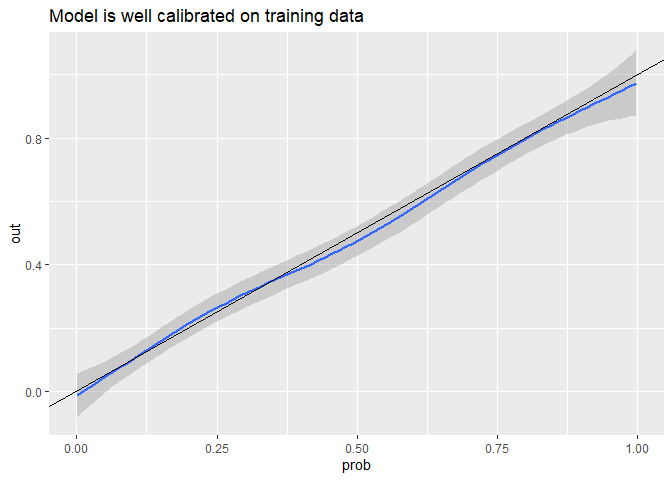
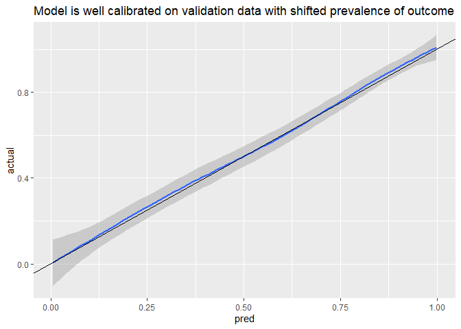
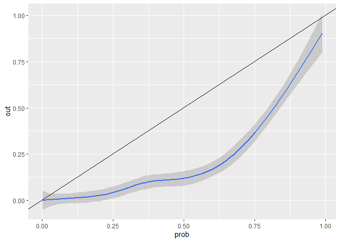

simulate_prevalence_shift
================
08 February, 2022

``` r
set.seed(123)
# N = samples
N <- 1000 
# np = number of fixed effects, excluding the intercept
np <- 6

## fixed effects
x0 <- rnorm(1)
x1 <- rnorm(1)
x2 <- rnorm(1)
x3 <- rnorm(1)
x4 <- rnorm(1)
x5 <- 0
x6 <- 0

B <- matrix(c(x0, x1, x2, x3, x4, x5, x6), ncol=1)

X <- cbind(rep(1, N), matrix(rnorm(n=np*N), ncol=np))

pi <- X %*% B + rnorm(n=N)
p <- exp(pi)/(1+exp(pi))

out <- rbinom(n=N, 1, p)
glue::glue("Prevalence in the training set: {mean(out)}")
```

    ## Prevalence in the training set: 0.415

``` r
rocobj <- pROC::roc(as.factor(out), p)
```

    ## Setting levels: control = 0, case = 1

    ## Warning in roc.default(as.factor(out), p): Deprecated use a matrix as predictor.
    ## Unexpected results may be produced, please pass a numeric vector.

    ## Setting direction: controls < cases

``` r
glue::glue("AUC in training set: {round(rocobj$auc, 4)}")
```

    ## AUC in training set: 0.8479

``` r
## check to see if predictions are calibrated
data.frame(prob=p, class=out) %>%
  ggplot(aes(prob, out)) + 
  geom_smooth() + 
  geom_abline() +
  labs(title="Model is well calibrated on training data")
```

    ## `geom_smooth()` using method = 'gam' and formula 'y ~ s(x, bs = "cs")'

<!-- -->

``` r
cost_vector <- c("TN"=0, "FN"=100, "TP"=80, "FP"=5)
train_thresholds <- get_thresholds(predicted=p, actual=out, costs=cost_vector)
```

    ## Setting levels: control = 0, case = 1

    ## Warning in roc.default(as.factor(actual), predicted): Deprecated use a matrix as
    ## predictor. Unexpected results may be produced, please pass a numeric vector.

    ## Setting direction: controls < cases

``` r
train_thresholds
```

    ## $youden
    ## [1] 0.499216
    ## 
    ## $cost_effective
    ## [1] 0.15

# sample new dataset with shift in distribution of fixed effects to cause change in prevalence of event

``` r
set.seed(123)
# shift the mean of the observed predictors
X <- cbind(rep(1, N), matrix(rnorm(n=np*N, mean=1), ncol=np))
pi <- X %*% B + rnorm(n=N)
p <- exp(pi)/(1+exp(pi))

out <- rbinom(n=N, 1, p)
glue::glue("Prevalence in the prevalence-shifted validation set: {mean(out)}")
```

    ## Prevalence in the prevalence-shifted validation set: 0.663

``` r
rocobj <- pROC::roc(as.factor(out), p)
```

    ## Setting levels: control = 0, case = 1

    ## Warning in roc.default(as.factor(out), p): Deprecated use a matrix as predictor.
    ## Unexpected results may be produced, please pass a numeric vector.

    ## Setting direction: controls < cases

``` r
glue::glue("AUC in prevalence-shifted validation set: {round(rocobj$auc, 4)}")
```

    ## AUC in prevalence-shifted validation set: 0.8636

``` r
# model is still calibrated in prevalence-shifted validation set
valid_df <- data.frame(pred=p, actual=out) 

valid_df %>%
  ggplot(aes(pred, actual)) + 
  geom_smooth() + 
  geom_abline() +
  labs(title="Model is well calibrated on validation data with shifted prevalence of outcome")
```

    ## `geom_smooth()` using method = 'gam' and formula 'y ~ s(x, bs = "cs")'

<!-- -->

## There’s a big shift in the probabilty threshold selected by youden, but not by the cost-effective method

### Suggests that probability thresholds selected by cost-effectiveness are more generalisable to new populations where the prevalence may have shifted but costs of interventions/QALYs hasn’t

``` r
cost_vector <- c("TN"=0, "FN"=100, "TP"=80, "FP"=5)
get_thresholds(predicted=valid_df$pred, actual=valid_df$actual, costs=cost_vector)
```

    ## Setting levels: control = 0, case = 1

    ## Setting direction: controls < cases

    ## $youden
    ## [1] 0.6434774
    ## 
    ## $cost_effective
    ## [1] 0.21

## If the Pt was selected based on costs vs youden from original model development, how would it affect costs on validation data with shift in prevalence?

``` r
valid_ce_cost <- classify_samples(
  predicted=valid_df$pred, 
  actual=valid_df$actual, 
  pt=train_thresholds$cost_effective, 
  costs=cost_vector
)
# costs per patient of using cost-effective selection of Pt
valid_ce_cost
```

    ## [1] 54.455

``` r
valid_youden_cost <- classify_samples(
  predicted=valid_df$pred, 
  actual=valid_df$actual, 
  pt=train_thresholds$youden,
  costs=cost_vector
)
# costs per patient of using Youden index for selection of Pt
valid_youden_cost
```

    ## [1] 55.13

## If there is a shift in the costs associated with the (mis)classification, is it beneficial to re-select Pt

#### (No shift in prevalence)

``` r
set.seed(1234)
# use a larger sample - same sample size to select threshold with new costs, evaluating on the remainder
N <- 1e4
# shift the mean of the observed predictors
X <- cbind(rep(1, N), matrix(rnorm(n=np*N), ncol=np))
pi <- X %*% B + rnorm(n=N)
p <- exp(pi)/(1+exp(pi))

out <- rbinom(n=N, 1, p)
glue::glue("Prevalence in the prevalence-shifted validation set: {mean(out)}")
```

    ## Prevalence in the prevalence-shifted validation set: 0.405

``` r
rocobj <- pROC::roc(as.factor(out), p)
```

    ## Setting levels: control = 0, case = 1

    ## Warning in roc.default(as.factor(out), p): Deprecated use a matrix as predictor.
    ## Unexpected results may be produced, please pass a numeric vector.

    ## Setting direction: controls < cases

``` r
glue::glue("AUC in prevalence-shifted validation set: {round(rocobj$auc, 4)}")
```

    ## AUC in prevalence-shifted validation set: 0.8508

``` r
# model is still calibrated in prevalence-shifted validation set
df_all <- data.frame(pred=p, actual=out)
df_train <- df_all[1:1000,]
df_valid <- df_all[1001:N,]

# decrease in increase in FP - represents an increase in the cost of the intervention?
# cost_vector <- c("TN"=0, "FN"=100, "TP"=80, "FP"=5)
new_cost_vector <- c("TN"=0, "FN"=100, "TP"=125, "FP"=50) 
new_thresholds <- get_thresholds(predicted=df_train$pred, actual=df_train$actual, c=new_cost_vector)
```

    ## Setting levels: control = 0, case = 1

    ## Setting direction: controls < cases

``` r
# new_thresholds$cost_effective
# train_thresholds$cost_effective
ce_cost_refit <- classify_samples(
  predicted=df_valid$pred, 
  actual=df_valid$actual, 
  pt=new_thresholds$cost_effective, 
  costs=new_cost_vector
)
# costs per patient of using a refit Pt by cost-effectiveness
ce_cost_refit
```

    ## [1] 40.45

``` r
ce_cost_orig <- classify_samples(
  predicted=df_valid$pred, 
  actual=df_valid$actual, 
  pt=train_thresholds$cost_effective,
  costs=new_cost_vector
)

# costs per patient of using a the original Pt by cost-effectiveness
ce_cost_orig
```

    ## [1] 67.08889

### The benefit of re-estimating Pt based on cost-effectiveness will depend on how large the change in costs are, and whether there is a change in the prevalence of the event.

# Assess new approach where the prevalence can be specified:

### take a larger sample and then sample from the classes

### (this doesn’t work)

``` r
set.seed(123)
# N = samples
N <- 10000
# np = number of fixed effects, excluding the intercept
np <- 6

# desired sample size 
n = 1000

# desired prevalence of sample
r <- 0.1

## fixed effects
x0 <- rnorm(1)
x1 <- rnorm(1)
x2 <- rnorm(1)
x3 <- rnorm(1)
x4 <- rnorm(1)
x5 <- 0
x6 <- 0

B <- matrix(c(x0, x1, x2, x3, x4, x5, x6), ncol=1)

X <- cbind(rep(1, N), matrix(rnorm(n=np*N), ncol=np))

pi <- X %*% B + rnorm(n=N)
p <- exp(pi)/(1+exp(pi))

out <- rbinom(n=N, 1, p)

df <- data.frame(p=p, out=out)

df_pos <- df[df$out==1,]
df_pos <- df_pos[sample(nrow(df_pos),n*r, replace=FALSE), ]

df_neg <- df[df$out==0,]
df_neg <- df_neg[sample(nrow(df_neg),n*(1-r), replace=FALSE), ]

df_combine <- rbind(df_pos, df_neg)


glue::glue("Prevalence in the training set: {mean(out)}")
```

    ## Prevalence in the training set: 0.4112

``` r
rocobj <- pROC::roc(as.factor(out), p)
```

    ## Setting levels: control = 0, case = 1

    ## Warning in roc.default(as.factor(out), p): Deprecated use a matrix as predictor.
    ## Unexpected results may be produced, please pass a numeric vector.

    ## Setting direction: controls < cases

``` r
glue::glue("AUC in training set: {round(rocobj$auc, 4)}")
```

    ## AUC in training set: 0.8506

``` r
## check to see if predictions are calibrated
data.frame(prob=df_combine$p, out=df_combine$out) %>% 
  ggplot(aes(prob, out)) + 
  geom_smooth() + 
  geom_abline()
```

    ## `geom_smooth()` using method = 'gam' and formula 'y ~ s(x, bs = "cs")'

<!-- -->
