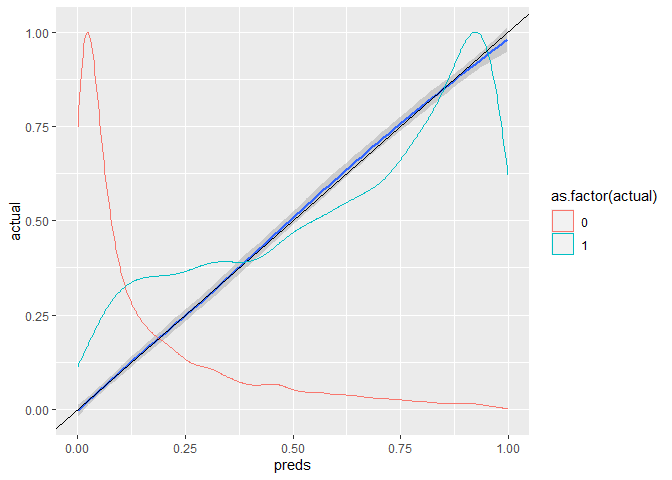
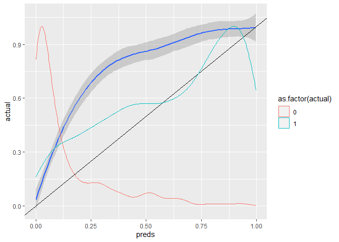

simulate_prevalence_shift_by_cohens_D
================
14 February, 2022

# testing the use of get_sample() as sampling predictors rather that probabilities/outcome

### AUC and prevalence is good

### Model is well calibrated on training data

``` r
df <- get_sample(auc=0.9, n_samples=10000, prevalence=0.3)

m <- glm(actual~predicted, data=df, family=binomial())
preds <- predict(m, type="response")

get_auc(predicted=preds, actual=df$actual)
```

    ## [1] 0.902556

``` r
data.frame(preds=preds, actual=as.factor(df$actual)) %>%
  group_by(actual) %>%
  summarize(mean(preds), n())
```

    ## # A tibble: 2 x 3
    ##   actual `mean(preds)` `n()`
    ##   <fct>          <dbl> <int>
    ## 1 0              0.160  7000
    ## 2 1              0.627  3000

``` r
data.frame(preds=preds, actual=df$actual) %>%
  ggplot(aes(x=preds, y=actual)) +
  geom_smooth() +
  geom_abline() +
  geom_density(aes(y=..scaled.., group=as.factor(actual), col=as.factor(actual)))
```

    ## `geom_smooth()` using method = 'gam' and formula 'y ~ s(x, bs = "cs")'

<!-- -->

### Evaluating that model on new data with shift in prevalence

### This produces correct AUC but poor calibration! This is despite no change in the sampling means and sds for positive and negative cases, but only a difference in the proportion of positive and negative cases that were sampled! AKA, if there’s a shift in prevalence, the model will lose calibration.

``` r
df_new <- get_sample(auc=0.9, n_samples=1000, prevalence=0.7)
preds_new <- predict(m, type="response", newdata=df_new)
get_auc(predicted=preds_new, actual=df_new$actual)
```

    ## [1] 0.9129143

``` r
data.frame(preds=preds_new, actual=as.factor(df_new$actual)) %>%
  group_by(actual) %>%
  summarize(mean(preds), n())
```

    ## # A tibble: 2 x 3
    ##   actual `mean(preds)` `n()`
    ##   <fct>          <dbl> <int>
    ## 1 0              0.139   300
    ## 2 1              0.615   700

``` r
data.frame(preds=preds_new, actual=df_new$actual) %>%
  ggplot(aes(x=preds, y=actual)) +
  geom_smooth() +
  geom_abline() +
  geom_density(aes(y=..scaled.., group=as.factor(actual), col=as.factor(actual)))
```

    ## `geom_smooth()` using method = 'gam' and formula 'y ~ s(x, bs = "cs")'

<!-- -->
