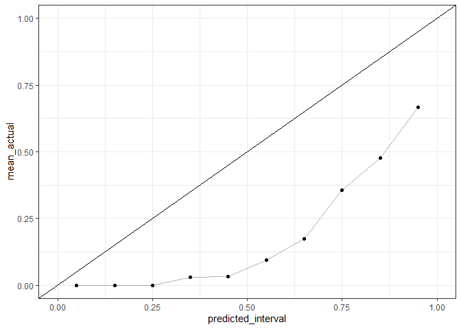
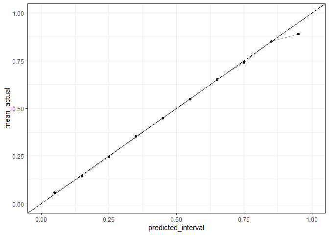
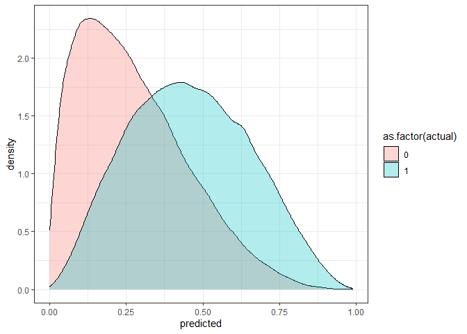
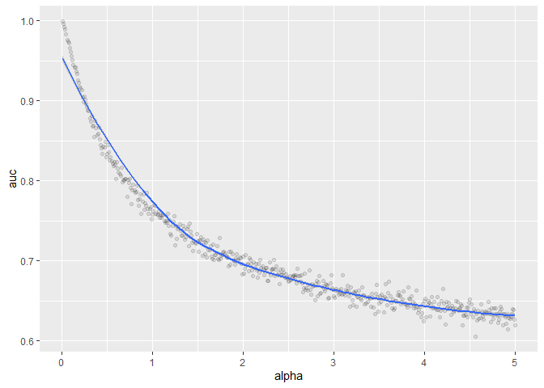
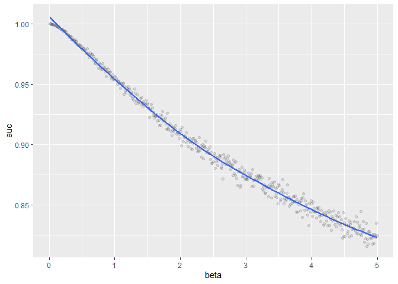

workspace
================
02 February, 2022

``` r
library(tidyverse)
```

    ## -- Attaching packages --------------------------------------- tidyverse 1.3.1 --

    ## v ggplot2 3.3.3     v purrr   0.3.4
    ## v tibble  3.1.2     v dplyr   1.0.6
    ## v tidyr   1.1.3     v stringr 1.4.0
    ## v readr   1.4.0     v forcats 0.5.1

    ## -- Conflicts ------------------------------------------ tidyverse_conflicts() --
    ## x dplyr::filter() masks stats::filter()
    ## x dplyr::lag()    masks stats::lag()

``` r
get_sample <- function(auc, n_samples, prevalence, scale=T){
  # https://stats.stackexchange.com/questions/422926/generate-synthetic-data-given-auc
  t <- sqrt(log(1/(1-auc)**2))
  z <- t-((2.515517 + 0.802853*t + 0.0103328*t**2) / 
            (1 + 1.432788*t + 0.189269*t**2 + 0.001308*t**3))
  d <- z*sqrt(2)
  
  n_neg <- round(n_samples*(1-prevalence))
  n_pos <- round(n_samples*prevalence)
  
  x <- c(rnorm(n_neg, mean=0), rnorm(n_pos, mean=d))
  y <- c(rep(0, n_neg), rep(1, n_pos))
  
  if(scale){
    x <- (x-min(x)) / (max(x)-min(x))
  }
  return(data.frame(predicted=x, actual=y))
}

df_preds <- get_sample(auc=0.8, n_samples=2000, prevalence=0.1) %>%
  mutate(predicted_interval=cut(predicted, seq(0,1,0.1), labels=FALSE)/10-0.05)

# df_preds %>%
#   ggplot(aes(predicted, fill=as.factor(actual))) +
#   geom_density(alpha=0.3) +
#   theme_bw()

# problem with this approach is that it doesn't lead to well calibrated predictions
df_preds %>%
  group_by(predicted_interval) %>%
  summarize(mean_actual=mean(actual)) %>%
  ggplot(aes(predicted_interval, mean_actual)) +
  geom_line(alpha=0.3) +
  geom_point()+
  geom_abline()+
  theme_bw() +
  scale_x_continuous(limits=c(0, 1)) + scale_y_continuous(limits=c(0, 1))
```

    ## Warning: Removed 1 row(s) containing missing values (geom_path).

    ## Warning: Removed 1 rows containing missing values (geom_point).

<!-- -->

``` r
source("src/utils.R")

# these give the same prevalence but different AUC
# df_beta_preds <- get_beta_preds(alpha=1, beta=2, n=100000, return_preds=TRUE)
df_beta_preds <- get_beta_preds(alpha=1.5, beta=3, n=100000, return_preds=TRUE)

df_beta_preds %>%
  mutate(predicted_interval=cut(predicted, seq(0,1,0.1), labels=FALSE)/10-0.05)%>%
  group_by(predicted_interval) %>%
  summarize(mean_actual=mean(actual)) %>%
  ggplot(aes(predicted_interval, mean_actual)) +
  geom_line(alpha=0.3) +
  geom_point()+
  geom_abline()+
  theme_bw() +
  scale_x_continuous(limits=c(0, 1)) + scale_y_continuous(limits=c(0, 1))
```

<!-- -->

``` r
df_beta_preds %>%
  ggplot(aes(predicted, fill=as.factor(actual))) +
  geom_density(alpha=0.3) +
  theme_bw()
```

<!-- -->

``` r
# this approach seems to be good at giving well-calibrated predictions but
# I don't know how what the "population" AUC would be for a given beta-distribution
# (under the assumption that the predictions are well-calibrated)
# have just posted a question on cross-validated: https://stats.stackexchange.com/questions/562000/how-to-simulate-a-calibrated-prediction-model-given-prevalence-and-auc
```

# Simulate prediction models from beta distribution to see association with AUC

### Given spread of input alphas and baseline prevalence (to compute the relevant beta)

``` r
df_alpha_vs_auc <- data.frame(alpha=seq(0.01, 5, by=0.01))
df_alpha_vs_auc$auc <- map_dbl(
  .x=df_alpha_vs_auc$alpha, 
  function(x) get_beta_preds(alpha=x, beta=NULL, p=0.1, n=10000)
)

df_alpha_vs_auc %>%
  ggplot(aes(alpha, auc)) + 
  geom_point(alpha=0.1) + 
  geom_smooth(method="loess")
```

    ## `geom_smooth()` using formula 'y ~ x'

<!-- -->

### Given spread of input betas and baseline prevalence (to compute the relevant alphas)

``` r
df_beta_vs_auc <- data.frame(beta=seq(0.01, 5, by=0.01))
df_beta_vs_auc$auc <- map_dbl(
  .x=df_beta_vs_auc$beta, 
  function(x) get_beta_preds(alpha=NULL, beta=x, p=0.1, n=10000)
)

df_beta_vs_auc %>%
  ggplot(aes(beta, auc)) + 
  geom_point(alpha=0.1) +
  geom_smooth(method="loess")
```

    ## `geom_smooth()` using formula 'y ~ x'

<!-- -->

# more realistic case where the selection of a threshold is performed on smaller data

``` r
df_preds <- get_beta_preds(alpha=get_alpha(beta=2.5, p=0.1), beta=2.5, p=0.1, n=1000, return_preds=TRUE)

df_pt_costs <- data.frame(pt=seq(0.05, 0.95,0.01))
df_pt_costs$mean_cost <- map_dbl(
  df_pt_costs$pt, 
  function(x)classify_samples(predicted=df_preds$predicted, actual=df_preds$actual, pt=x, costs=costs)
)

cost_effective_pt <- slice(arrange(df_pt_costs, mean_cost),1)$pt

rocobj <- pROC::roc(as.factor(df_preds$actual), df_preds$predicted)
```

    ## Setting levels: control = 0, case = 1

    ## Setting direction: controls < cases

``` r
youden_pt <- pROC::coords(rocobj, "best")$threshold


# validate on larger dataset (10x bigger than development)
df_valid <- get_beta_preds(alpha=get_alpha(beta=2.5, p=0.1), beta=2.5, p=0.1, n=10000, return_preds=TRUE)

valid_ce_cost <- classify_samples(
  predicted=df_valid$predicted, 
  actual=df_valid$actual, 
  pt=cost_effective_pt, 
  costs=costs
)


valid_youden_cost <- classify_samples(
  predicted=df_valid$predicted, 
  actual=df_valid$actual, 
  pt=youden_pt, 
  costs=costs
)

cat(glue::glue(
  "mean cost on validation set when using threshold determined by costs:        {scales::dollar_format()(valid_ce_cost)}\n",
  "mean cost on validation set when using threshold determined by youden index: {scales::dollar_format()(valid_youden_cost)}",
))
```

    ## mean cost on validation set when using threshold determined by costs:        $8.73
    ## mean cost on validation set when using threshold determined by youden index: $8.80
